# Guia Mermaid de Referência Pública

> **Guia revisado para publicação**  
> Escopo: cobertura prática dos principais tipos de diagrama Mermaid, com aprofundamento em `flowchart`, `sequenceDiagram`, `classDiagram` e referência completa de `stateDiagram-v2`, além de personalização visual, integração em Markdown/HTML, depuração e acessibilidade.

---

## Metadados do guia

| Campo | Valor |
|---|---|
| Versão deste guia | `3.1.1` |
| Data da revisão | 2026-05-10 |
| Versão Mermaid usada como referência principal | Mermaid `11.14.0` |
| Foco aprofundado | `flowchart`, `sequenceDiagram`, `classDiagram`, `stateDiagram-v2`, `classDef`, SVG, CSS, tema e integração local-first |
| Público-alvo | pessoas que escrevem documentação técnica, READMEs, wikis, guias públicos e páginas HTML com Mermaid |
| Status editorial | Guia público revisado para publicação, com correções estruturais, exemplos práticos e lacunas técnicas saneadas |

> **Nota editorial:** este guia prioriza completude, exemplos reais e capacidade de consulta pública. A quantidade de linhas não é usada como critério de corte.

> **Nota de compatibilidade:** Mermaid evolui rápido. Um diagrama que funciona em Mermaid 11 pode falhar em ambientes que ainda usam Mermaid 10 ou versões customizadas. Antes de publicar em GitHub, GitLab, Obsidian, VS Code, Docusaurus, VitePress, MkDocs ou HTML próprio, teste no ambiente final.

---

## Sumário

1. [O que é Mermaid](#1-o-que-é-mermaid)
2. [Quick Start](#2-quick-start)
3. [Onde Mermaid roda](#3-onde-mermaid-roda)
4. [Como escolher o tipo de diagrama](#4-como-escolher-o-tipo-de-diagrama)
5. [Visão geral dos principais tipos de diagrama](#5-visão-geral-dos-principais-tipos-de-diagrama)
6. [`stateDiagram-v2` — referência completa](#6-statediagram-v2--referência-completa)
7. [Personalização visual: `classDef`, tema e CSS](#7-personalização-visual-classdef-tema-e-css)
8. [Integração em Markdown, HTML e documentação](#8-integração-em-markdown-html-e-documentação)
9. [Debugging e solução de problemas](#9-debugging-e-solução-de-problemas)
10. [Acessibilidade](#10-acessibilidade)
11. [Boas práticas para guia público](#11-boas-práticas-para-guia-público)
12. [Checklist final de publicação](#12-checklist-final-de-publicação)
13. [Referências e recursos](#13-referências-e-recursos)
14. [Changelog editorial](#14-changelog-editorial)

---

# 1. O que é Mermaid

Mermaid é uma ferramenta de **diagramas como código**. Em vez de desenhar manualmente caixas, setas e relacionamentos, você escreve uma descrição textual dentro de um bloco Markdown e o Mermaid renderiza essa descrição como SVG, PNG ou outro formato dependendo da ferramenta usada.

Exemplo mental:

```txt
Código Mermaid
   ↓
Parser Mermaid
   ↓
Diagrama renderizado
   ↓
Documentação versionável em Git/Markdown
```

## 1.1 Para que serve

Use Mermaid quando você precisa criar diagramas que sejam:

| Objetivo | Por que Mermaid ajuda |
|---|---|
| Documentação técnica versionável | o diagrama fica em texto e pode ser revisado em Git |
| READMEs e wikis | funciona em várias plataformas Markdown |
| Arquitetura de software | descreve fluxos, classes, entidades e sequências |
| Processos e regras de negócio | permite fluxogramas, estados, timelines e Gantt |
| Materiais didáticos | facilita copiar, alterar, testar e explicar |

## 1.2 Modelo mental essencial

Todo diagrama começa com uma declaração de tipo:

```txt
flowchart TD
sequenceDiagram
classDiagram
stateDiagram-v2
erDiagram
gantt
pie
mindmap
timeline
gitGraph
```

A declaração informa ao parser **qual gramática deve ser usada**. Um erro nessa primeira linha geralmente faz o diagrama inteiro falhar.

---

# 2. Quick Start

## 2.1 Teste sem instalar nada

A forma mais simples de começar é abrir o **Mermaid Live Editor**:

```txt
https://mermaid.live
```

Cole o exemplo abaixo:

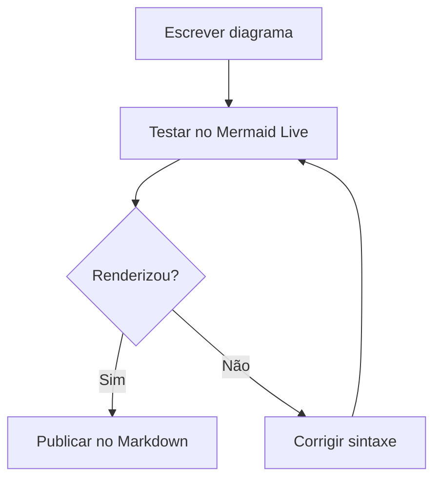

## 2.2 Usar em Markdown

Em plataformas que renderizam Mermaid nativamente, use um bloco cercado com a linguagem `mermaid`:

````md
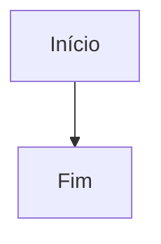
````

## 2.3 Usar em HTML via CDN

Para uma página HTML simples:

```html
<!doctype html>
<html lang="pt-BR">
<head>
  <meta charset="utf-8">
  <title>Mermaid Quick Start</title>
</head>
<body>
  <pre class="mermaid">
flowchart TD
    A[Início] --> B[Fim]
  </pre>

  <script type="module">
    import mermaid from "https://cdn.jsdelivr.net/npm/mermaid@11/dist/mermaid.esm.min.mjs";

    mermaid.initialize({
      startOnLoad: false,
      theme: "default"
    });

    await mermaid.run({ querySelector: ".mermaid" });
  </script>
</body>
</html>
```

## 2.4 Usar via npm

```bash
npm install mermaid
```

Uso típico em aplicação web:

```js
import mermaid from "mermaid";

mermaid.initialize({
  startOnLoad: false,
  theme: "default"
});

await mermaid.run({ querySelector: ".mermaid" });
```

## 2.5 Exportar via CLI

Para gerar SVG/PNG/PDF em pipeline local ou CI/CD, use o Mermaid CLI:

```bash
npm install -g @mermaid-js/mermaid-cli
mmdc -i diagrama.mmd -o diagrama.svg
```

---

# 3. Onde Mermaid roda

| Ambiente | Suporte | Observação prática |
|---|---:|---|
| Mermaid Live Editor | Nativo | melhor lugar para testar rapidamente |
| GitHub | Nativo em blocos `mermaid` | bom para README, issues, PRs e wikis |
| GitLab | Nativo em blocos `mermaid` | a versão suportada pode ficar atrás da versão oficial atual |
| Obsidian | Suporte em Markdown | depende da versão do app e plugins/tema |
| VS Code | Via extensões | a extensão define a versão Mermaid usada no preview |
| Docusaurus | Via `@docusaurus/theme-mermaid` | adequado para documentação pública versionada |
| VitePress | Via plugin/integração | exige configuração do bundler/documentação |
| MkDocs Material | Integração com Mermaid | útil para docs técnicas em Python/Markdown |
| HTML próprio | Via CDN/npm | você controla versão, CSS, segurança e renderização |
| `marked`, `markdown-it`, `remark` | Via plugins ou pós-processamento | é preciso converter blocos `mermaid` em containers renderizáveis |

> **Regra prática:** quando o guia for público, informe a versão Mermaid testada e liste os ambientes onde os exemplos foram validados.

---

# 4. Como escolher o tipo de diagrama

A escolha correta do tipo de diagrama evita gambiarras. Antes de escrever o código, pergunte: **o que estou tentando comunicar?**

| Quero comunicar... | Use | Por quê |
|---|---|---|
| Processo, decisão, pipeline, arquitetura simples | `flowchart` | é o tipo mais flexível e mais usado |
| Comunicação temporal entre atores/sistemas | `sequenceDiagram` | mostra ordem das mensagens no tempo |
| Classes, métodos, herança, composição e dependências | `classDiagram` | mostra estrutura orientada a objetos ou contratos |
| Ciclo de vida, máquina de estados, telas, status | `stateDiagram-v2` | mostra estados possíveis e transições válidas |
| Modelo de dados relacional | `erDiagram` | mostra entidades, atributos e cardinalidade |
| Cronograma, prazo e dependência temporal | `gantt` | mostra tarefas, duração, marcos e criticidade |
| Percentuais simples | `pie` | comunica proporções rápidas |
| Hierarquia de ideias | `mindmap` | organiza conceitos em árvore |
| Evolução histórica ou marcos | `timeline` | mostra sequência cronológica |
| Branches, commits e merges | `gitGraph` | documenta fluxo Git |
| Jornada, experiência e satisfação | `journey` | mostra etapas do usuário e pontuação por persona |
| Quadrantes de priorização | `quadrantChart` | útil para impacto/esforço, risco/valor etc. |
| Série numérica em eixo X/Y | `xychart-beta` / `xychart` conforme ambiente | útil para gráficos simples em documentação |
| Arquitetura cloud/CI/CD | `architecture` | mostra serviços, recursos e relações em implantação |
| Kanban visual | `kanban` | mostra cartões por coluna/fase |
| Radar/spider chart | `radar` | compara dimensões em formato polar |
| Treemap, Venn, Ishikawa, TreeView | tipos específicos Mermaid 11+ | consulte a documentação oficial antes de publicar |

> **Regra prática:** se você está em dúvida, comece por `flowchart`. Ele resolve a maior parte dos diagramas de processo, arquitetura e decisão. Use tipos mais especializados quando a semântica for importante.

> **Cuidado de versão:** Mermaid 11.14.0 lista vários tipos modernos, como `quadrantChart`, `xychart`, `block`, `packet`, `kanban`, `architecture`, `radar`, `treemap`, `venn`, `ishikawa` e `treeView`. Ambientes como GitHub, GitLab, extensões de VS Code e plugins Markdown podem usar versões diferentes. Sempre teste no ambiente final.

---

# 5. Visão geral dos principais tipos de diagrama

Esta seção apresenta os principais tipos de diagrama Mermaid com exemplos práticos. O objetivo não é substituir a documentação oficial de cada sintaxe, mas dar ao leitor um ponto de partida real, copiável e suficientemente completo para escolher o tipo correto antes de aprofundar.

## 5.1 `flowchart` — fluxogramas

`flowchart` é provavelmente o tipo de diagrama mais usado no Mermaid. Ele serve para processos, decisões, pipelines, arquitetura de sistemas, documentação de fluxo de dados, rotinas operacionais, troubleshooting e visão geral de componentes.

A direção vem logo depois do tipo:

| Direção | Significado | Uso típico |
|---|---|---|
| `TD` / `TB` | top-down / top-to-bottom | processos didáticos e fluxos verticais |
| `LR` | left-to-right | pipeline, arquitetura e fluxo de dados |
| `BT` | bottom-to-top | casos raros, leitura invertida |
| `RL` | right-to-left | casos raros ou fluxos específicos |

### 5.1.1 Exemplo mínimo

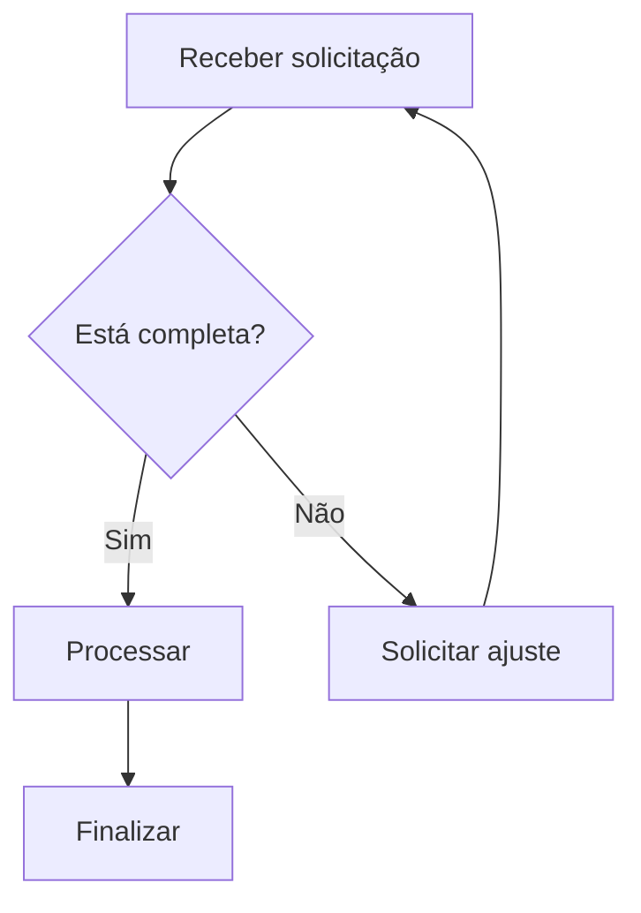

### 5.1.2 Formas de nó mais usadas

| Sintaxe | Forma visual | Uso comum |
|---|---|---|
| `A[Texto]` | retângulo | ação, etapa, componente comum |
| `A(Texto)` | retângulo arredondado | início/fim leve, etapa amigável |
| `A{Texto}` | losango | decisão, condição, bifurcação |
| `A((Texto))` | círculo | evento, alerta, conector |
| `A[(Texto)]` | cilindro | banco de dados, storage, cache |
| `A[/Texto/]` | paralelogramo | entrada/saída, relatório, payload |
| `A[[Texto]]` | subrotina | processo reutilizável |
| `A>Texto]` | assimétrico | marcador especial ou etapa destacada |

Exemplo com formas práticas:

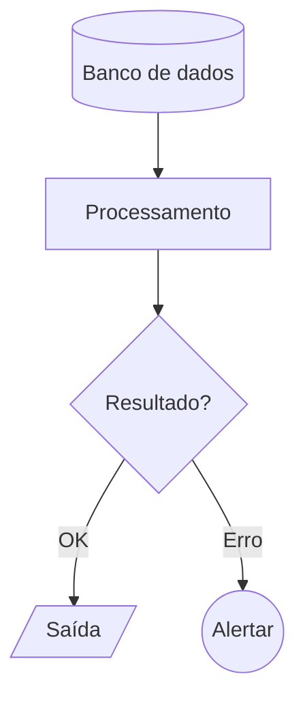

### 5.1.3 Rótulos em setas com `|texto|`

Use `|texto|` para explicar a condição, evento ou significado da transição.

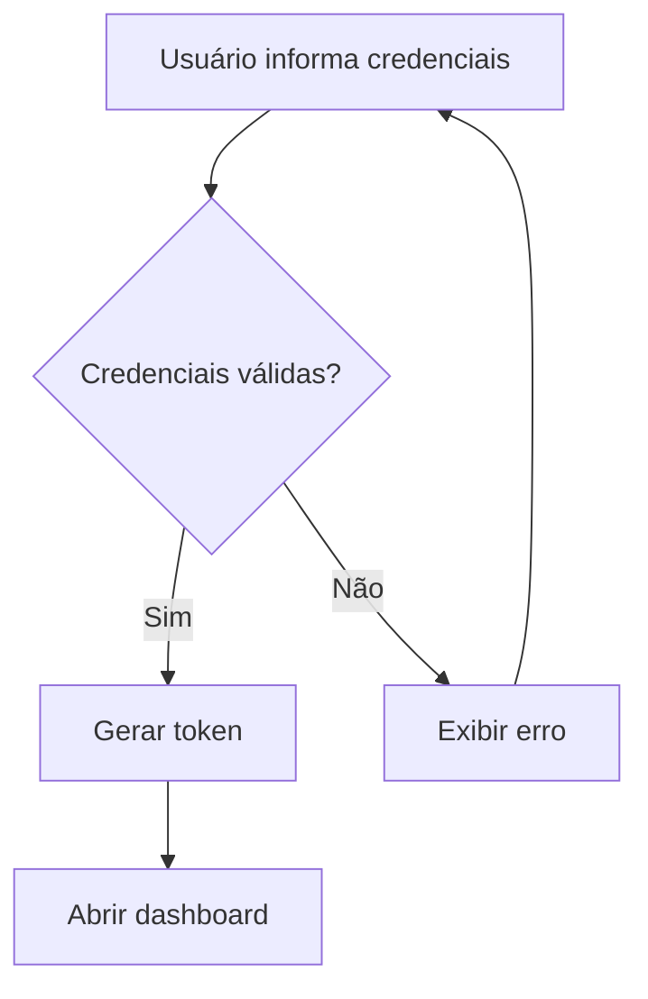

Boas práticas para rótulos:

| Faça | Evite |
|---|---|
| `-->|Sim|` e `-->|Não|` em decisões | deixar setas saindo de losango sem rótulo |
| rótulos curtos: `200 OK`, `timeout`, `cache miss` | frases longas que entortam o layout |
| rótulos técnicos quando o público é técnico | esconder protocolo/status importante |

### 5.1.4 Tipos de seta e linha

| Sintaxe | Leitura prática |
|---|---|
| `A --> B` | fluxo direcional padrão |
| `A --- B` | relação sem direção forte |
| `A -.-> B` | dependência, fallback, caminho indireto |
| `A ==> B` | fluxo forte/importante |
| `A -- texto --> B` | seta com texto alternativo |
| `A -->|texto| B` | seta rotulada mais legível |

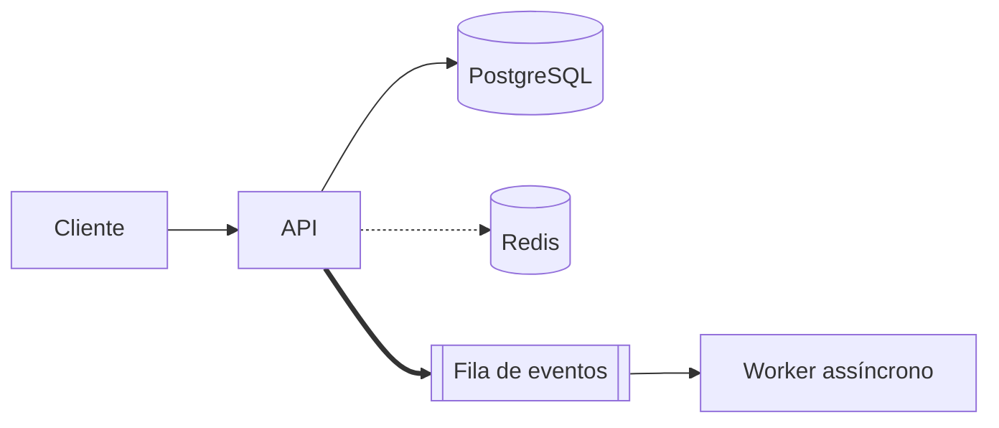

### 5.1.5 `subgraph` — agrupando arquitetura e responsabilidades

`subgraph` é essencial para diagramas de arquitetura, porque separa fronteiras: cliente, front-end, back-end, dados, observabilidade, rede, cloud etc.

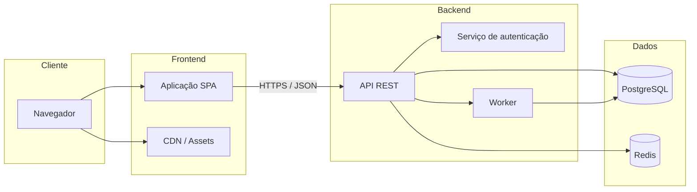

#### Subgraph com direção interna

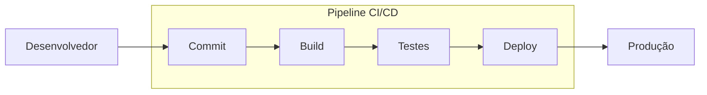

### 5.1.6 Estilizando nós com `classDef`

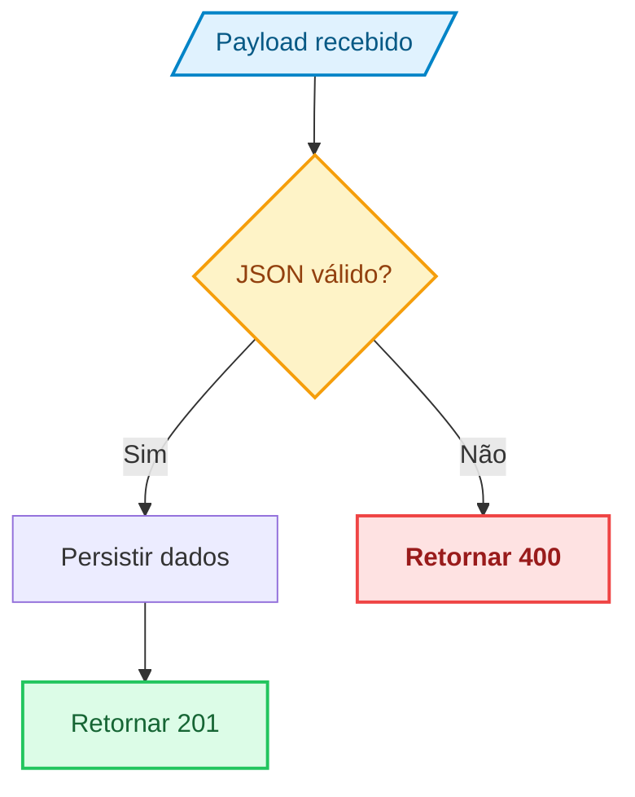

### 5.1.7 `linkStyle` — estilizando setas individualmente

`linkStyle` estiliza arestas pelo índice da seta, começando em `0`, na ordem em que as conexões aparecem no código. É poderoso, mas exige cuidado: se você inserir uma seta antes, os índices mudam.

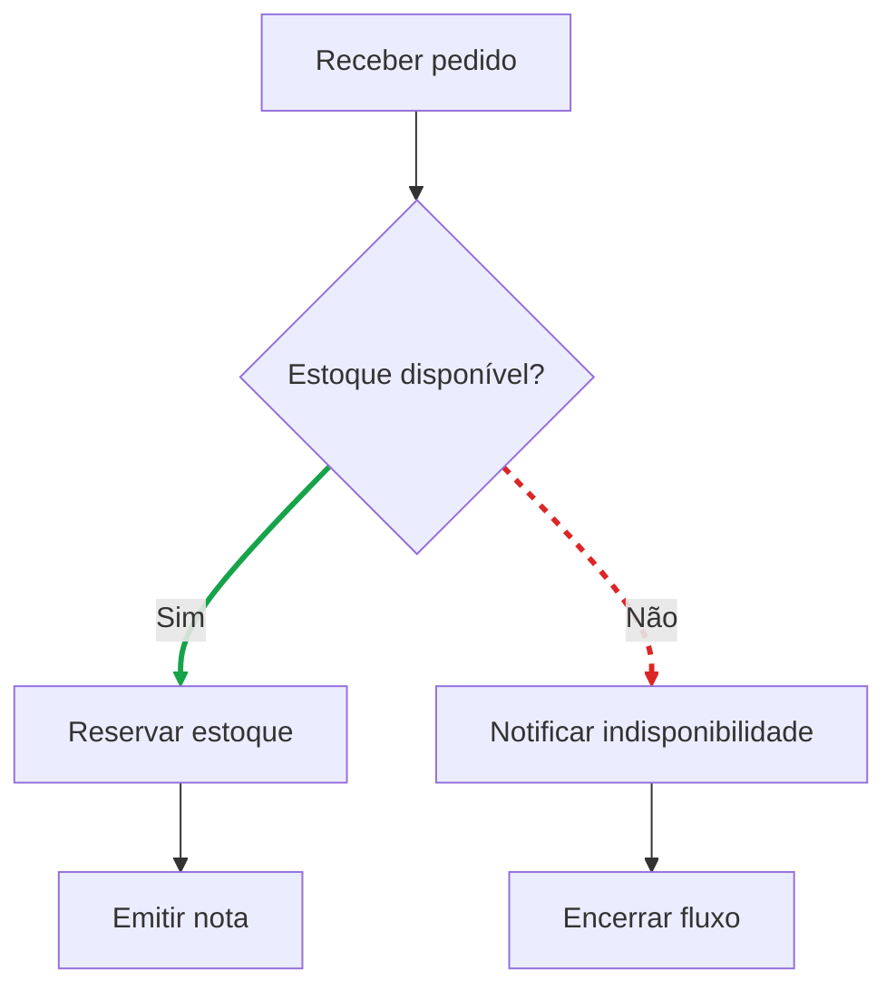

Leitura do índice acima:

| Índice | Aresta |
|---:|---|
| `0` | `A --> B` |
| `1` | `B --> C` |
| `2` | `B --> D` |
| `3` | `C --> E` |
| `4` | `D --> F` |

### 5.1.8 Exemplo real: fluxo de login com cache, banco e auditoria

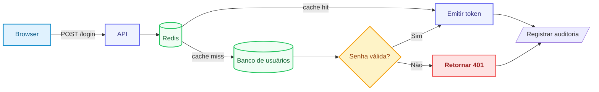

### 5.1.9 Pegadinhas clássicas de `flowchart`

| Pegadinha | Como evitar |
|---|---|
| usar `end` minúsculo como texto/ID | escreva `End`, `END` ou use outro ID |
| nó começando com `o` ou `x` após certos conectores | insira espaço ou use maiúscula para não virar marcador especial |
| texto muito longo no nó | use rótulo curto + nota textual fora do diagrama |
| `linkStyle` quebrar depois de inserir nova seta | revise índices após qualquer alteração estrutural |
| subgraphs enormes | divida por fronteiras lógicas e use direção interna |

## 5.2 `sequenceDiagram` — sequência de mensagens

`sequenceDiagram` mostra **quem fala com quem e em qual ordem temporal**. É excelente para documentar protocolo, autenticação, checkout, troca de mensagens entre microserviços, eventos assíncronos e comportamento de APIs.

### 5.2.1 Exemplo básico

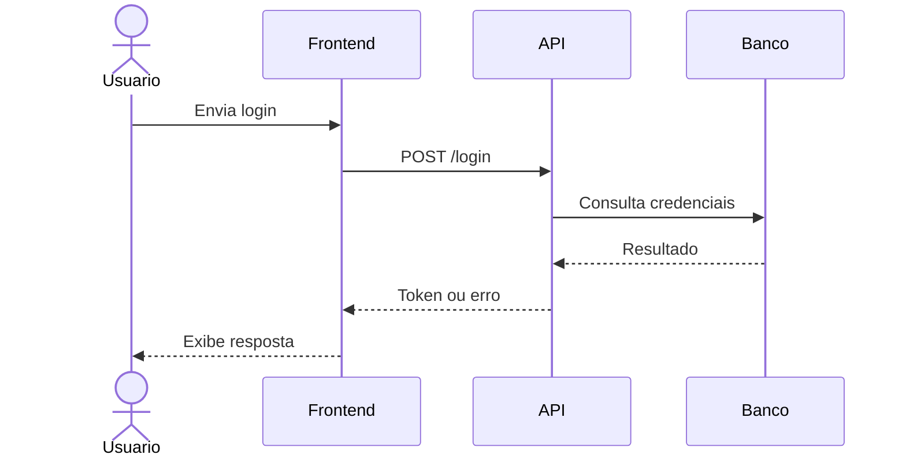

### 5.2.2 Participantes, atores e aliases

```mermaid
sequenceDiagram
    actor U as Usuário
    participant FE as Front-end
    participant API as API de autenticação
    database DB as Banco de usuários

    U->>FE: Informa credenciais
    FE->>API: POST /login
    API->>DB: SELECT usuário
    DB-->>API: Dados do usuário
    API-->>FE: Resposta
```

Use aliases quando o nome técnico for curto, mas o rótulo visual precisar ser claro.

### 5.2.3 Tipos de mensagem

| Sintaxe | Interpretação comum |
|---|---|
| `A->>B: msg` | chamada síncrona/forte |
| `A-->>B: msg` | resposta/retorno |
| `A-)B: msg` | mensagem assíncrona |
| `A--xB: msg` | falha, perda, encerramento ou rejeição |
| `A->>+B: msg` | ativa linha de vida de `B` |
| `B-->>-A: msg` | retorna e desativa linha de vida de `B` |

### 5.2.4 `activate` e `deactivate`

Use ativação para mostrar que um serviço está processando algo durante certo intervalo.

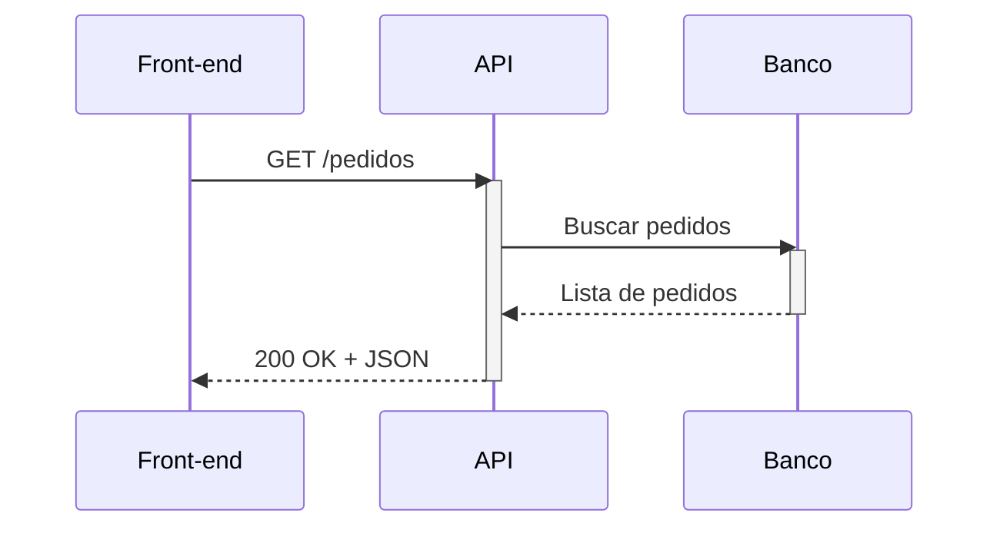

Forma compacta equivalente:

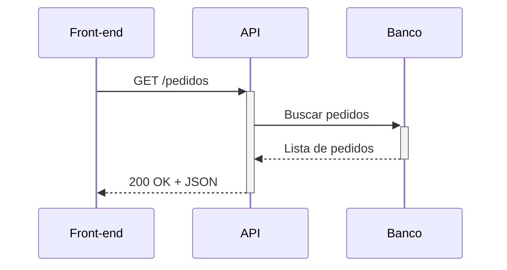

### 5.2.5 `alt`, `else` e `opt` — condicionais

`alt` representa caminhos alternativos. `opt` representa um bloco opcional.

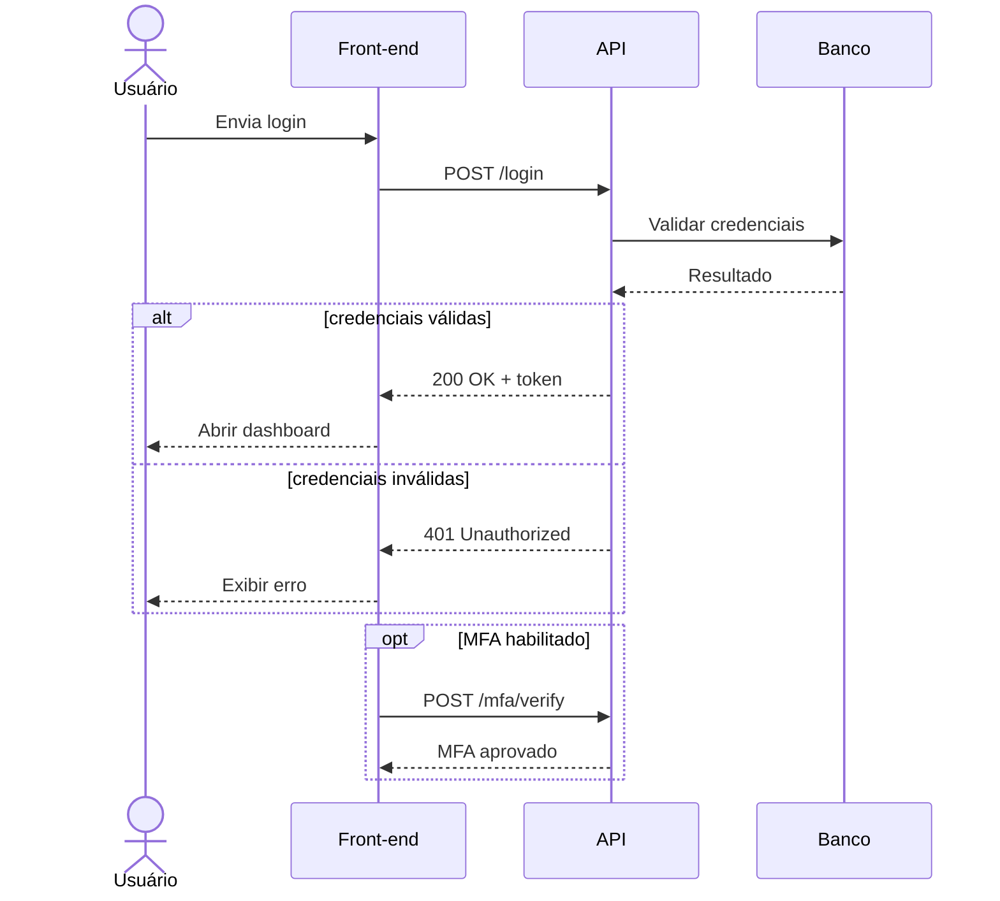

### 5.2.6 `loop` — repetição

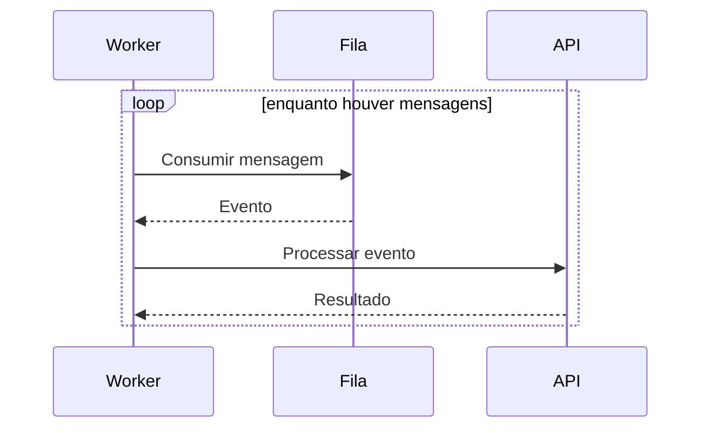

### 5.2.7 `par` — ações paralelas

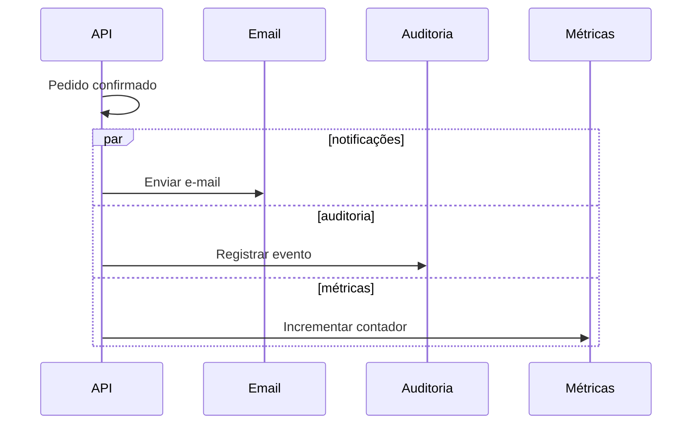

### 5.2.8 `note over`, `note left of` e `note right of`

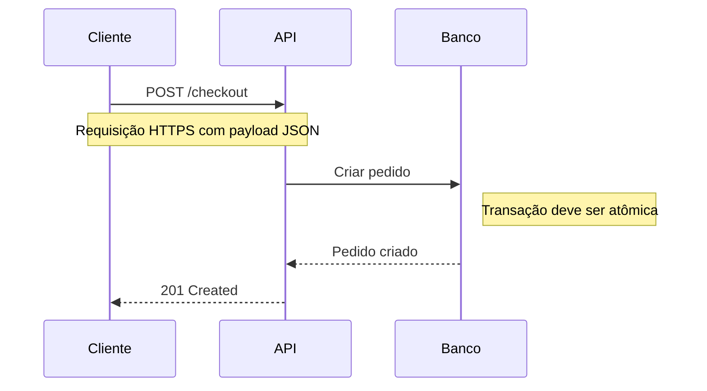

### 5.2.9 `autonumber`

`autonumber` numera automaticamente as mensagens. É muito útil em documentação de protocolo, troubleshooting e auditoria.

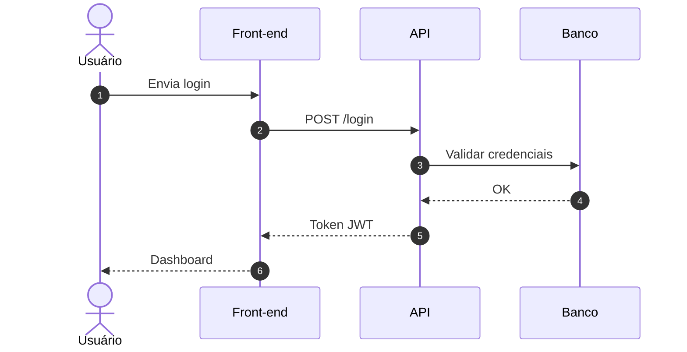

### 5.2.10 Exemplo real: login com cache, banco, MFA e auditoria

```mermaid
sequenceDiagram
    autonumber
    actor U as Usuário
    participant FE as Front-end
    participant API as API Auth
    participant Cache as Redis
    participant DB as Banco
    participant MFA as Serviço MFA
    participant Audit as Auditoria

    U->>FE: Informar e-mail e senha
    FE->>+API: POST /login
    API->>Cache: Buscar tentativa recente

    alt usuário bloqueado temporariamente
        Cache-->>API: Bloqueado
        API-->>-FE: 429 Too Many Requests
        FE-->>U: Exibir bloqueio temporário
    else usuário pode tentar login
        Cache-->>API: Sem bloqueio
        API->>+DB: Consultar usuário
        DB-->>-API: Hash da senha e flags

        alt senha inválida
            API->>Cache: Incrementar tentativas
            API->>Audit: Registrar falha
            API-->>FE: 401 Unauthorized
            FE-->>U: Exibir erro
        else senha válida
            opt MFA habilitado
                API->>+MFA: Solicitar validação
                MFA-->>-API: MFA aprovado
            end

            par pós-login
                API->>Audit: Registrar sucesso
            and sessão
                API->>Cache: Armazenar sessão
            end

            API-->>FE: 200 OK + token
            FE-->>U: Abrir dashboard
        end
        deactivate API
    end
```

### 5.2.11 Quando o diagrama de sequência fica ruim

| Sintoma | Correção |
|---|---|
| muitos participantes | agrupe serviços ou divida em diagramas menores |
| muitas mensagens de baixo nível | esconda detalhes internos sem valor para o leitor |
| condicionais aninhadas demais | considere `stateDiagram-v2` para lógica de estados |
| setas cruzadas/confusas | reorganize a ordem dos participantes |
| texto de mensagem enorme | use mensagem curta e explique fora do diagrama |

## 5.3 `classDiagram` — classes e relacionamentos

`classDiagram` documenta estrutura: classes, atributos, métodos e relações. Ele é útil para OO, contratos de domínio, modelagem conceitual e comunicação entre devs.

### 5.3.1 Exemplo básico

```mermaid
classDiagram
    class Usuario {
      +string nome
      +string email
      +autenticar()
    }

    class Pedido {
      +int id
      +decimal total
      +fechar()
    }

    Usuario "1" --> "0..*" Pedido : cria
```

### 5.3.2 Visibilidade de membros

| Símbolo | Significado usual |
|---|---|
| `+` | público |
| `-` | privado |
| `#` | protegido |
| `~` | pacote/internal |

```mermaid
classDiagram
    class ContaBancaria {
      -decimal saldo
      +depositar(decimal valor)
      +sacar(decimal valor)
      #validarSaldo(decimal valor)
    }
```

### 5.3.3 Tipos de relacionamento

| Notação | Nome | Leitura prática |
|---|---|---|
| `<|--` | herança/generalização | `Cachorro` é um `Animal` |
| `*--` | composição | parte depende fortemente do todo |
| `o--` | agregação | parte pertence ao todo, mas pode existir fora dele |
| `-->` | associação | uma classe conhece/usa a outra |
| `..>` | dependência | uso pontual, parâmetro, retorno, chamada |
| `--` | link simples | relação genérica sem direção forte |
| `..|>` | realização/interface | classe implementa interface |

```mermaid
classDiagram
    Animal <|-- Cachorro
    Animal <|-- Gato
    Pedido *-- ItemPedido
    Time o-- Jogador
    ControladorPedido --> PedidoService
    PedidoService ..> EmailService
    Pessoa -- Endereco

    class Animal {
      +string nome
      +emitirSom()
    }

    class Cachorro {
      +latir()
    }

    class Gato {
      +miar()
    }

    class Pedido {
      +int id
      +fechar()
    }

    class ItemPedido {
      +int quantidade
      +decimal subtotal
    }
```

### 5.3.4 Cardinalidade e rótulo

```mermaid
classDiagram
    Cliente "1" --> "0..*" Pedido : realiza
    Pedido "1" *-- "1..*" ItemPedido : contém
    Produto "1" --> "0..*" ItemPedido : vendido em
```

| Cardinalidade | Significado |
|---|---|
| `1` | exatamente um |
| `0..1` | zero ou um |
| `0..*` | zero ou muitos |
| `1..*` | um ou muitos |
| `n` | quantidade específica/conceitual |

### 5.3.5 Interface e implementação

```mermaid
classDiagram
    class RepositorioUsuario {
      <<interface>>
      +buscarPorEmail(string email) Usuario
      +salvar(Usuario usuario)
    }

    class RepositorioUsuarioPostgres {
      +buscarPorEmail(string email) Usuario
      +salvar(Usuario usuario)
    }

    RepositorioUsuario <|.. RepositorioUsuarioPostgres
```

### 5.3.6 Exemplo real: domínio de pedido

```mermaid
classDiagram
    class Cliente {
      +uuid id
      +string nome
      +string email
      +criarPedido()
    }

    class Pedido {
      +uuid id
      +PedidoStatus status
      +decimal total
      +adicionarItem(Produto produto, int quantidade)
      +fechar()
      +cancelar()
    }

    class ItemPedido {
      +int quantidade
      +decimal precoUnitario
      +subtotal()
    }

    class Produto {
      +uuid id
      +string nome
      +decimal preco
      +bool ativo
    }

    class Pagamento {
      +uuid id
      +decimal valor
      +autorizar()
      +estornar()
    }

    class PedidoStatus {
      <<enumeration>>
      RASCUNHO
      FECHADO
      PAGO
      CANCELADO
    }

    Cliente "1" --> "0..*" Pedido : realiza
    Pedido "1" *-- "1..*" ItemPedido : contém
    ItemPedido "*" --> "1" Produto : referencia
    Pedido "1" o-- "0..1" Pagamento : pagamento
    Pedido --> PedidoStatus : estado
```

### 5.3.7 Diferença prática entre associação, agregação e composição

| Relação | Pergunta de decisão | Exemplo |
|---|---|---|
| Associação `-->` | “uma classe conhece/usa a outra?” | `PedidoService --> PedidoRepository` |
| Agregação `o--` | “a parte pode viver sem o todo?” | `Time o-- Jogador` |
| Composição `*--` | “a parte morre com o todo?” | `Pedido *-- ItemPedido` |

Quando estiver em dúvida, prefira associação simples. Use composição/agregação quando a semântica de ciclo de vida for realmente importante.

## 5.4 `stateDiagram-v2` — estados e transições

Use para comportamento de sistemas com estados finitos.

```mermaid
stateDiagram-v2
    [*] --> Idle
    Idle --> Loading: iniciar
    Loading --> Success: resposta 200
    Loading --> Error: falha
    Error --> Idle: tentar novamente
    Success --> [*]
```

Este guia aprofunda esse tipo a partir da seção [6](#6-statediagram-v2--referência-completa).

## 5.5 `erDiagram` — entidade-relacionamento

Use para modelagem de dados.

```mermaid
erDiagram
    CLIENTE ||--o{ PEDIDO : realiza
    PEDIDO ||--|{ ITEM_PEDIDO : contém
    PRODUTO ||--o{ ITEM_PEDIDO : compõe

    CLIENTE {
      int id
      string nome
      string email
    }

    PEDIDO {
      int id
      date criado_em
      decimal total
    }
```


### 5.5.1 Notação de cardinalidade em `erDiagram`

A cardinalidade aparece nas duas pontas da relação. Cada marcador combina **mínimo** e **máximo** de ocorrência.

| Marcador | Leitura | Modelo mental |
|---|---|---|
| `||` | exatamente um | obrigatório e único |
| `|o` / `o|` | zero ou um | opcional, no máximo um |
| `|{` / `}|` | um ou muitos | obrigatório, pode repetir |
| `o{` / `}o` | zero ou muitos | opcional, pode repetir |

Exemplo de leitura:

```mermaid
erDiagram
    CLIENTE ||--o{ PEDIDO : realiza
    PEDIDO ||--|{ ITEM_PEDIDO : contém
    PRODUTO ||--o{ ITEM_PEDIDO : aparece_em
```

Como interpretar:

| Relação | Leitura prática |
|---|---|
| `CLIENTE ||--o{ PEDIDO` | um cliente pode realizar zero ou muitos pedidos; cada pedido pertence a exatamente um cliente |
| `PEDIDO ||--|{ ITEM_PEDIDO` | um pedido contém um ou muitos itens; cada item pertence a exatamente um pedido |
| `PRODUTO ||--o{ ITEM_PEDIDO` | um produto pode aparecer em zero ou muitos itens de pedido; cada item referencia exatamente um produto |

Além da cardinalidade, a linha também indica se a relação é **identificadora** ou **não identificadora**:

| Linha | Tipo | Uso |
|---|---|---|
| `--` | identificadora / sólida | quando a entidade dependente não existe sem a entidade principal |
| `..` | não identificadora / tracejada | quando as entidades podem existir de forma mais independente |

## 5.6 `gantt` — cronogramas

Use `gantt` para planejamento de atividades, dependências temporais, marcos, status e criticidade.

```mermaid
gantt
    title Implantação de documentação Mermaid
    dateFormat  YYYY-MM-DD

    section Preparação
    Revisar guia antigo      :done,    a1, 2026-05-01, 2d
    Definir escopo público   :active,  a2, after a1, 2d

    section Publicação
    Escrever guia revisado   :crit,    b1, after a2, 3d
    Validar exemplos         :         b2, after b1, 1d
    Publicar versão final    :milestone, m1, after b2, 0d
```

Tags úteis:

| Tag | Significado prático |
|---|---|
| `done` | tarefa concluída |
| `active` | tarefa em andamento |
| `crit` | tarefa crítica; atraso impacta o cronograma |
| `milestone` | marco, entrega ou ponto de controle |

Exemplo com dependência explícita:

```mermaid
gantt
    title Release de documentação técnica
    dateFormat YYYY-MM-DD
    excludes weekends

    section Conteúdo
    Levantamento          :done,    t1, 2026-05-01, 2d
    Escrita técnica       :crit,    t2, after t1, 4d
    Revisão por pares     :active,  t3, after t2, 2d

    section Publicação
    Ajustes finais        :crit,    t4, after t3, 1d
    Deploy da documentação:milestone, t5, after t4, 0d
```

Boas práticas:

| Faça | Evite |
|---|---|
| use IDs (`t1`, `t2`) para dependências | depender só da ordem visual |
| marque `crit` para tarefas críticas | tratar todas as tarefas como iguais |
| use `milestone` para entregas | representar entrega como tarefa longa |
| teste datas e exclusões no ambiente final | assumir que toda plataforma usa mesma versão Mermaid |

## 5.7 `pie` — gráfico de pizza

Use para percentuais simples e distribuição proporcional.

```mermaid
pie showData
    title Tipos de uso do Mermaid em documentação
    "Fluxogramas" : 45
    "Sequência" : 25
    "Estados" : 20
    "Outros" : 10
```

## 5.8 `mindmap` — mapa mental

Use para hierarquias conceituais.

```mermaid
mindmap
  root((Mermaid))
    Sintaxe
      flowchart
      sequenceDiagram
      stateDiagram-v2
    Integração
      GitHub
      GitLab
      HTML
    Qualidade
      Acessibilidade
      Debugging
      Versionamento
```

## 5.9 `timeline` — linha do tempo

Use para evolução histórica, releases, marcos e fases.

```mermaid
timeline
    title Evolução de um guia Mermaid
    2026-05-01 : Conteúdo em formato de aulas
    2026-05-05 : Consolidação de exemplos
    2026-05-10 : Revisão para guia público
```

## 5.10 `gitGraph` — histórico Git

Use para explicar branches, merges e fluxo de entrega.

```mermaid
gitGraph
    commit id: "init"
    branch develop
    checkout develop
    commit id: "docs"
    commit id: "review"
    checkout main
    merge develop id: "release"
```

## 5.11 `journey` — jornada do usuário

Use para representar etapas de experiência e satisfação.

```mermaid
journey
    title Jornada de leitura de um guia público
    section Descoberta
      Encontra o guia: 4: Leitor
      Lê o Quick Start: 5: Leitor
    section Uso
      Copia exemplo: 5: Leitor
      Corrige erro de sintaxe: 3: Leitor
      Publica diagrama: 5: Leitor
```

---

# 6. `stateDiagram-v2` — referência completa

## 6.1 Quando usar

Use `stateDiagram-v2` quando o foco é mostrar **em qual estado um sistema pode estar** e **quais eventos ou condições fazem esse sistema mudar de estado**.

Bons casos:

| Caso | Exemplo |
|---|---|
| Interface | `Idle`, `Loading`, `Success`, `Error` |
| Pedido | `Criado`, `Pago`, `Enviado`, `Cancelado` |
| Autenticação | `Anonimo`, `Logado`, `Bloqueado` |
| Máquina de estados | `Parado`, `EmMovimento`, `Falha` |
| Workflow | `Rascunho`, `EmRevisao`, `Aprovado`, `Publicado` |

## 6.2 `stateDiagram` vs `stateDiagram-v2`

A recomendação prática para diagramas novos é usar:

```txt
stateDiagram-v2
```

Diferença conceitual:

| Sintaxe | Situação prática |
|---|---|
| `stateDiagram-v2` | renderer/sintaxe atual para novos diagramas de estado; melhor escolha para documentação nova |
| `stateDiagram` | forma antiga/legada ainda aceita em muitos ambientes; pode aparecer em exemplos antigos |

Diferenças práticas importantes:

| Ponto | `stateDiagram` legado | `stateDiagram-v2` atual |
|---|---|---|
| Renderer | associado a implementação antiga | renderer atual para diagramas de estado |
| Consistência visual | pode variar mais entre versões | tende a ser mais previsível em versões recentes |
| `classDef` em estados simples | pode funcionar, mas com mais inconsistência histórica | melhor suporte em estados simples |
| Estados compostos | suportados, mas com limitações de estilo | sintaxe mais consistente, embora estilos em compostos ainda exijam cuidado |
| Material novo | use apenas se precisa compatibilidade com ambiente antigo | preferível para guias públicos atuais |

> **Regra de ouro:** use `stateDiagram-v2` no material novo, mas saiba ler `stateDiagram` porque muitos READMEs, respostas antigas e exemplos na internet ainda usam a forma legada.

> **Atenção:** mesmo em `stateDiagram-v2`, `[*]` não deve ser tratado como estado comum para `classDef`, e estados compostos continuam exigindo testes no ambiente final.

## 6.3 Estrutura mínima

```mermaid
stateDiagram-v2
    [*] --> Still
    Still --> Moving
    Moving --> Crash
    Crash --> [*]
```

Leitura:

```txt
início → Still → Moving → Crash → fim
```

## 6.4 Estado inicial e final

```mermaid
stateDiagram-v2
    [*] --> Aguardando
    Aguardando --> [*]
```

| Sintaxe | Significado |
|---|---|
| `[*] --> Estado` | início do fluxo |
| `Estado --> [*]` | fim do fluxo |

`[*]` é marcador especial. Ele não deve ser tratado como um estado comum.

## 6.5 Transições simples

```mermaid
stateDiagram-v2
    Parado --> EmMovimento
    EmMovimento --> Parado
```

Se um estado ainda não foi declarado, Mermaid cria esse estado a partir do ID usado na transição.

## 6.6 Transições com rótulo

```mermaid
stateDiagram-v2
    Idle --> Loading: clicar em carregar
    Loading --> Success: resposta 200
    Loading --> Error: timeout
```

Use rótulos para eventos, condições ou respostas.

| Tipo de rótulo | Exemplo |
|---|---|
| Evento | `clicar em salvar` |
| Condição | `se válido` |
| Resposta | `HTTP 200` |
| Falha | `timeout` |
| Ação | `tentar novamente` |

## 6.7 Direção do layout

```mermaid
stateDiagram-v2
    direction LR
    [*] --> Rascunho
    Rascunho --> Revisao
    Revisao --> Publicado
    Publicado --> [*]
```

| Comando | Direção | Melhor uso |
|---|---|---|
| `direction TB` | cima → baixo | fluxos didáticos verticais |
| `direction BT` | baixo → cima | casos raros, leitura invertida |
| `direction LR` | esquerda → direita | pipelines e ciclos curtos |
| `direction RL` | direita → esquerda | casos específicos de layout |

## 6.8 ID interno diferente do texto visual

Forma recomendada para textos longos:

```mermaid
stateDiagram-v2
    state "Usuário autenticado" as Authenticated
    [*] --> Authenticated
    Authenticated --> [*]
```

Forma curta:

```mermaid
stateDiagram-v2
    Authenticated: Usuário autenticado
    [*] --> Authenticated
    Authenticated --> [*]
```

| Elemento | Papel |
|---|---|
| `Authenticated` | ID interno usado no código |
| `Usuário autenticado` | texto exibido no diagrama |

## 6.9 Estado composto

Use quando um estado possui um fluxo interno.

```mermaid
stateDiagram-v2
    [*] --> Pedido

    state Pedido {
        [*] --> Criado
        Criado --> Pago
        Pago --> Enviado
        Enviado --> [*]
    }

    Pedido --> Finalizado
    Finalizado --> [*]
```

Modelo mental:

```txt
Pedido
 ├─ Criado
 ├─ Pago
 └─ Enviado
```

## 6.10 `choice`

Use `choice` para bifurcações condicionais.

```mermaid
stateDiagram-v2
    [*] --> Validar
    Validar --> Decisao

    state Decisao <<choice>>

    Decisao --> Aprovado: válido
    Decisao --> Reprovado: inválido

    Aprovado --> [*]
    Reprovado --> [*]
```

## 6.11 `fork` e `join`

Use quando uma etapa se divide em atividades paralelas e depois se reúne.

```mermaid
stateDiagram-v2
    [*] --> Preparar

    state Fork <<fork>>
    state Join <<join>>

    Preparar --> Fork
    Fork --> EnviarEmail
    Fork --> RegistrarLog

    EnviarEmail --> Join
    RegistrarLog --> Join

    Join --> Finalizado
    Finalizado --> [*]
```

## 6.12 Concorrência com `--`

Use `--` dentro de estado composto para regiões paralelas.

```mermaid
stateDiagram-v2
    [*] --> Ativo

    state Ativo {
        [*] --> Processamento
        Processamento --> Rodando

        --

        [*] --> Monitoramento
        Monitoramento --> Observando
    }

    Ativo --> [*]
```

## 6.13 Notas

```mermaid
stateDiagram-v2
    [*] --> Login
    Login --> Dashboard

    note right of Login
        Validar usuário,
        senha e MFA.
    end note

    Dashboard --> [*]
```

| Sintaxe | Uso |
|---|---|
| `note right of Estado` | nota à direita |
| `note left of Estado` | nota à esquerda |

## 6.14 Comentários

Comentários Mermaid começam com `%%` e devem ficar em linha própria.

```mermaid
stateDiagram-v2
    %% Comentário interno: não aparece no diagrama.
    [*] --> A
    A --> B
    B --> [*]
```

Evite colocar `{` e `}` em comentários complexos, pois alguns cenários podem confundir o parser.

## 6.15 Exemplo completo de referência

```mermaid
---
config:
  theme: base
  themeVariables:
    primaryColor: "#ffffff"
    primaryTextColor: "#111111"
    primaryBorderColor: "#64748b"
    lineColor: "#64748b"
    noteBkgColor: "#fff7ed"
    noteTextColor: "#7c2d12"
    noteBorderColor: "#fdba74"
---
stateDiagram-v2
    direction TB

    accTitle: Fluxo de autenticação
    accDescr: Diagrama mostra login, validação, decisão, sucesso, bloqueio e erro.

    classDef normal fill:#ffffff,color:#111111,stroke:#64748b,stroke-width:1px
    classDef active fill:#e0f2fe,color:#075985,stroke:#0284c7,stroke-width:2px
    classDef success fill:#dcfce7,color:#166534,stroke:#22c55e,stroke-width:2px
    classDef warning fill:#fef3c7,color:#92400e,stroke:#f59e0b,stroke-width:2px
    classDef danger fill:#dc2626,color:#ffffff,stroke:#facc15,stroke-width:3px,font-weight:bold

    [*] --> Login
    Login --> Validar: enviar credenciais

    state Decisao <<choice>>

    Validar --> Decisao
    Decisao --> Dashboard: válido
    Decisao --> Bloqueado: muitas tentativas
    Decisao --> Erro: inválido

    Erro --> Login: tentar novamente
    Dashboard --> [*]
    Bloqueado --> [*]

    note right of Login
        Entrada do usuário.
    end note

    note right of Erro
        Erro pode retornar
        para nova tentativa.
    end note

    class Login normal
    class Validar active
    class Decisao warning
    class Dashboard success
    class Bloqueado,Erro danger
```

---

# 7. Personalização visual: `classDef`, tema e CSS

A personalização do Mermaid tem três camadas principais:

```txt
1. Sintaxe Mermaid
   classDef, class, :::, direction, note, state

2. Configuração/tema Mermaid
   theme, themeVariables, frontmatter, initialize

3. CSS da página
   .mermaid svg, text, tspan, rect, path, .label, .stateLabel
```

## 7.1 `classDef`

`classDef` cria um estilo nomeado.

```mermaid
stateDiagram-v2
    classDef danger fill:#dc2626,color:#ffffff,stroke:#facc15,stroke-width:3px,font-weight:bold

    [*] --> Crash
    Crash --> [*]

    class Crash danger
```

## 7.2 Propriedades úteis em `classDef`

| Propriedade | Afeta | Exemplo recomendado | Observação |
|---|---|---|---|
| `fill` | fundo do estado/nó | `fill:#ffffff` | em SVG, `fill` também pode aparecer em textos se o seletor for amplo |
| `color` | texto | `color:#111111` | pode ser vencido por CSS externo em `text`/`tspan` |
| `stroke` | borda | `stroke:#64748b` | também usado em linhas/contornos SVG |
| `stroke-width` | espessura da borda | `stroke-width:2px` | pode alterar percepção de tamanho |
| `font-weight` | peso da fonte | `font-weight:bold` | pode ser sobrescrito por CSS global |
| `font-style` | itálico/normal | `font-style:italic` | útil para estados especiais |
| `font-size` | tamanho do texto | `font-size:16px` | fonte maior pode exigir re-render após troca de fonte/tema |
| `font-family` | fonte | `font-family:system-ui,sans-serif` | prefira pilha com fallback, não apenas `Arial` |
| `stroke-dasharray` | borda tracejada | `stroke-dasharray:5 5` | útil para pendente, opcional, fallback |
| `opacity` | transparência | `opacity:0.9` | cuidado com contraste/acessibilidade |

> Para guia público, prefira hexadecimal (`#ffffff`) e pilha de fonte (`system-ui,sans-serif`) em vez de nomes soltos como `white`, `yellow` ou `Arial`.

## 7.3 Aplicar classe com `class`

```mermaid
stateDiagram-v2
    classDef pending fill:#fff7ed,color:#7c2d12,stroke:#fb923c,stroke-width:2px,stroke-dasharray:5 5
    classDef done fill:#dcfce7,color:#166534,stroke:#22c55e,stroke-width:2px

    [*] --> Pendente
    Pendente --> Concluido
    Concluido --> [*]

    class Pendente pending
    class Concluido done
```

## 7.4 Aplicar uma classe a vários estados

```mermaid
stateDiagram-v2
    classDef comum fill:#f8fafc,color:#0f172a,stroke:#94a3b8
    classDef problema fill:#fee2e2,color:#991b1b,stroke:#ef4444,font-weight:bold

    [*] --> A
    A --> B
    B --> C
    C --> Erro
    Erro --> [*]

    class A,B,C comum
    class Erro problema
```

## 7.5 Aplicação inline com `:::`

```mermaid
stateDiagram-v2
    classDef danger fill:#dc2626,color:#ffffff,stroke:#facc15,stroke-width:3px,font-weight:bold

    [*] --> Still
    Still --> Crash:::danger
    Crash --> [*]
```

| Forma | Melhor uso |
|---|---|
| `class Estado classe` | diagramas médios/grandes, manutenção e leitura |
| `Estado:::classe` | exemplos curtos e aplicação direta |

## 7.6 Limitações de `classDef` em `stateDiagram-v2`

| Alvo | Situação |
|---|---|
| Estado simples | funciona bem |
| Vários estados simples | funciona bem |
| Estado inicial/final `[*]` | não trate como estado comum |
| Estado composto | limitado/não confiável para estilo direto |
| Estado interno de composto | pode variar por versão/renderer |

Exemplo problemático:

```txt
class end danger
```

Essa linha não estiliza `[*]`. Ela tenta aplicar classe a um estado chamado literalmente `end`.

## 7.7 Exemplo clássico corrigido: `badBadEvent`

Versão consistente, usando hexadecimal e sem tentar estilizar `end`:

```mermaid
stateDiagram-v2
    direction TB

    accTitle: Diagrama de estados com estilos
    accDescr: Exemplo com estado parado, movimento e colisão.

    classDef notMoving fill:#ffffff,color:#111111,stroke:#64748b
    classDef movement fill:#eef2ff,color:#312e81,stroke:#6366f1,font-style:italic
    classDef badBadEvent fill:#ff0000,color:#ffffff,font-weight:bold,stroke-width:2px,stroke:#ffff00

    [*] --> Still
    Still --> [*]
    Still --> Moving
    Moving --> Still
    Moving --> Crash
    Crash --> [*]

    class Still notMoving
    class Moving movement
    class Crash movement
    class Crash badBadEvent
```

O estado `Crash` recebe duas classes: `movement` e `badBadEvent`.

## 7.8 Tema por frontmatter

Use frontmatter quando quiser configurar um diagrama específico. Para customizar `themeVariables`, use preferencialmente `theme: base`, porque é o tema oficialmente modificável.

```mermaid
---
config:
  theme: base
  themeVariables:
    primaryColor: "#ffffff"
    primaryTextColor: "#111111"
    primaryBorderColor: "#64748b"
    lineColor: "#64748b"
    fontFamily: "system-ui, sans-serif"
---
stateDiagram-v2
    [*] --> A
    A --> B
    B --> [*]
```

> Em YAML, cores hexadecimais devem ficar entre aspas, porque `#` inicia comentário.

### Variáveis úteis para `stateDiagram-v2` e diagramas próximos

| Variável | Uso prático |
|---|---|
| `primaryColor` | fundo base dos estados/nós |
| `primaryTextColor` | texto principal dos estados/nós |
| `primaryBorderColor` | borda base dos estados/nós |
| `lineColor` | linhas, setas e conectores |
| `fontFamily` | família tipográfica do diagrama |
| `fontSize` | tamanho base da fonte |
| `labelColor` | cor de labels em diagramas de estado/arestas, dependendo do renderer |
| `altBackground` | fundo alternativo usado em áreas compostas ou agrupadas, dependendo do renderer |
| `noteBkgColor` | fundo de notas |
| `noteTextColor` | texto de notas |
| `noteBorderColor` | borda de notas |

Exemplo mais completo:

```mermaid
---
config:
  theme: base
  themeVariables:
    primaryColor: "#ffffff"
    primaryTextColor: "#111111"
    primaryBorderColor: "#64748b"
    lineColor: "#64748b"
    labelColor: "#111111"
    altBackground: "#f8fafc"
    noteBkgColor: "#fff7ed"
    noteTextColor: "#7c2d12"
    noteBorderColor: "#fdba74"
    fontFamily: "system-ui, sans-serif"
    fontSize: "16px"
---
stateDiagram-v2
    direction TB
    [*] --> Login
    Login --> Validar: enviar credenciais
    Validar --> Sucesso: válido
    Validar --> Erro: inválido
    Sucesso --> [*]
    Erro --> Login: tentar novamente

    note right of Login
      Entrada do usuário.
    end note
```

### Quando usar tema em vez de `classDef`

| Necessidade | Melhor escolha |
|---|---|
| aparência padrão do diagrama inteiro | `themeVariables` |
| destacar um estado específico | `classDef` |
| corrigir SVG final dentro da sua página | CSS externo específico |
| manter o diagrama portátil para GitHub/Live Editor | `classDef` e frontmatter, evitando CSS externo |

## 7.9 Configuração global via JavaScript

Use `mermaid.initialize()` para configurar Mermaid no nível da página/aplicação.

```js
mermaid.initialize({
  startOnLoad: false,
  securityLevel: "strict", // padrão seguro; use "loose" apenas se precisar HTML em rótulos/conteúdo confiável
  theme: "base",
  themeVariables: {
    primaryColor: "#ffffff",
    primaryTextColor: "#111111",
    primaryBorderColor: "#64748b",
    lineColor: "#64748b",
    labelColor: "#111111",
    altBackground: "#f8fafc",
    noteBkgColor: "#fff7ed",
    noteTextColor: "#7c2d12",
    noteBorderColor: "#fdba74",
    fontFamily: "system-ui, sans-serif",
    fontSize: "16px"
  }
});
```

Recomendações:

| Configuração | Por quê |
|---|---|
| `startOnLoad:false` | evita renderização automática fora do seu controle |
| `securityLevel:"strict"` | mantém HTML em rótulos codificado e reduz superfície de risco por padrão |
| `securityLevel:"loose"` | use somente quando você controla a origem do diagrama e precisa permitir HTML/clicks em rótulos |
| `theme:"base"` | permite `themeVariables` customizadas |
| `fontFamily:"system-ui, sans-serif"` | funciona melhor entre Windows, Linux, macOS e mobile |
| tema centralizado | facilita trocar claro/escuro sem regras agressivas no SVG |

## 7.10 CSS externo seguro para HTML local-first

O CSS externo deve cuidar de **layout do SVG**, não sobrescrever indiscriminadamente as cores internas do Mermaid.

```css
.mermaid {
  display: block;
  max-width: 100%;
  overflow-x: auto;
  overflow-y: visible;
  background: transparent;
  text-align: center;
}

.mermaid svg {
  display: inline-block;
  max-width: 100%;
  height: auto;
  overflow: visible;
  background: transparent;
}

.mermaid svg text,
.mermaid svg tspan {
  font-family: inherit;
}
```

Esse padrão evita:

| Problema | Prevenção |
|---|---|
| diagrama gigante | `max-width:100%` |
| distorção | `height:auto` |
| seta cortada | `overflow:visible` |
| fundo indevido de `<pre>`/`code` | `background:transparent` |
| fonte desalinhada demais | `font-family:inherit` sem forçar cor |

### 7.10.1 Modo claro/escuro sem quebrar `classDef`

O erro comum no modo escuro é tentar “corrigir” todos os textos Mermaid com uma regra global:

```css
/* Não recomendado: atropela classes definidas no próprio diagrama */
[data-theme="dark"] .mermaid svg text {
  fill: #e5e7eb !important;
}
```

Essa regra pode fazer um estado como `badBadEvent` perder `color:#ffffff`, ou pode deixar labels e notas com contraste errado.

Prefira corrigir classes específicas que você sabe que precisam vencer o tema:

```css
[data-theme="dark"] .mermaid svg .badBadEvent text,
[data-theme="dark"] .mermaid svg .badBadEvent tspan,
[data-theme="dark"] .mermaid svg .badBadEvent .label,
[data-theme="dark"] .mermaid svg .badBadEvent .stateLabel {
  fill: #ffffff !important;
  color: #ffffff !important;
}
```

E mantenha o tema global no Mermaid:

```js
const isDark = document.documentElement.dataset.theme === "dark";

mermaid.initialize({
  startOnLoad: false,
  theme: "base",
  themeVariables: isDark
    ? {
        primaryColor: "#111827",
        primaryTextColor: "#f9fafb",
        primaryBorderColor: "#6b7280",
        lineColor: "#9ca3af",
        labelColor: "#f9fafb",
        altBackground: "#1f2937",
        fontFamily: "system-ui, sans-serif"
      }
    : {
        primaryColor: "#ffffff",
        primaryTextColor: "#111111",
        primaryBorderColor: "#64748b",
        lineColor: "#64748b",
        labelColor: "#111111",
        altBackground: "#f8fafc",
        fontFamily: "system-ui, sans-serif"
      }
});
```

### 7.10.2 Regra mental para dark mode

```txt
Tema claro/escuro geral  → themeVariables
Correção de layout SVG   → CSS de container/SVG
Correção de classe real  → seletor específico da classe
Correção global de texto → evitar
```

## 7.11 CSS defensivo para uma classe específica

Use CSS específico quando o CSS global da página estiver vencendo a cor do texto no SVG.

```css
.mermaid svg .badBadEvent text,
.mermaid svg .badBadEvent tspan,
.mermaid svg .badBadEvent .label,
.mermaid svg .badBadEvent .stateLabel {
  fill: #ffffff !important;
  color: #ffffff !important;
  font-weight: 700 !important;
}

.mermaid svg .badBadEvent rect {
  fill: #ff0000 !important;
  stroke: #ffff00 !important;
  stroke-width: 2px !important;
}
```

## 7.12 Anti-padrões de CSS

Evite regras amplas demais:

```css
/* Não recomendado */
.mermaid * {
  fill: #ffffff !important;
}

/* Não recomendado */
svg text {
  fill: #111111 !important;
}

/* Não recomendado */
.mermaid svg text,
.mermaid svg tspan {
  fill: var(--text-color) !important;
}

/* Não recomendado */
[data-theme="dark"] .mermaid svg text {
  fill: #e5e7eb !important;
}

/* Não recomendado */
.mermaid svg {
  width: 100% !important;
  height: 100% !important;
}
```

Por quê?

| Anti-padrão | Risco |
|---|---|
| `.mermaid *` | afeta texto, linhas, bordas, notas, marcadores e setas |
| `svg text` global | quebra outros SVGs da página |
| `.mermaid svg text` com `!important` | vence `classDef color` e tema Mermaid |
| regra global de dark mode | faz funcionar no escuro, mas quebra classes específicas |
| `width` e `height` forçados | distorce layout e pode causar sobreposição |

Correção mais segura:

```css
/* Layout geral */
.mermaid svg {
  max-width: 100%;
  height: auto;
}

/* Classe específica */
.mermaid svg .danger text,
.mermaid svg .danger tspan {
  fill: #ffffff !important;
}
```

---

# 8. Integração em Markdown, HTML e documentação

Mermaid pode aparecer em READMEs, wikis, issues, documentação estática, páginas HTML locais e aplicações customizadas. A regra central é separar o que é **portátil** — sintaxe Mermaid, `classDef`, `class`, frontmatter `config` — do que depende do ambiente — CSS externo, pipeline JavaScript, versão embutida e política de segurança da plataforma.

## 8.1 GitHub

Use bloco Markdown cercado com `mermaid`:

````md
```mermaid
flowchart TD
    A[Início] --> B[Fim]
```
````

Cuidados:

| Ponto | Recomendação |
|---|---|
| Compatibilidade | teste no próprio GitHub, não apenas no Live Editor |
| Segurança | GitHub sanitiza/renderiza o SVG conforme política própria |
| Portabilidade | evite depender de CSS externo para o diagrama funcionar |

> **Nota importante:** `classDef`, `class` e `:::` são portáveis no GitHub porque fazem parte da sintaxe Mermaid do próprio bloco. O que não é portátil é depender de CSS externo da sua página, como `.mermaid svg .danger text { ... }`, porque o GitHub controla o ambiente de renderização e sanitização.

## 8.2 GitLab

GitLab também suporta blocos `mermaid`, mas a versão Mermaid pode ser diferente da versão oficial mais recente. Ao publicar documentação para GitLab, valide no GitLab real.

## 8.3 Obsidian

Em notas Obsidian, use bloco `mermaid`. O resultado pode variar com tema, versão do app e plugins. Para guias públicos, evite exemplos que dependam de CSS externo do vault.

## 8.4 VS Code

O VS Code normalmente precisa de extensão para preview Mermaid. Exemplos comuns:

```txt
Markdown Preview Mermaid Support
Mermaid Markdown Syntax Highlighting
Mermaid Preview
```

A extensão pode embutir uma versão Mermaid específica. Se algo funciona no Live Editor e falha no VS Code, compare versões.

## 8.5 Docusaurus

Docusaurus possui tema dedicado para Mermaid:

```bash
npm install --save @docusaurus/theme-mermaid
```

Uso conceitual:

```js
module.exports = {
  themes: ["@docusaurus/theme-mermaid"],
  markdown: {
    mermaid: true
  }
};
```

## 8.6 VitePress

VitePress costuma depender de plugin ou integração customizada. Pontos de atenção:

| Ponto | Risco |
|---|---|
| SSR/build | Mermaid depende de DOM em alguns fluxos |
| tema claro/escuro | pode exigir re-renderização ou tema dinâmico |
| versão Mermaid | controlada pelo pacote instalado |

## 8.7 MkDocs Material

MkDocs Material oferece integração para diagramas em Markdown. É útil para documentação técnica publicada como site estático.

## 8.8 `marked`, `markdown-it` e `remark`

Se você constrói sua própria página HTML local-first, o parser Markdown geralmente transforma:

```txt
```mermaid
flowchart TD
    A --> B
```
```

em algo parecido com:

```html
<pre><code class="language-mermaid">flowchart TD
    A --> B</code></pre>
```

Você precisa converter esse bloco em um container que o Mermaid consiga processar:

```html
<pre class="mermaid">flowchart TD
    A --> B</pre>
```

## 8.9 Pipeline local-first recomendado

```txt
Markdown bruto
   ↓
Parser Markdown
   ↓
Detectar code blocks language-mermaid
   ↓
Criar containers .mermaid
   ↓
Executar mermaid.run()
   ↓
Aplicar CSS seguro
   ↓
Exibir SVG final
```

## 8.10 Renderização segura com `mermaid.run`

Em Mermaid 10+, `mermaid.run()` é a forma preferível para renderizar elementos Mermaid já presentes no DOM.

```js
import mermaid from "mermaid";

mermaid.initialize({
  startOnLoad: false,
  theme: "base"
});

await mermaid.run({ querySelector: ".mermaid" });
```

### 8.10.1 `mermaid.run()` vs `mermaid.render()`

| API | Quando usar | Como funciona |
|---|---|---|
| `mermaid.run()` | renderizar elementos `.mermaid` já existentes no DOM | o Mermaid encontra os nós e substitui/renderiza o conteúdo |
| `mermaid.render()` | renderização customizada a partir de string | retorna `{ svg, bindFunctions }`; você injeta o SVG manualmente |
| `mermaid.init()` | legado | deprecated em Mermaid 10; prefira `run()` |

Uso recomendado para página Markdown local-first:

```js
mermaid.initialize({ startOnLoad: false });
await mermaid.run({ nodes: document.querySelectorAll(".mermaid") });
```

Uso customizado com `render()`:

```js
const graphDefinition = `flowchart TD
    A[Início] --> B[Fim]`;

const container = document.querySelector("#graphDiv");

let renderCount = 0;
const renderId = `mermaid-render-${++renderCount}`;
const { svg, bindFunctions } = await mermaid.render(renderId, graphDefinition);

container.innerHTML = svg;
bindFunctions?.(container);
```

### 8.10.2 Padrão para evitar renderização duplicada

Esse padrão é crítico em páginas que alternam entre editor/preview, trocam tema claro/escuro, fazem busca com highlight, recarregam Markdown ou re-renderizam conteúdo dinâmico.

```js
let mermaidRenderToken = 0;

async function safeRenderMermaid(container) {
  const token = ++mermaidRenderToken;

  prepareMermaidBlocks(container);

  await Promise.resolve();

  if (token !== mermaidRenderToken) return;

  await mermaid.run({
    nodes: Array.from(container.querySelectorAll(".mermaid"))
  });
}
```

Modelo mental:

```txt
Render 1 começa
Render 2 começa logo depois
Render 1 termina atrasado
Token detecta que Render 1 ficou velho
Render 1 não sobrescreve Render 2
```

### 8.10.3 Preparando blocos `language-mermaid`

Exemplo de função defensiva para transformar blocos Markdown em containers Mermaid:

```js
function prepareMermaidBlocks(container) {
  const codeBlocks = container.querySelectorAll("pre > code.language-mermaid");

  for (const code of codeBlocks) {
    const pre = code.parentElement;
    const mermaidBlock = document.createElement("pre");

    mermaidBlock.className = "mermaid";
    mermaidBlock.textContent = code.textContent.trim();

    pre.replaceWith(mermaidBlock);
  }
}
```

### 8.10.4 `try/catch` com fallback visível ao usuário

Não deixe o usuário olhando para um espaço vazio. Em HTML de produção, mostre uma mensagem clara e preserve o código original para debug.

```js
async function renderMermaidWithFallback(container) {
  try {
    await safeRenderMermaid(container);
  } catch (error) {
    console.error("Erro ao renderizar Mermaid:", error);

    const failedBlocks = container.querySelectorAll(".mermaid");

    for (const block of failedBlocks) {
      if (block.querySelector("svg")) continue;

      const original = block.textContent;
      const fallback = document.createElement("div");
      fallback.className = "mermaid-error";
      fallback.setAttribute("role", "alert");
      fallback.innerHTML = `
        <strong>Não foi possível renderizar este diagrama Mermaid.</strong>
        <p>Teste o bloco no Mermaid Live Editor e verifique a sintaxe.</p>
        <pre><code></code></pre>
      `;
      fallback.querySelector("code").textContent = original;
      block.replaceWith(fallback);
    }
  }
}
```

CSS simples para fallback:

```css
.mermaid-error {
  border: 1px solid #ef4444;
  background: #fef2f2;
  color: #7f1d1d;
  border-radius: 0.75rem;
  padding: 1rem;
  overflow-x: auto;
}
```

### 8.10.5 Re-render após troca de tema

Se a página troca `data-theme`, não renderize duas vezes sem controle. Atualize o tema, incremente o token e renderize novamente.

```js
async function applyThemeAndRender(container, themeName) {
  document.documentElement.dataset.theme = themeName;

  mermaid.initialize({
    startOnLoad: false,
    theme: "base",
    themeVariables: themeName === "dark"
      ? {
          primaryColor: "#111827",
          primaryTextColor: "#f9fafb",
          primaryBorderColor: "#6b7280",
          lineColor: "#9ca3af",
          labelColor: "#f9fafb",
          fontFamily: "system-ui, sans-serif"
        }
      : {
          primaryColor: "#ffffff",
          primaryTextColor: "#111111",
          primaryBorderColor: "#64748b",
          lineColor: "#64748b",
          labelColor: "#111111",
          fontFamily: "system-ui, sans-serif"
        }
  });

  await safeRenderMermaid(container);
}
```

---

# 9. Debugging e solução de problemas

Debugging em Mermaid precisa separar quatro camadas: **sintaxe**, **parser Markdown**, **renderização JavaScript** e **CSS/SVG final**. Essa separação evita corrigir o código Mermaid quando o problema está no ambiente, ou culpar o CSS quando o diagrama nem foi parseado corretamente.

## 9.1 Protocolo rápido de diagnóstico

```txt
1. Copie o bloco para o Mermaid Live Editor.
2. Confirme se o erro é de sintaxe Mermaid ou do ambiente final.
3. Reduza o diagrama para o menor exemplo que ainda falha.
4. Verifique a primeira linha: flowchart, sequenceDiagram, stateDiagram-v2 etc.
5. Verifique indentação, aspas, chaves e comentários.
6. Teste no ambiente final: GitHub, GitLab, VS Code, HTML próprio etc.
7. Abra o console do navegador se for HTML próprio.
8. Inspecione o SVG no DevTools se o problema for visual.
```

## 9.2 Como diferenciar erro de sintaxe e erro visual

| Sintoma | Causa provável | Caminho de correção |
|---|---|---|
| Diagrama não aparece | sintaxe inválida ou renderer não rodou | Live Editor + console |
| Aparece como texto | Markdown não converteu bloco `mermaid` | pipeline Markdown |
| Fundo muda, texto não | CSS sobrescreveu `text/tspan` | DevTools + CSS específico |
| Diagrama gigante | CSS forçou `width/height` | corrigir escala do SVG |
| Linha sobrepõe caixa | layout recalculado antes da fonte/CSS | re-renderizar após layout estabilizar |
| Funciona no Live Editor, falha no GitLab | versão Mermaid diferente | testar sintaxe compatível |

## 9.3 Erros comuns de sintaxe

### Tipo de diagrama errado

```txt
statediagram-v2
```

Correto:

```txt
stateDiagram-v2
```

### Fragmentos inválidos em blocos `mermaid`

Não coloque fragmentos isolados como bloco renderizável:

````md
```mermaid
direction TB
```
````

Use `txt` para fragmentos:

````md
```txt
direction TB
```
````

### Comentário problemático

Evite comentários com chaves ou diretivas antigas dentro de comentário:

```txt
%% evite comentários com { } quando estiver depurando erro estranho
```

### Palavra reservada ou problemática

Em alguns diagramas, termos como `end` podem ter significado especial. Se um rótulo textual quebrar o diagrama, coloque entre aspas ou troque o ID interno.

## 9.4 Usando `mermaid.parse` em integração própria

Em aplicações customizadas, valide antes de renderizar:

```js
let renderCount = 0;

try {
  await mermaid.parse(source);

  // Nunca use um ID fixo reaproveitado em renderizações repetidas.
  // O ID informado pode aparecer no SVG final e deve ser único por chamada.
  const renderId = `mermaid-render-${++renderCount}`;
  const { svg, bindFunctions } = await mermaid.render(renderId, source);

  container.innerHTML = svg;
  bindFunctions?.(container);
} catch (error) {
  container.innerHTML = `<pre class="mermaid-error" role="alert"></pre>`;
  container.querySelector(".mermaid-error").textContent = `Erro Mermaid: ${error.message}`;
}
```

### 9.4.1 Por que evitar ID fixo em `mermaid.render()`

O primeiro argumento de `mermaid.render(id, source)` identifica a renderização e pode influenciar IDs internos no SVG gerado. Em páginas com múltiplos diagramas, troca de tema, preview/editor ou re-renderização dinâmica, um ID fixo reaproveitado vira uma armadilha: duas renderizações podem disputar o mesmo identificador. Prefira contador, `crypto.randomUUID()` quando disponível, ou uma combinação de timestamp e sufixo aleatório.

Opção com `crypto.randomUUID()`:

```js
const renderId = `mermaid-${crypto.randomUUID()}`;
const { svg } = await mermaid.render(renderId, source);
```

Fallback sem `crypto.randomUUID()`:

```js
const renderId = `mermaid-${Date.now()}-${Math.random().toString(36).slice(2)}`;
const { svg } = await mermaid.render(renderId, source);
```

## 9.5 Debug visual no DevTools

Quando o diagrama renderiza, mas a aparência está errada:

```txt
1. Clique com botão direito no texto/estado problemático.
2. Inspecione o elemento SVG.
3. Procure <text>, <tspan>, <rect>, <path> e classes aplicadas.
4. Veja no painel Computed qual regra venceu.
5. Remova CSS global suspeito.
6. Use CSS específico somente para a classe afetada.
```

Seletores suspeitos:

```css
svg text
svg tspan
.mermaid text
.mermaid tspan
.markdown-body svg text
.prose svg text
.mermaid .label
.mermaid .stateLabel
```

## 9.6 Checklist específico para `badBadEvent`

```txt
1. A classe badBadEvent aparece no SVG?
2. O estado correto recebeu class Crash badBadEvent?
3. O fundo vermelho funciona?
4. O texto branco falha?
5. Existe CSS global forçando fill em text/tspan?
6. A correção mira apenas .badBadEvent text/tspan?
7. As cores estão em hexadecimal?
8. Não existe class end badBadEvent tentando estilizar [*]?
```

---

# 10. Acessibilidade

## 10.1 Use `accTitle` e `accDescr`

`accTitle` e `accDescr` adicionam título e descrição acessíveis ao SVG gerado. Eles não substituem uma explicação textual humana, mas melhoram a semântica do diagrama.

Exemplo com descrição em linha única:

```mermaid
flowchart TD
    accTitle: Fluxo de decisão de publicação
    accDescr: Diagrama mostra revisão, aprovação, correção e publicação de um documento.

    A[Revisar] --> B{Aprovado?}
    B -->|Sim| C[Publicar]
    B -->|Não| D[Corrigir]
    D --> A
```

Exemplo com `accDescr` multilinha:

```mermaid
stateDiagram-v2
    accTitle: Ciclo de vida de um processamento
    accDescr {
      Diagrama com três estados principais: Parado, EmProcessamento e Falha.
      O fluxo inicia em Parado, pode processar com sucesso ou falhar,
      e permite nova tentativa após uma falha.
    }

    [*] --> Parado
    Parado --> EmProcessamento: iniciar
    EmProcessamento --> Parado: sucesso
    EmProcessamento --> Falha: erro
    Falha --> Parado: tentar novamente
```

Boas práticas:

| Elemento | Recomendação |
|---|---|
| `accTitle` | curto, objetivo, nome do diagrama |
| `accDescr` | descreva fluxo, estados e decisões principais |
| Descrição textual fora do diagrama | obrigatória para diagramas complexos em guia público |
| Texto dentro de nós | não dependa apenas do SVG para transmitir informação crítica |

## 10.2 Descrição textual alternativa

Para diagramas complexos, inclua uma explicação em texto logo antes ou depois do diagrama.

Exemplo:

```md
O fluxo começa em Revisar. Se aprovado, segue para Publicar. Se não aprovado, volta para Corrigir e depois retorna para Revisar.
```

## 10.3 Contraste de cores

Para texto normal, mire contraste mínimo **4.5:1** conforme WCAG AA. Para texto grande, o mínimo é menor, mas a regra prática para documentação pública é manter 4.5:1 sempre que possível.

| Combinação | Status prático |
|---|---|
| texto `#111111` em fundo `#ffffff` | bom |
| texto `#ffffff` em fundo `#dc2626` | bom na maioria dos casos |
| texto cinza claro em fundo branco | risco alto |
| texto colorido em fundo colorido claro | testar contraste |

## 10.4 Não dependa só de cor

Não use apenas vermelho/verde para comunicar significado. Combine cor com texto, rótulo, borda ou nota.

Exemplo:

```mermaid
stateDiagram-v2
    classDef success fill:#dcfce7,color:#166534,stroke:#22c55e,stroke-width:2px
    classDef danger fill:#fee2e2,color:#991b1b,stroke:#ef4444,stroke-width:2px,font-weight:bold

    [*] --> Validar
    Validar --> Aprovado: válido
    Validar --> Reprovado: inválido
    Aprovado --> [*]
    Reprovado --> [*]

    class Aprovado success
    class Reprovado danger
```

## 10.5 `aria-label` no container

Quando você controla o HTML, pode acrescentar contexto no container. Isso não substitui `accTitle`/`accDescr`, mas ajuda em páginas customizadas.

```html
<div class="diagram-wrapper" aria-label="Diagrama de estados do fluxo de autenticação">
  <pre class="mermaid">
stateDiagram-v2
    [*] --> Login
    Login --> Dashboard
    Dashboard --> [*]
  </pre>
</div>
```

## 10.6 Como testar

| Teste | Ferramenta/ação |
|---|---|
| Leitura por tecnologia assistiva | NVDA, JAWS, VoiceOver ou leitor disponível no sistema |
| Estrutura do SVG | DevTools: verificar `<title>`, `<desc>`, `aria-labelledby`, `aria-describedby` |
| Contraste | WebAIM Contrast Checker ou ferramenta equivalente |
| Navegação sem visão do diagrama | ler a descrição textual alternativa |
| Tema claro/escuro | validar contraste nos dois modos |

---

# 11. Boas práticas para guia público

## 11.1 Estrutura editorial recomendada

Um guia público deve ser organizado por **tarefa e consulta**, não por histórico de aulas.

Boa estrutura:

```txt
Introdução
Quick Start
Tipos de diagrama
Referência do tipo principal
Personalização
Integração
Debugging
Acessibilidade
Checklist
Referências
```

Estrutura menos adequada para referência:

```txt
Aula 1
Aula 2
Aula 3
...
```

## 11.2 Reduza repetição

Em vez de repetir o mesmo exemplo vinte vezes, mantenha:

| Conteúdo | Melhor local |
|---|---|
| exemplo `badBadEvent` | seção única de referência/diagnóstico |
| tabela de `classDef` | seção única de personalização |
| pipeline Markdown → SVG | seção única de integração |
| checklist final | uma seção final completa |

## 11.3 Use exemplos completos em blocos `mermaid`

Todo bloco marcado como `mermaid` deve ser renderizável sozinho.

Errado:

````md
```mermaid
direction TB
```
````

Certo:

````md
```txt
direction TB
```
````

Ou:

````md
```mermaid
stateDiagram-v2
    direction TB
    [*] --> A
    A --> [*]
```
````

## 11.4 Padronize cores

Use hexadecimal em exemplos públicos.

| Evite | Prefira |
|---|---|
| `white` | `#ffffff` |
| `yellow` | `#ffff00` |
| `red` | `#ff0000` |
| `#fff` | `#ffffff` em material didático |

## 11.5 Documente versão e ambiente

Inclua no topo:

```txt
Testado com Mermaid 11.14.0.
Validar novamente em ambientes que usem Mermaid 10 ou renderizadores próprios.
```

## 11.6 Separe sintaxe, tema e CSS

Não misture responsabilidades.

| Camada | Responsabilidade |
|---|---|
| Mermaid | estrutura e estilo portátil do diagrama |
| ThemeVariables | aparência geral do renderizador |
| CSS externo | integração visual na página final |
| JS | momento e estratégia de renderização |

---

# 12. Checklist final de publicação

## 12.1 Conteúdo

- [ ] O guia explica o que é Mermaid.
- [ ] O guia tem Quick Start antes de conteúdo avançado.
- [ ] A versão Mermaid usada está documentada.
- [ ] O escopo está claro: tipos principais cobertos com profundidade adequada e `stateDiagram-v2` com referência completa.
- [ ] Existem exemplos dos principais tipos de diagrama.
- [ ] `stateDiagram-v2` está explicado de forma completa.
- [ ] `stateDiagram` vs `stateDiagram-v2` está explicado sem ambiguidade.
- [ ] A seção de integração cobre GitHub, GitLab, VS Code, Obsidian, HTML e documentação estática.
- [ ] A seção de debugging cobre sintaxe, parser, ambiente e CSS/SVG.
- [ ] A seção de acessibilidade cobre `accTitle`, `accDescr`, contraste e alternativa textual.

## 12.2 Código

- [ ] Todo bloco `mermaid` é um diagrama completo e renderizável.
- [ ] Fragmentos isolados usam `txt`, `css`, `js`, `html` ou `yaml`, não `mermaid`.
- [ ] Exemplos usam cores hexadecimais.
- [ ] Não há `class end ...` sugerido como solução para estilizar `[*]`.
- [ ] CSS externo não usa seletores globais perigosos como `.mermaid *`.
- [ ] Exemplos com YAML colocam cores `#...` entre aspas.

## 12.3 Publicação

- [ ] Testar exemplos no Mermaid Live Editor.
- [ ] Testar no ambiente real de publicação.
- [ ] Conferir tema claro/escuro.
- [ ] Conferir contraste.
- [ ] Conferir sumário e âncoras.
- [ ] Conferir links externos.
- [ ] Registrar mudanças no changelog.

---

# 13. Referências e recursos

## 13.1 Oficiais

| Recurso | URL | Uso |
|---|---|---|
| Documentação Mermaid | `https://mermaid.js.org/` | referência principal |
| Nova home Mermaid | `https://mermaid.ai/` | página oficial atual |
| Mermaid Live Editor | `https://mermaid.live` | testar sem instalar |
| Sintaxe dos diagramas | `https://mermaid.js.org/intro/syntax-reference.html` | lista de tipos e regras gerais |
| State Diagram | `https://mermaid.js.org/syntax/stateDiagram.html` | referência de estados |
| Flowchart | `https://mermaid.js.org/syntax/flowchart.html` | referência de fluxogramas |
| Sequence Diagram | `https://mermaid.js.org/syntax/sequenceDiagram.html` | referência de sequências |
| Class Diagram | `https://mermaid.js.org/syntax/classDiagram.html` | referência de classes |
| Entity Relationship Diagram | `https://mermaid.js.org/syntax/entityRelationshipDiagram.html` | referência de entidades e cardinalidade |
| Usage / API | `https://mermaid.js.org/config/usage.html` | uso, integração, `run()`, `render()` e `parse()` |
| Configuração | `https://mermaid.js.org/config/configuration.html` | frontmatter e initialize |
| Acessibilidade | `https://mermaid.js.org/config/accessibility.html` | `accTitle`, `accDescr`, SVG acessível |
| Repositório GitHub | `https://github.com/mermaid-js/mermaid` | código, issues e releases |
| Releases/Changelog | `https://github.com/mermaid-js/mermaid/releases` | mudanças por versão |
| Mermaid CLI | `https://github.com/mermaid-js/mermaid-cli` | exportação SVG/PNG/PDF |
| Ecossistema/integrações | `https://mermaid.js.org/ecosystem/integrations-community.html` | integrações da comunidade |

## 13.2 Plataformas

| Recurso | URL |
|---|---|
| GitHub Mermaid Markdown | `https://docs.github.com/en/get-started/writing-on-github/working-with-advanced-formatting/creating-diagrams` |
| GitLab Mermaid Markdown | `https://docs.gitlab.com/user/markdown/` |
| Docusaurus Mermaid | `https://docusaurus.io/docs/api/themes/@docusaurus/theme-mermaid` |
| MkDocs Material diagrams | `https://squidfunk.github.io/mkdocs-material/reference/diagrams/` |

## 13.3 Acessibilidade

| Recurso | URL |
|---|---|
| WCAG 2.1 | `https://www.w3.org/TR/WCAG21/` |
| WCAG contraste mínimo | `https://www.w3.org/WAI/WCAG21/Understanding/contrast-minimum` |
| WebAIM Contrast Checker | `https://webaim.org/resources/contrastchecker/` |

---

# 14. Changelog editorial

## `3.1.1` — Polimento editorial final

### Corrigido

- Atualizado o checklist 12.1 para refletir o escopo real do guia: tipos principais com profundidade adequada e `stateDiagram-v2` como referência completa.
- Corrigido o typo editorial de duplicação da palavra `geral` no checklist 12.1.
- Removida a ocorrência textual de um identificador fixo específico no exemplo da seção 9.4, evitando a falsa impressão de que `mermaid.render()` ainda usa ID hardcoded.

### Verificado

- Confirmado que a seção 5 possui parágrafo introdutório antes das subseções dos tipos de diagrama.
- Confirmado que os exemplos de `mermaid.render()` usam IDs dinâmicos por contador, `crypto.randomUUID()` ou fallback com timestamp e sufixo aleatório.

## `3.1.0` — Correção pré-publicação e refinamento técnico

### Corrigido

- Adicionado o cabeçalho pai `# 5. Visão geral dos principais tipos de diagrama`, que existia no sumário mas não no corpo do documento.
- Adicionado o cabeçalho pai `# 8. Integração em Markdown, HTML e documentação`, restaurando a hierarquia correta antes de `## 8.1 GitHub`.
- Adicionado o cabeçalho pai `# 9. Debugging e solução de problemas`, restaurando a hierarquia correta antes de `## 9.1 Protocolo rápido de diagnóstico`.
- Corrigida a tabela de referências oficiais da seção 13.1, separando URLs que estavam coladas em uma única célula.
- Corrigidos exemplos com `mermaid.render()` para evitar ID fixo em renderizações repetidas.

### Adicionado

- Tabela de cardinalidade para `erDiagram`, incluindo `||`, `|o`/`o|`, `|{`/`}|` e `o{`/`}o`.
- Nota sobre portabilidade no GitHub: `classDef`, `class` e `:::` são portáveis por fazerem parte da sintaxe Mermaid; CSS externo não é.
- Configuração explícita de `securityLevel: "strict"` em `mermaid.initialize()` com ressalva sobre uso pontual de `"loose"` apenas para conteúdo confiável.
- Explicação específica sobre por que IDs fixos em `mermaid.render()` são uma armadilha em páginas com múltiplos diagramas ou re-renderização.

## `3.0.0` — Expansão para guia público completo

### Adicionado

- Cobertura aprofundada de `flowchart`, incluindo formas de nó, `subgraph`, rótulos de seta, tipos de seta, `classDef`, `linkStyle`, arquitetura real e pegadinhas.
- Cobertura aprofundada de `sequenceDiagram`, incluindo `alt`, `else`, `opt`, `loop`, `par`, `activate`, `deactivate`, `note over`, `autonumber` e exemplo real de autenticação.
- Cobertura ampliada de `classDiagram`, incluindo herança, composição, agregação, associação, dependência, link simples, interfaces, cardinalidade e exemplo real de domínio.
- Exemplo de `gantt` com `crit`, `active`, `done` e `milestone`.
- Explicação prática de `mermaid.run()` vs `mermaid.render()`.
- Padrão com `mermaidRenderToken` para evitar renderização duplicada em páginas HTML local-first.
- Fallback visível ao usuário em caso de erro de renderização Mermaid.
- Orientação específica para modo claro/escuro sem quebrar `classDef`.
- Tabela ampliada de `themeVariables`, incluindo `labelColor`, `altBackground`, variáveis de nota e `fontFamily` com fallback.
- `accDescr` multilinha.
- Lista honesta de tipos modernos Mermaid 11+, incluindo `quadrantChart`, `xychart`, `architecture`, `kanban`, `radar`, `treemap`, `venn`, `ishikawa` e `treeView`.

### Corrigido

- Exemplos com `fontFamily:"Arial"` foram substituídos por `system-ui, sans-serif` em trechos públicos.
- O guia deixou de priorizar redução de linhas e passou a priorizar completude, exemplos reais e preservação do conteúdo técnico.
- Reforço contra CSS global agressivo no modo escuro, especialmente regras em `.mermaid svg text`.

## `2.0.0` — Revisão para guia público

### Adicionado

- Introdução: o que é Mermaid e para que serve.
- Quick Start com Live Editor, Markdown, HTML via CDN, npm e CLI.
- Registro explícito da versão Mermaid usada como referência.
- Capítulo de visão geral dos principais tipos de diagrama.
- Exemplos introdutórios de `flowchart`, `sequenceDiagram`, `classDiagram`, `stateDiagram-v2`, `erDiagram`, `gantt`, `pie`, `mindmap`, `timeline`, `gitGraph` e `journey`.
- Seção específica sobre `stateDiagram` vs `stateDiagram-v2`.
- Seção de integração com GitHub, GitLab, Obsidian, VS Code, Docusaurus, VitePress, MkDocs, `marked`, `markdown-it` e `remark`.
- Seção de debugging de sintaxe Mermaid.
- Seção de acessibilidade com `accTitle`, `accDescr`, contraste WCAG e alternativa textual.
- Checklist final de publicação.
- Referências ampliadas.

### Corrigido

- Estrutura em formato de aulas foi substituída por estrutura de referência.
- Redundâncias do exemplo `badBadEvent` foram consolidadas em uma única seção.
- Tabela de propriedades de `classDef` foi mantida em um único ponto.
- Pipeline Markdown → parser → SVG → CSS foi consolidado.
- Exemplos passaram a usar cores hexadecimais.
- Fragmentos inválidos deixaram de aparecer como blocos `mermaid` renderizáveis.
- A tentativa `class end badBadEvent` foi tratada como anti-padrão, não como solução.

### Mantido

- Profundidade técnica sobre `stateDiagram-v2`.
- Diagnóstico de SVG/CSS.
- Explicação de `classDef`, `class`, `:::`, tema e CSS defensivo.
- Orientação local-first para páginas HTML com Markdown + Mermaid.
