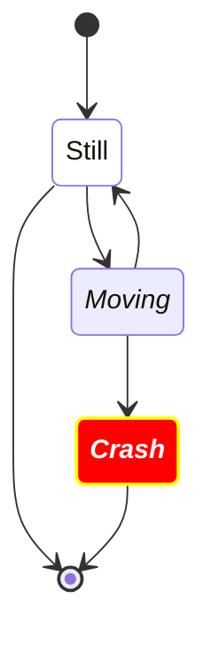

# Aula Mermaid — Personalizações em `stateDiagram`

> **Material de referência consolidado**  
> Arquivo Markdown com as **8 aulas completas** sobre personalizações em blocos Mermaid, com foco em `stateDiagram`, `classDef`, SVG, CSS, tema e correção em página HTML local-first standalone.

---

## Sumário

1. [Aula 1 — Entendendo o `stateDiagram` comando por comando](#aula-1--entendendo-o-statediagram-comando-por-comando)
2. [Aula 2 — Tipos de personalização em `stateDiagram`](#aula-2--tipos-de-personalização-em-statediagram)
3. [Aula 3 — Diagnóstico visual avançado do Mermaid dentro de uma página HTML local-first](#aula-3--diagnóstico-visual-avançado-do-mermaid-dentro-de-uma-página-html-local-first)
4. [Aula 4 — Laboratório prático de personalizações em `stateDiagram`](#aula-4--laboratório-prático-de-personalizações-em-statediagram)
5. [Aula 5 — Tabela definitiva de comandos e personalizações em `stateDiagram`](#aula-5--tabela-definitiva-de-comandos-e-personalizações-em-statediagram)
6. [Aula 6 — Estudo específico do `badBadEvent`](#aula-6--estudo-específico-do-badbadevent)
7. [Aula 7 — Como auditar e corrigir uma página HTML local-first com Markdown + Mermaid](#aula-7--como-auditar-e-corrigir-uma-página-html-local-first-com-markdown--mermaid)
8. [Aula 8 — Checklist final de correção da página + modelo de patch CSS/JS](#aula-8--checklist-final-de-correção-da-página--modelo-de-patch-cssjs)
9. [Referências oficiais](#referências-oficiais)

---

# Aula 1 — Entendendo o `stateDiagram` comando por comando

Nesta aula, o ponto de partida foi o seguinte bloco Mermaid:

````md

````

A documentação oficial do Mermaid confirma que `stateDiagram` aceita estados, transições, estado inicial/final com `[*]`, direção do diagrama, comentários, acessibilidade e estilização com `classDef`.

## 1. `stateDiagram`

```mermaid
stateDiagram
```

Esse comando diz ao Mermaid:

> Renderize este bloco como um **diagrama de estados**.

Um **diagrama de estados** representa situações possíveis de um sistema e como ele muda de uma situação para outra.

| Estado | Significado |
|---|---|
| `Still` | parado |
| `Moving` | em movimento |
| `Crash` | colidiu |

## 2. `direction TB`

```mermaid
direction TB
```

Define a direção visual do diagrama.

`TB` significa:

```txt
Top to Bottom
De cima para baixo
```

Principais opções:

| Comando | Significado | Direção |
|---|---|---|
| `direction TB` | Top to Bottom | cima → baixo |
| `direction BT` | Bottom to Top | baixo → cima |
| `direction LR` | Left to Right | esquerda → direita |
| `direction RL` | Right to Left | direita → esquerda |

`direction` altera o **layout**, não a cor, a fonte ou o estilo visual.

## 3. `accTitle`

```mermaid
accTitle: This is the accessible title
```

Define o **título acessível** do SVG gerado.

Ele não muda a aparência visual. Serve para:

- leitores de tela;
- acessibilidade;
- descrição semântica do SVG;
- tecnologias assistivas.

Na prática, pode gerar algo equivalente a:

```html
<title>This is the accessible title</title>
```

## 4. `accDescr`

```mermaid
accDescr: This is an accessible description
```

Define a **descrição acessível** do diagrama.

Também não muda a aparência visual. Pode gerar algo equivalente a:

```html
<desc>This is an accessible description</desc>
```

Também existe forma multilinha:

```mermaid
accDescr {
Este diagrama mostra o ciclo entre Still, Moving e Crash.
Ele também indica início e fim do fluxo.
}
```

## 5. `classDef notMoving fill:white`

```mermaid
classDef notMoving fill:white
```

`classDef` significa **definição de classe/estilo**.

Você cria uma classe chamada `notMoving` com a regra:

```css
fill: white;
```

No Mermaid, `fill` normalmente afeta o **fundo da forma**, isto é, o retângulo/caixa do estado.

## 6. `classDef movement font-style:italic`

```mermaid
classDef movement font-style:italic
```

Cria a classe `movement`, com:

```css
font-style: italic;
```

Ou seja:

> Todo estado com a classe `movement` deve ter texto em itálico.

Aqui não há alteração de fundo, borda ou cor. Apenas estilo da fonte.

## 7. `classDef badBadEvent ...`

```mermaid
classDef badBadEvent fill:#f00,color:white,font-weight:bold,stroke-width:2px,stroke:yellow
```

Cria a classe `badBadEvent` com múltiplas regras separadas por vírgula.

| Trecho | Tipo | O que deveria fazer |
|---|---|---|
| `fill:#f00` | fundo | deixa o estado vermelho |
| `color:white` | texto | deixa o texto branco |
| `font-weight:bold` | texto | deixa o texto em negrito |
| `stroke-width:2px` | borda | deixa a borda com 2px |
| `stroke:yellow` | borda | deixa a borda amarela |

Resultado visual esperado:

```txt
┌─────────────────┐
│ Crash em branco │  fundo vermelho
└─────────────────┘  borda amarela
```

## 8. `[*]--> Still`

```mermaid
[*]--> Still
```

Cria uma transição do **estado inicial** para `Still`.

`[*]` é um marcador especial. Quando aparece antes da seta:

```mermaid
[*] --> Still
```

significa:

```txt
início do fluxo → Still
```

## 9. `Still --> [*]`

```mermaid
Still --> [*]
```

Quando `[*]` aparece depois da seta, representa o fim do fluxo:

```txt
Still → fim do fluxo
```

| Sintaxe | Significado |
|---|---|
| `[*] --> Still` | início |
| `Still --> [*]` | fim |

## 10. Transições entre estados

```mermaid
Still --> Moving
Moving --> Still
Moving --> Crash
Crash --> [*]
```

Leitura:

| Transição | Interpretação |
|---|---|
| `Still --> Moving` | sai de parado e entra em movimento |
| `Moving --> Still` | sai de movimento e volta para parado |
| `Moving --> Crash` | a colisão ocorre a partir do movimento |
| `Crash --> [*]` | depois de `Crash`, o fluxo encerra |

## 11. `class Still notMoving`

```mermaid
class Still notMoving
```

Aplica a classe `notMoving` ao estado `Still`.

Como `notMoving` tem `fill:white`, `Still` deve receber fundo branco.

Sintaxe mental:

```txt
class [estado] [classe]
```

## 12. `class Moving, Crash movement`

```mermaid
class Moving, Crash movement
```

Aplica a classe `movement` a `Moving` e `Crash`.

Como `movement` tem `font-style:italic`, ambos deveriam ficar em itálico.

Importante: uma classe não substitui necessariamente a outra. `Crash` pode receber mais de uma classe.

## 13. `class Crash badBadEvent`

```mermaid
class Crash badBadEvent
```

Aplica `badBadEvent` ao estado `Crash`.

Então `Crash` acumula:

```css
font-style: italic;
fill: #f00;
color: white;
font-weight: bold;
stroke-width: 2px;
stroke: yellow;
```

| Propriedade | Resultado esperado em `Crash` |
|---|---|
| fundo | vermelho |
| texto | branco |
| texto | negrito |
| texto | itálico |
| borda | amarela |
| borda | 2px |

## 14. `class end badBadEvent`

```mermaid
class end badBadEvent
```

Essa linha **não significa** “aplique `badBadEvent` ao estado final”.

Ela significa:

> Aplique `badBadEvent` a um estado chamado literalmente `end`.

Mas o estado final é:

```mermaid
[*]
```

Então essa linha é enganosa e provavelmente sem efeito útil no caso.

Além disso, a documentação oficial informa limitações para aplicar `classDef` em estados de início/fim e estados compostos.

## 15. Por que o texto de `Crash` deveria ficar branco?

Por causa de:

```mermaid
classDef badBadEvent fill:#f00,color:white,font-weight:bold,stroke-width:2px,stroke:yellow
class Crash badBadEvent
```

A lógica é:

```txt
O estado Crash recebe a classe badBadEvent.
A classe badBadEvent define color:white.
Logo, o texto de Crash deveria ficar branco.
```

## 16. Por que em uma página HTML o texto pode não ficar branco?

Porque Mermaid transforma o bloco em SVG.

O SVG final pode se parecer com:

```html
<g class="state badBadEvent">
  <rect></rect>
  <text>
    <tspan>Crash</tspan>
  </text>
</g>
```

O problema ocorre se o CSS da página sobrescreve:

```css
text
tspan
.label
.stateLabel
.mermaid text
```

Exemplo perigoso:

```css
.mermaid text {
  fill: #111;
}
```

Em SVG, texto costuma ser pintado por `fill`, não apenas por `color`.

## 17. Diferença essencial entre `fill`, `color` e `stroke`

| Propriedade | Em HTML comum | Em SVG Mermaid |
|---|---|---|
| `color` | cor do texto | pode afetar texto, mas nem sempre vence |
| `fill` | geralmente não usado em texto comum | fundo de formas e também cor de texto SVG |
| `stroke` | raro em HTML comum | borda/linha/contorno SVG |
| `stroke-width` | raro em HTML comum | espessura da linha/borda SVG |

## 18. Modelo mental do problema

```txt
classDef badBadEvent
        ↓
Mermaid gera classes no SVG
        ↓
Sua página tem CSS global
        ↓
CSS global pode sobrescrever o texto
        ↓
Fundo fica vermelho, mas texto não fica branco
```

## 19. Três níveis de personalização

### 19.1 Dentro do bloco Mermaid

```mermaid
classDef danger fill:#f00,color:#fff,stroke:#ff0,stroke-width:2px
class Crash danger
```

Vantagens:

- portátil;
- funciona em GitHub/StackEdit/Mermaid Live;
- fica junto do diagrama.

Limitações:

- pode ser sobrescrito pelo CSS da página;
- pode não controlar todos os detalhes do SVG final;
- tem limitações em início/fim e estados compostos.

### 19.2 Por tema/configuração Mermaid

```mermaid
---
config:
  theme: base
  themeVariables:
    primaryColor: "#ffffff"
    primaryTextColor: "#111111"
    lineColor: "#333333"
---
stateDiagram
    [*] --> Still
```

`themeVariables` é indicado principalmente com `theme: base`.

### 19.3 Por CSS externo da página

```css
.mermaid svg .badBadEvent rect {
  fill: #f00 !important;
  stroke: yellow !important;
  stroke-width: 2px !important;
}

.mermaid svg .badBadEvent text,
.mermaid svg .badBadEvent tspan,
.mermaid svg .badBadEvent .stateLabel {
  fill: #fff !important;
  color: #fff !important;
  font-weight: 700 !important;
}
```

Esse nível é útil para página HTML local-first, mas deve ser usado com cuidado.

## 20. Diretivas antigas

Exemplo antigo:

```mermaid
%%{init: { "theme": "forest" } }%%
stateDiagram
    [*] --> Still
```

A documentação atual recomenda `config` por frontmatter:

```mermaid
---
config:
  theme: forest
---
stateDiagram
    [*] --> Still
```

## 21. Diagnóstico esperado do exemplo

| Estado | Classe aplicada | Resultado esperado |
|---|---|---|
| `Still` | `notMoving` | fundo branco |
| `Moving` | `movement` | texto itálico |
| `Crash` | `movement` + `badBadEvent` | fundo vermelho, texto branco, negrito, itálico, borda amarela |
| `[*]` inicial/final | nenhuma classe real aplicada | estilo padrão |
| `end` | tenta aplicar, mas não existe como estado visível | sem efeito prático |

## 22. Regra de ouro

Não basta procurar:

```css
.badBadEvent {
  color: white;
}
```

Também é necessário verificar:

```css
.mermaid text
.mermaid tspan
.mermaid .label
.mermaid .stateLabel
.markdown-body .mermaid text
.prose .mermaid text
svg text
svg tspan
```

Correção defensiva possível:

```css
.mermaid svg .badBadEvent text,
.mermaid svg .badBadEvent tspan,
.mermaid svg .badBadEvent .stateLabel {
  fill: #fff !important;
  color: #fff !important;
}
```

## Resumo mental da Aula 1

```txt
stateDiagram
  ↓
declara o tipo do diagrama

direction TB
  ↓
define direção visual

accTitle / accDescr
  ↓
acessibilidade do SVG, não aparência

classDef
  ↓
cria estilo nomeado

class Estado Classe
  ↓
aplica estilo ao estado

[*]
  ↓
início ou fim especial

class end badBadEvent
  ↓
não estiliza o [*]; tenta estilizar um estado chamado end

color:white
  ↓
intenção correta para texto branco

mas em SVG
  ↓
às vezes precisa vencer fill em text/tspan
```

---

# Aula 2 — Tipos de personalização em `stateDiagram`

Nesta etapa, a personalização foi separada em **camadas**, porque nem tudo é feito com `classDef`.

A documentação oficial do Mermaid para `stateDiagram` confirma suporte a estados, transições, start/end, estados compostos, choice, fork/join, notes, concurrency, direção, comentários e estilização com `classDef`.

## 1. Personalização estrutural

Aqui você muda **como o diagrama é construído**, não necessariamente as cores.

### 1.1 Estado simples

```mermaid
stateDiagram
    [*] --> Still
    Still --> Moving
    Moving --> Crash
    Crash --> [*]
```

`Still`, `Moving` e `Crash` são IDs de estados. Se um estado aparece em uma transição e ainda não foi declarado antes, o Mermaid cria esse estado automaticamente.

### 1.2 Estado com nome visual diferente do ID

Forma 1:

```mermaid
stateDiagram
    state "Usuário parado" as Still
    [*] --> Still
```

Forma 2:

```mermaid
stateDiagram
    Still: Usuário parado
    [*] --> Still
```

| Parte | Função |
|---|---|
| `Still` | ID interno usado nas transições |
| `Usuário parado` | texto exibido na tela |

Isso é útil quando o texto visual precisa ter espaço, acento, frase longa ou rótulo mais didático.

## 2. Personalização de fluxo

Aqui você muda **a leitura lógica** do diagrama.

### 2.1 Transição simples

```mermaid
stateDiagram
    Still --> Moving
```

Lê-se:

```txt
Still vai para Moving
```

### 2.2 Transição com rótulo

```mermaid
stateDiagram
    Still --> Moving: start
    Moving --> Still: stop
```

O texto depois dos dois-pontos vira o **rótulo da seta**.

### 2.3 Estado inicial e final

```mermaid
stateDiagram
    [*] --> Still
    Still --> [*]
```

| Sintaxe | Significado |
|---|---|
| `[*] --> Still` | início |
| `Still --> [*]` | fim |

`[*]` é sintaxe especial para start/stop states.

## 3. Personalização de direção/layout

```mermaid
stateDiagram
    direction TB
    [*] --> A
    A --> B
    B --> C
```

| Comando | Significado | Resultado mental |
|---|---|---|
| `direction TB` | top to bottom | cima → baixo |
| `direction BT` | bottom to top | baixo → cima |
| `direction LR` | left to right | esquerda → direita |
| `direction RL` | right to left | direita → esquerda |

**Regra prática:** para página didática, `TB` costuma funcionar melhor em tela vertical; para fluxos de processo, `LR` costuma ficar mais parecido com pipeline.

## 4. Personalização visual com `classDef`

`classDef` cria um **estilo nomeado**, parecido com uma classe CSS.

```mermaid
stateDiagram
    classDef danger fill:#f00,color:white,stroke:yellow,stroke-width:2px,font-weight:bold

    [*] --> Crash
    Crash --> [*]

    class Crash danger
```

### 4.1 Propriedades mais úteis em `classDef`

| Propriedade | Afeta | Exemplo |
|---|---|---|
| `fill` | fundo do estado | `fill:#f00` |
| `color` | cor do texto | `color:white` |
| `stroke` | cor da borda | `stroke:yellow` |
| `stroke-width` | espessura da borda | `stroke-width:2px` |
| `font-weight` | peso da fonte | `font-weight:bold` |
| `font-style` | estilo da fonte | `font-style:italic` |
| `font-size` | tamanho do texto | `font-size:18px` |
| `font-family` | família tipográfica | `font-family:Arial` |
| `stroke-dasharray` | borda tracejada | `stroke-dasharray:5 5` |

Exemplo completo:

```mermaid
stateDiagram
    classDef normal fill:#fff,color:#111,stroke:#999,stroke-width:1px
    classDef warning fill:#fff3cd,color:#664d03,stroke:#ffca2c,stroke-width:2px
    classDef danger fill:#dc3545,color:#fff,stroke:#842029,stroke-width:3px,font-weight:bold

    [*] --> Validando
    Validando --> Aprovado
    Validando --> Erro

    class Validando warning
    class Aprovado normal
    class Erro danger
```

## 5. Duas formas de aplicar estilo

### 5.1 Usando `class`

```mermaid
stateDiagram
    classDef danger fill:#f00,color:white

    [*] --> Crash
    Crash --> [*]

    class Crash danger
```

Forma mental:

```txt
class [estado] [classe]
```

### 5.2 Usando `:::`

```mermaid
stateDiagram
    classDef danger fill:#f00,color:white

    [*] --> Crash:::danger
    Crash --> [*]
```

Forma mental:

```txt
Estado:::Classe
```

### 5.3 Quando usar cada um?

| Forma | Quando usar |
|---|---|
| `class Crash danger` | melhor para leitura, manutenção e vários estados |
| `Crash:::danger` | útil para aplicar estilo diretamente na linha da transição |
| `class A,B,C danger` | bom para aplicar o mesmo estilo em vários estados |

## 6. Limitações reais do `classDef` em `stateDiagram`

A documentação lista duas limitações:

1. não pode ser aplicado a estados de início/fim pela forma comum;
2. não pode ser aplicado a estados compostos ou dentro deles.

Exemplo problemático:

```mermaid
stateDiagram
    classDef danger fill:#f00,color:white

    [*] --> A
    A --> [*]

    class end danger
```

`end` não é o estado final. O estado final é o símbolo especial `[*]`.

## 7. Personalização com estados compostos

Estado composto é um estado “grande” que contém outros estados.

```mermaid
stateDiagram
    [*] --> Pedido

    state Pedido {
        [*] --> Criado
        Criado --> Pago
        Pago --> Enviado
        Enviado --> [*]
    }

    Pedido --> Finalizado
    Finalizado --> [*]
```

Modelo mental:

```txt
Pedido
 ├─ Criado
 ├─ Pago
 └─ Enviado
```

Use quando um estado tem uma vida interna própria.

## 8. Personalização com `choice`

```mermaid
stateDiagram
    [*] --> Validar
    Validar --> Decisao

    state Decisao <<choice>>

    Decisao --> Aprovado: válido
    Decisao --> Reprovado: inválido

    Aprovado --> [*]
    Reprovado --> [*]
```

Use `choice` quando existe bifurcação lógica:

```txt
se válido   → Aprovado
se inválido → Reprovado
```

## 9. Personalização com fork/join

```mermaid
stateDiagram
    [*] --> Preparar

    state Fork <<fork>>
    state Join <<join>>

    Preparar --> Fork
    Fork --> EnviarEmail
    Fork --> RegistrarLog

    EnviarEmail --> Join
    RegistrarLog --> Join

    Join --> Finalizado
    Finalizado --> [*]
```

Leitura:

```txt
Preparar
   ↓
divide em duas tarefas
   ↓
junta novamente
   ↓
Finalizado
```

## 10. Personalização com notas

```mermaid
stateDiagram
    [*] --> Login
    Login --> Dashboard

    note right of Login
        Validar usuário,
        senha e MFA.
    end note
```

Posições principais:

| Sintaxe | Resultado |
|---|---|
| `note right of Estado` | nota à direita |
| `note left of Estado` | nota à esquerda |

## 11. Personalização com concorrência

```mermaid
stateDiagram
    [*] --> Ativo

    state Ativo {
        [*] --> PrimeiraRegiao
        PrimeiraRegiao --> Rodando

        --
        [*] --> SegundaRegiao
        SegundaRegiao --> Monitorando
    }
```

O separador `--` cria regiões paralelas dentro de um estado composto.

## 12. Personalização com comentários

```mermaid
stateDiagram
    %% Este comentário será ignorado pelo Mermaid
    [*] --> Still
    Still --> Moving
```

Comentários precisam estar em linha própria e começar com `%%`.

## 13. Personalização por tema

```mermaid
---
config:
  theme: base
  themeVariables:
    primaryColor: "#ffffff"
    primaryTextColor: "#111111"
    primaryBorderColor: "#444444"
    lineColor: "#666666"
    fontFamily: "Arial"
---
stateDiagram
    [*] --> Still
    Still --> Moving
```

Temas disponíveis: `default`, `neutral`, `dark`, `forest` e `base`. O `base` é o tema modificável via `themeVariables`.

### 13.1 Variáveis relevantes

| Variável | Uso |
|---|---|
| `fontFamily` | fonte do diagrama |
| `fontSize` | tamanho base da fonte |
| `primaryColor` | cor base de fundo dos nós |
| `primaryTextColor` | cor base do texto |
| `primaryBorderColor` | cor base de borda |
| `lineColor` | cor das linhas |
| `noteBkgColor` | fundo das notas |
| `noteTextColor` | texto das notas |
| `noteBorderColor` | borda das notas |
| `labelColor` | variável específica para labels em State |
| `altBackground` | fundo alternativo em estados compostos profundos |

## 14. Cuidado com nomes de cor no tema

Em `classDef`, é comum funcionar:

```mermaid
classDef danger fill:red,color:white
```

Mas em `themeVariables`, prefira hexadecimal:

```yaml
primaryColor: "#ff0000"
```

## 15. Diretivas antigas

Exemplo antigo:

```mermaid
%%{init: { "theme": "dark" } }%%
stateDiagram
    [*] --> Still
```

Para material novo, prefira:

```mermaid
---
config:
  theme: dark
---
stateDiagram
    [*] --> Still
```

## 16. CSS externo da página HTML

Exemplo seguro:

```css
.mermaid svg {
  max-width: 100%;
  height: auto;
}

.mermaid svg text,
.mermaid svg tspan {
  font-family: system-ui, sans-serif;
}
```

Exemplo perigoso:

```css
.mermaid svg text,
.mermaid svg tspan {
  fill: #111 !important;
}
```

Esse CSS pode fazer `Crash` continuar com texto escuro mesmo com `color:white`.

## 17. Correção defensiva para preservar `classDef`

```css
.mermaid svg .badBadEvent text,
.mermaid svg .badBadEvent tspan,
.mermaid svg .badBadEvent .stateLabel,
.mermaid svg .badBadEvent .label {
  fill: #fff !important;
  color: #fff !important;
  font-weight: 700 !important;
}

.mermaid svg .badBadEvent rect {
  fill: #f00 !important;
  stroke: yellow !important;
  stroke-width: 2px !important;
}
```

## 18. O que dá e o que não dá para personalizar com segurança

| Tipo de personalização | Melhor ferramenta | Observação |
|---|---|---|
| fundo de estado | `classDef fill` | geralmente funciona bem |
| texto do estado | `classDef color` + CSS defensivo se necessário | pode ser sobrescrito por `text/tspan fill` |
| borda do estado | `stroke`, `stroke-width` | geralmente funciona bem |
| fonte/itálico/negrito | `font-style`, `font-weight`, `font-size` | depende do SVG final |
| direção | `direction TB/LR/...` | suportado no próprio diagrama |
| nota | `note right/left of` | conteúdo explicativo |
| cor da nota | `themeVariables` | `noteBkgColor`, `noteTextColor`, `noteBorderColor` |
| tema geral | frontmatter `config` | usar `theme: base` |
| estado inicial/final | limitado | `classDef` tem limitação documentada |
| estado composto | limitado | `classDef` tem limitação documentada |
| seta individual | não é o foco documentado em `stateDiagram` | melhor não prometer `linkStyle` aqui |
| SVG final na página | CSS externo | útil, mas pode quebrar se for amplo demais |

## 19. Modelo mental definitivo

```txt
1. Mermaid syntax
   classDef, class, direction, note, state, choice, fork

2. Mermaid config/theme
   theme, themeVariables, fontFamily, labelColor, noteBkgColor

3. CSS da página HTML
   .mermaid svg, text, tspan, rect, path, .stateLabel
```

## 20. Exemplo completo didático

```mermaid
---
config:
  theme: base
  themeVariables:
    primaryColor: "#ffffff"
    primaryTextColor: "#111111"
    primaryBorderColor: "#666666"
    lineColor: "#666666"
    noteBkgColor: "#fff3cd"
    noteTextColor: "#664d03"
    noteBorderColor: "#ffca2c"
    fontFamily: "Arial"
---
stateDiagram
    direction TB

    accTitle: Fluxo de autenticação
    accDescr: Diagrama mostra login, validação, aprovação, bloqueio e erro.

    classDef normal fill:#ffffff,color:#111111,stroke:#666666,stroke-width:1px
    classDef active fill:#e7f1ff,color:#084298,stroke:#0d6efd,stroke-width:2px
    classDef success fill:#d1e7dd,color:#0f5132,stroke:#198754,stroke-width:2px
    classDef danger fill:#dc3545,color:#ffffff,stroke:#842029,stroke-width:3px,font-weight:bold
    classDef decision fill:#fff3cd,color:#664d03,stroke:#ffca2c,stroke-width:2px

    [*] --> Login
    Login --> Validar: enviar credenciais

    state ValidarCredenciais <<choice>>
    Validar --> ValidarCredenciais

    ValidarCredenciais --> Dashboard: válido
    ValidarCredenciais --> Bloqueado: muitas tentativas
    ValidarCredenciais --> Erro: inválido

    Dashboard --> [*]
    Bloqueado --> [*]
    Erro --> Login: tentar novamente

    note right of Login
        Entrada do usuário.
    end note

    class Login normal
    class Validar active
    class Dashboard success
    class Bloqueado,Erro danger
    class ValidarCredenciais decision
```

## Resumo da Aula 2

| Camada | Serve para |
|---|---|
| `state`, `ID: descrição` | mudar nome exibido |
| `-->: texto` | rotular transição |
| `direction` | mudar layout |
| `note` | adicionar explicação |
| `choice` | criar decisão |
| `fork/join` | criar divisão/junção de fluxo |
| `state { ... }` | criar estado composto |
| `classDef` | criar estilo visual |
| `class` | aplicar estilo depois |
| `:::` | aplicar estilo inline |
| `themeVariables` | configurar aparência geral |
| CSS externo | corrigir/polir SVG final da página |

---

# Aula 3 — Diagnóstico visual avançado do Mermaid dentro de uma página HTML local-first

Agora saímos da sintaxe pura do Mermaid e entramos no ponto que costuma causar bugs reais:

> O bloco Mermaid está correto, mas a página HTML renderiza diferente do GitHub, StackEdit ou Mermaid Live Editor.

Isso acontece porque o Mermaid transforma o bloco textual em **SVG**, e depois o **CSS da página** pode interferir nesse SVG.

## 1. Pipeline mental: do Markdown até o SVG

Quando você escreve:

````md
```mermaid
stateDiagram
    classDef badBadEvent fill:#f00,color:white
    [*] --> Crash
    Crash --> [*]
    class Crash badBadEvent
```
````

a página geralmente faz:

```txt
Markdown bruto
   ↓
Parser Markdown
   ↓
Bloco <pre><code class="language-mermaid">
   ↓
JS detecta blocos Mermaid
   ↓
mermaid.render() / mermaid.run()
   ↓
SVG final
   ↓
CSS da página altera o SVG
```

## 2. O erro mais comum: “o Mermaid está certo, mas o CSS final venceu”

Exemplo:

```mermaid
classDef badBadEvent fill:#f00,color:white,font-weight:bold,stroke-width:2px,stroke:yellow
class Crash badBadEvent
```

| Regra | Resultado esperado |
|---|---|
| `fill:#f00` | fundo vermelho |
| `color:white` | texto branco |
| `font-weight:bold` | texto em negrito |
| `stroke:yellow` | borda amarela |
| `stroke-width:2px` | borda mais grossa |

Só que o Mermaid gera **SVG**, e em SVG o texto é frequentemente pintado por `fill`, não apenas por `color`.

Este CSS externo pode quebrar `color:white`:

```css
.mermaid svg text,
.mermaid svg tspan {
  fill: #111 !important;
}
```

## 3. Por que o fundo muda, mas o texto não?

Porque o fundo e o texto são elementos diferentes dentro do SVG.

Estrutura conceitual:

```html
<g class="state badBadEvent">
  <rect class="basic label-container" />
  <g class="label">
    <text>
      <tspan>Crash</tspan>
    </text>
  </g>
</g>
```

Modelo mental:

```txt
Crash
├─ retângulo  → fill vermelho funcionou
└─ texto      → fill foi sobrescrito pela página
```

## 4. Diagnóstico no DevTools

### Passo 1 — Inspecione o texto

```txt
Botão direito no texto do estado → Inspecionar
```

Procure:

```html
<text>
<tspan>Crash</tspan>
```

ou:

```html
<span class="nodeLabel">Crash</span>
```

### Passo 2 — Veja qual regra venceu

Na aba Styles/Computed, procure:

```css
fill
color
font-weight
font-style
```

O problema pode vir de:

```css
.markdown-body svg text {
  fill: var(--text-color);
}
```

ou:

```css
.mermaid text {
  fill: currentColor;
}
```

ou:

```css
svg text {
  fill: #222 !important;
}
```

### Passo 3 — Verifique se a classe existe no SVG

Procure:

```html
<g class="state badBadEvent">
```

ou:

```html
<g class="state default badBadEvent">
```

Se a classe não aparece, o problema está antes:

| Causa possível | Onde olhar |
|---|---|
| Markdown alterou o bloco | parser Markdown |
| Mermaid não renderizou o bloco original | JS de renderização |
| sanitizador removeu algo | função de limpeza HTML |
| erro de sintaxe | console do navegador |
| bloco foi convertido em texto comum | pipeline Markdown |

Se a classe aparece, mas a cor não, o problema provavelmente é CSS vencendo CSS.

## 5. Checklist dos bugs visuais mais comuns

### 5.1 Texto não fica branco

Sintoma:

```txt
Crash tem fundo vermelho, mas texto preto/cinza.
```

Causa provável:

```css
.mermaid text,
.mermaid tspan {
  fill: alguma-cor;
}
```

Correção típica:

```css
.mermaid svg .badBadEvent text,
.mermaid svg .badBadEvent tspan,
.mermaid svg .badBadEvent .stateLabel,
.mermaid svg .badBadEvent .label {
  fill: #fff !important;
  color: #fff !important;
}
```

### 5.2 Mermaid gigante/desproporcional

Sintoma:

```txt
O diagrama ocupa a tela inteira ou fica muito maior que o exemplo base.
```

Causas prováveis:

```css
.mermaid svg {
  width: 100%;
  height: 100%;
}
```

ou:

```css
svg {
  width: 100vw;
}
```

Correção defensiva:

```css
.mermaid {
  max-width: 100%;
  overflow-x: auto;
}

.mermaid svg {
  display: block;
  max-width: 100%;
  height: auto;
  margin-inline: auto;
}
```

Evite:

```css
.mermaid svg {
  width: 100% !important;
  height: 100% !important;
}
```

### 5.3 Fundo colorido aparecendo onde não deveria

Sintoma:

```txt
O diagrama aparece com uma caixa/fundo cinza, azul, preto ou colorido.
```

Causa provável:

```css
pre,
code,
.markdown-body pre,
.mermaid {
  background: alguma-cor;
}
```

Correção típica:

```css
.mermaid {
  background: transparent;
}

.mermaid svg {
  background: transparent;
}
```

E, se houver wrapper:

```css
.mermaid-rendered,
.markdown-body .mermaid {
  background: transparent;
  border: 0;
}
```

### 5.4 Texto desalinhado dentro do retângulo

Causas possíveis:

1. CSS global alterou `line-height`;
2. CSS global alterou `font-size`;
3. CSS global alterou `dominant-baseline`;
4. CSS global alterou `text-anchor`;
5. wrapper HTML interferiu em `<foreignObject>`;
6. versão diferente do Mermaid gerou estrutura diferente.

Correções possíveis:

```css
.mermaid svg text,
.mermaid svg tspan {
  line-height: normal;
}
```

Se a estrutura usar `.stateLabel`:

```css
.mermaid svg .stateLabel {
  dominant-baseline: central;
  text-anchor: middle;
}
```

Cuidado: se aplicado globalmente, pode mexer em labels de setas, notas e outros textos.

### 5.5 Linha/seta sobrepondo o retângulo

Causas possíveis:

| Causa | Explicação |
|---|---|
| SVG escalado de forma errada | `width/height` forçados distorcem coordenadas visuais |
| `overflow: hidden` no container | corta parte da seta/marcador |
| CSS muda tamanho do texto depois da renderização | layout foi calculado com uma fonte/tamanho e exibido com outro |
| re-renderização duplicada | um SVG antigo fica sobreposto |
| Mermaid inicializa antes da fonte/layout estabilizar | medidas iniciais ficam erradas |

Correção base:

```css
.mermaid {
  overflow: visible;
}

.mermaid svg {
  overflow: visible;
}
```

Correção de robustez no JS:

```js
await mermaid.run({ querySelector: ".mermaid" });
```

Se a página troca tema/fonte/tamanho depois:

```js
requestAnimationFrame(() => {
  mermaid.run({ querySelector: ".mermaid" });
});
```

## 6. Regra de ouro: não estilize `svg text` globalmente

Perigoso:

```css
svg text {
  fill: var(--text-color);
}
```

Também perigoso:

```css
.mermaid text {
  fill: var(--text-color) !important;
}
```

Melhor:

```css
.markdown-body > :not(.mermaid) svg text {
  fill: var(--text-color);
}
```

ou, mais simples:

```css
.mermaid svg text {
  font-family: inherit;
}
```

sem forçar `fill`.

## 7. `classDef` não é CSS completo

O `classDef` parece CSS, mas não é a mesma coisa que escrever CSS livre.

Exemplo:

```mermaid
classDef danger fill:#f00,color:white,stroke:yellow
```

`class end badBadEvent` não estiliza automaticamente `[*]`; tenta estilizar um estado chamado `end`.

## 8. Tema Mermaid também pode interferir

Exemplo:

```js
mermaid.initialize({
  theme: "base",
  themeVariables: {
    primaryColor: "#ffffff",
    primaryTextColor: "#111111",
    lineColor: "#555555"
  }
});
```

Para `stateDiagram`, variáveis como `labelColor` e `altBackground` também são relevantes.

Exemplo útil:

```js
mermaid.initialize({
  startOnLoad: false,
  theme: "base",
  themeVariables: {
    primaryColor: "#ffffff",
    primaryTextColor: "#111111",
    primaryBorderColor: "#64748b",
    lineColor: "#64748b",
    labelColor: "#111111",
    noteBkgColor: "#fff7ed",
    noteTextColor: "#7c2d12",
    noteBorderColor: "#fdba74"
  }
});
```

## 9. Hexadecimal no tema, nomes de cor no `classDef`

No tema, prefira:

```yaml
primaryColor: "#ff0000"
```

Dentro de `classDef`, é comum funcionar:

```mermaid
classDef danger fill:red,color:white
```

Mas para robustez:

```mermaid
classDef danger fill:#ff0000,color:#ffffff
```

## 10. Diferença entre corrigir “visual” e corrigir “causa”

### Correção ruim

```css
.mermaid * {
  fill: white !important;
}
```

Problema:

```txt
Tudo fica branco: texto, linha, borda, nota, seta, marcador.
```

### Correção melhor

```css
.mermaid svg .badBadEvent text,
.mermaid svg .badBadEvent tspan {
  fill: #fff !important;
}
```

### Correção ideal

```css
/* Não force cor global nos textos Mermaid */
.mermaid svg text,
.mermaid svg tspan {
  font-family: inherit;
}

/* Preserve classe específica vinda do classDef */
.mermaid svg .badBadEvent text,
.mermaid svg .badBadEvent tspan,
.mermaid svg .badBadEvent .stateLabel,
.mermaid svg .badBadEvent .label {
  fill: #fff !important;
  color: #fff !important;
  font-weight: 700 !important;
}

/* Preserve forma visual do estado */
.mermaid svg .badBadEvent rect {
  fill: #f00 !important;
  stroke: yellow !important;
  stroke-width: 2px !important;
}
```

## 11. Diagnóstico específico para arquivo real

Procurar:

### CSS

```css
.mermaid
.mermaid svg
.mermaid text
.mermaid tspan
svg text
svg *
pre
code
.markdown-body
.prose
```

### JS

```js
mermaid.initialize(...)
mermaid.run(...)
mermaid.render(...)
marked(...)
markdown-it(...)
innerHTML
sanitize
DOMPurify
```

### HTML gerado

```html
<pre><code class="language-mermaid">
<div class="mermaid">
<svg>
<g class="state">
<rect>
<text>
<tspan>
```

### Perguntas de fluxo

```txt
1. Mermaid renderiza antes do Markdown terminar?
2. Renderiza duas vezes?
3. O bloco original é apagado corretamente?
4. O tema claro/escuro força cor depois?
5. A busca/highlight mexe dentro do SVG?
6. O CSS de code block sobra no diagrama?
7. O container força width/height?
```

## 12. Mini-protocolo de correção seguro

```txt
1. Confirmar que o bloco Mermaid chega intacto.
2. Confirmar que o Mermaid renderiza uma única vez.
3. Confirmar que a classe classDef aparece no SVG.
4. Remover CSS global que atropela text/tspan.
5. Criar CSS defensivo específico para classes Mermaid.
6. Corrigir escala do SVG sem distorcer.
7. Corrigir overflow sem cortar setas.
8. Testar modo claro/escuro.
9. Testar Markdown view/editor, se existir.
10. Testar exemplos iguais ao arquivo base.
```

## 13. CSS limpo para Mermaid local-first

```css
/* Container Mermaid */
.mermaid {
  display: block;
  max-width: 100%;
  overflow-x: auto;
  overflow-y: visible;
  background: transparent;
  text-align: center;
}

/* SVG gerado */
.mermaid svg {
  display: inline-block;
  max-width: 100%;
  height: auto;
  overflow: visible;
  background: transparent;
}

/* Não force cor global do texto; apenas fonte */
.mermaid svg text,
.mermaid svg tspan {
  font-family: inherit;
}

/* Classe Mermaid usada no exemplo oficial */
.mermaid svg .badBadEvent text,
.mermaid svg .badBadEvent tspan,
.mermaid svg .badBadEvent .label,
.mermaid svg .badBadEvent .stateLabel {
  fill: #fff !important;
  color: #fff !important;
  font-weight: 700 !important;
}

.mermaid svg .badBadEvent rect {
  fill: #f00 !important;
  stroke: yellow !important;
  stroke-width: 2px !important;
}
```

## Resumo mental da Aula 3

```txt
Bloco Mermaid correto
   ≠
Renderização final correta
```

Cadeia:

```txt
Mermaid syntax
   ↓
SVG gerado
   ↓
Tema Mermaid
   ↓
CSS da página
   ↓
resultado visual final
```

Para o caso estudado:

```txt
Se fundo vermelho funciona,
mas texto branco não funciona,
então o classDef provavelmente chegou parcialmente.
O suspeito principal é CSS em text/tspan/fill.
```

---

# Aula 4 — Laboratório prático de personalizações em `stateDiagram`

Esta aula trouxe um **laboratório de exemplos prontos**, cada um focado em um tipo de personalização. A ideia é aprender a identificar:

```txt
O que está sendo personalizado?
Onde?
Por qual comando?
Qual camada pode quebrar isso no HTML final?
```

## 1. Laboratório 1 — Estado simples + direção

```mermaid
stateDiagram
    direction TB

    [*] --> Still
    Still --> Moving
    Moving --> Crash
    Crash --> [*]
```

| Linha | Função |
|---|---|
| `stateDiagram` | declara diagrama de estados |
| `direction TB` | organiza de cima para baixo |
| `[*] --> Still` | cria estado inicial |
| `Crash --> [*]` | cria estado final |

`direction TB` altera layout, não estilo visual.

## 2. Laboratório 2 — Nome técnico diferente do nome visual

```mermaid
stateDiagram
    direction TB

    state "Usuário parado" as Still
    state "Usuário em movimento" as Moving
    state "Evento de colisão" as Crash

    [*] --> Still
    Still --> Moving
    Moving --> Crash
    Crash --> [*]
```

| Elemento | Papel |
|---|---|
| `Still` | ID interno usado no código |
| `"Usuário parado"` | texto que aparece visualmente |

Use quando o texto visual precisa ter espaço, acento, frase longa, português natural ou rótulo didático.

## 3. Laboratório 3 — Transições com rótulo

```mermaid
stateDiagram
    direction LR

    [*] --> Idle
    Idle --> Loading: clicar em carregar
    Loading --> Success: resposta 200
    Loading --> Error: falha de rede
    Success --> [*]
    Error --> Idle: tentar novamente
```

O texto depois de `:` vira o rótulo da transição.

| Caso | Exemplo |
|---|---|
| evento | `clicar em salvar` |
| condição | `se válido` |
| retorno de API | `resposta 200` |
| erro | `timeout` |
| ação do usuário | `confirmar` |

## 4. Laboratório 4 — `classDef` básico: fundo do estado

```mermaid
stateDiagram
    direction TB

    classDef parado fill:#ffffff
    classDef movimento fill:#e7f1ff
    classDef erro fill:#f8d7da

    [*] --> Still
    Still --> Moving
    Moving --> Crash
    Crash --> [*]

    class Still parado
    class Moving movimento
    class Crash erro
```

| Classe | Aplicada em | Resultado |
|---|---|---|
| `parado` | `Still` | fundo branco |
| `movimento` | `Moving` | fundo azul claro |
| `erro` | `Crash` | fundo vermelho claro |

## 5. Laboratório 5 — Fundo, texto e borda

```mermaid
stateDiagram
    direction TB

    classDef normal fill:#ffffff,color:#111111,stroke:#64748b,stroke-width:1px
    classDef danger fill:#dc2626,color:#ffffff,stroke:#facc15,stroke-width:3px,font-weight:bold

    [*] --> Normal
    Normal --> Crash
    Crash --> [*]

    class Normal normal
    class Crash danger
```

| Propriedade | Efeito esperado |
|---|---|
| `fill:#dc2626` | fundo vermelho |
| `color:#ffffff` | texto branco |
| `stroke:#facc15` | borda amarela |
| `stroke-width:3px` | borda grossa |
| `font-weight:bold` | texto negrito |

Pegadinha: `color:#ffffff` pode não vencer se a página tiver:

```css
.mermaid svg text,
.mermaid svg tspan {
  fill: #111 !important;
}
```

## 6. Laboratório 6 — Itálico, negrito e tamanho de fonte

```mermaid
stateDiagram
    direction TB

    classDef normal fill:#ffffff,color:#111111
    classDef destaque fill:#eef2ff,color:#312e81,font-style:italic,font-weight:bold,font-size:18px

    [*] --> Leitura
    Leitura --> Revisao
    Revisao --> [*]

    class Leitura normal
    class Revisao destaque
```

| Propriedade | Efeito |
|---|---|
| `font-style:italic` | itálico |
| `font-weight:bold` | negrito |
| `font-size:18px` | tamanho |

Atenção: `font-size` pode causar desalinhamento se o SVG foi medido antes de a página aplicar a fonte/tamanho final.

## 7. Laboratório 7 — Borda tracejada

```mermaid
stateDiagram
    direction LR

    classDef pending fill:#fff7ed,color:#7c2d12,stroke:#fb923c,stroke-width:2px,stroke-dasharray:5 5
    classDef done fill:#dcfce7,color:#166534,stroke:#22c55e,stroke-width:2px

    [*] --> Pendente
    Pendente --> Concluido
    Concluido --> [*]

    class Pendente pending
    class Concluido done
```

`stroke-dasharray:5 5` cria uma borda tracejada.

| Estado | Intenção visual |
|---|---|
| `Pendente` | temporário/incompleto |
| `Concluido` | finalizado |

## 8. Laboratório 8 — Aplicando classe em vários estados

```mermaid
stateDiagram
    direction TB

    classDef comum fill:#f8fafc,color:#0f172a,stroke:#94a3b8
    classDef problema fill:#fee2e2,color:#991b1b,stroke:#ef4444,font-weight:bold

    [*] --> A
    A --> B
    B --> C
    C --> Erro
    Erro --> [*]

    class A,B,C comum
    class Erro problema
```

Você pode aplicar uma classe a vários estados:

```mermaid
class A,B,C comum
```

Também pode funcionar com espaços:

```mermaid
class A, B, C comum
```

Para máxima previsibilidade, prefira sem espaços depois da vírgula.

## 9. Laboratório 9 — Aplicação inline com `:::`

```mermaid
stateDiagram
    direction TB

    classDef danger fill:#dc2626,color:#ffffff,stroke:#facc15,stroke-width:3px,font-weight:bold

    [*] --> Still
    Still --> Crash:::danger
    Crash --> [*]
```

| Forma | Exemplo | Melhor uso |
|---|---|---|
| `class` | `class Crash danger` | mais legível em diagramas médios/grandes |
| `:::` | `Crash:::danger` | bom para exemplos curtos |

## 10. Laboratório 10 — `choice` personalizado

```mermaid
stateDiagram
    direction TB

    classDef decision fill:#fef3c7,color:#92400e,stroke:#f59e0b,stroke-width:2px
    classDef success fill:#dcfce7,color:#166534,stroke:#22c55e,stroke-width:2px
    classDef danger fill:#fee2e2,color:#991b1b,stroke:#ef4444,stroke-width:2px

    [*] --> Validar

    state Decisao <<choice>>

    Validar --> Decisao
    Decisao --> Aprovado: válido
    Decisao --> Reprovado: inválido

    Aprovado --> [*]
    Reprovado --> [*]

    class Decisao decision
    class Aprovado success
    class Reprovado danger
```

`choice` é ideal para:

```txt
se válido   → Aprovado
se inválido → Reprovado
```

## 11. Laboratório 11 — Notas explicativas

```mermaid
stateDiagram
    direction LR

    [*] --> Login
    Login --> Dashboard

    note right of Login
        O usuário informa
        login e senha.
    end note

    Dashboard --> [*]
```

| Sintaxe | Resultado |
|---|---|
| `note right of Estado` | nota à direita |
| `note left of Estado` | nota à esquerda |

## 12. Laboratório 12 — Estado composto

```mermaid
stateDiagram
    direction TB

    [*] --> Pedido

    state Pedido {
        [*] --> Criado
        Criado --> Pago
        Pago --> Enviado
        Enviado --> [*]
    }

    Pedido --> Finalizado
    Finalizado --> [*]
```

Modelo mental:

```txt
Pedido
 ├─ Criado
 ├─ Pago
 └─ Enviado
```

Use quando uma macroetapa tem fluxo interno próprio.

## 13. Laboratório 13 — Concorrência com `--`

```mermaid
stateDiagram
    direction TB

    [*] --> Ativo

    state Ativo {
        [*] --> Processamento
        Processamento --> Rodando

        --

        [*] --> Monitoramento
        Monitoramento --> Observando
    }

    Ativo --> [*]
```

O separador `--` cria regiões paralelas dentro de um estado composto.

## 14. Laboratório 14 — Fork e Join

```mermaid
stateDiagram
    direction TB

    state fork_state <<fork>>
    state join_state <<join>>

    [*] --> Preparar
    Preparar --> fork_state

    fork_state --> EnviarEmail
    fork_state --> RegistrarLog

    EnviarEmail --> join_state
    RegistrarLog --> join_state

    join_state --> Finalizado
    Finalizado --> [*]
```

| Elemento | Função |
|---|---|
| `<<fork>>` | divide o fluxo |
| `<<join>>` | junta o fluxo novamente |

## 15. Laboratório 15 — Comentários Mermaid

```mermaid
stateDiagram
    %% Este comentário não aparece no diagrama

    [*] --> A
    A --> B
    B --> [*]
```

Comentários começam com `%%`.

## 16. Laboratório 16 — Tema por frontmatter

```mermaid
---
config:
  theme: base
  themeVariables:
    primaryColor: "#ffffff"
    primaryTextColor: "#111111"
    primaryBorderColor: "#64748b"
    lineColor: "#64748b"
    noteBkgColor: "#fff7ed"
    noteTextColor: "#7c2d12"
    noteBorderColor: "#fdba74"
---
stateDiagram
    direction TB

    [*] --> Login

    note right of Login
        Nota personalizada pelo tema.
    end note

    Login --> [*]
```

| Camada | Exemplo |
|---|---|
| sintaxe do diagrama | `stateDiagram`, `direction`, `classDef` |
| configuração do diagrama | `config`, `theme`, `themeVariables` |
| CSS externo da página | `.mermaid svg text { ... }` |

## 17. Laboratório 17 — O exemplo clássico do problema

```mermaid
stateDiagram
    direction TB

    accTitle: This is the accessible title
    accDescr: This is an accessible description

    classDef notMoving fill:white
    classDef movement font-style:italic
    classDef badBadEvent fill:#f00,color:white,font-weight:bold,stroke-width:2px,stroke:yellow

    [*] --> Still
    Still --> [*]
    Still --> Moving
    Moving --> Still
    Moving --> Crash
    Crash --> [*]

    class Still notMoving
    class Moving,Crash movement
    class Crash badBadEvent
    class end badBadEvent
```

| Estado | Classe | Resultado esperado |
|---|---|---|
| `Still` | `notMoving` | fundo branco |
| `Moving` | `movement` | texto itálico |
| `Crash` | `movement` + `badBadEvent` | fundo vermelho, texto branco, negrito, itálico, borda amarela |
| `end` | `badBadEvent` | provavelmente sem efeito útil |

## 18. Laboratório 18 — Versão mais limpa do exemplo anterior

```mermaid
stateDiagram
    direction TB

    accTitle: Diagrama de estados com estilos
    accDescr: Exemplo com estado parado, movimento e colisão.

    classDef notMoving fill:#ffffff,color:#111111,stroke:#64748b
    classDef movement fill:#eef2ff,color:#312e81,stroke:#6366f1,font-style:italic
    classDef badBadEvent fill:#ff0000,color:#ffffff,font-weight:bold,stroke-width:2px,stroke:#ffff00

    [*] --> Still
    Still --> [*]
    Still --> Moving
    Moving --> Still
    Moving --> Crash
    Crash --> [*]

    class Still notMoving
    class Moving movement
    class Crash movement
    class Crash badBadEvent
```

| Antes | Depois | Por quê |
|---|---|---|
| `fill:white` | `fill:#ffffff` | mais previsível |
| `color:white` | `color:#ffffff` | mais previsível |
| `stroke:yellow` | `stroke:#ffff00` | mais previsível |
| `class Moving, Crash movement` | linhas separadas | leitura mais clara |
| `class end badBadEvent` | removido | não estiliza `[*]` de forma confiável |

## 19. Laboratório 19 — CSS externo correto para preservar `badBadEvent`

```css
.mermaid svg .badBadEvent text,
.mermaid svg .badBadEvent tspan,
.mermaid svg .badBadEvent .label,
.mermaid svg .badBadEvent .stateLabel {
  fill: #ffffff !important;
  color: #ffffff !important;
  font-weight: 700 !important;
}

.mermaid svg .badBadEvent rect {
  fill: #ff0000 !important;
  stroke: #ffff00 !important;
  stroke-width: 2px !important;
}
```

Isso mira apenas elementos dentro de `.badBadEvent`.

## 20. Laboratório 20 — CSS seguro para tamanho e proporção

```css
.mermaid {
  display: block;
  max-width: 100%;
  overflow-x: auto;
  overflow-y: visible;
  background: transparent;
  text-align: center;
}

.mermaid svg {
  display: inline-block;
  max-width: 100%;
  height: auto;
  overflow: visible;
  background: transparent;
}
```

| Problema | Correção |
|---|---|
| diagrama gigante | `max-width:100%` |
| distorção | `height:auto` |
| seta cortada | `overflow:visible` |
| fundo indesejado | `background:transparent` |
| alinhamento visual | `text-align:center` + `inline-block` |

Evite:

```css
.mermaid svg {
  width: 100% !important;
  height: 100% !important;
}
```

## 21. Laboratório 21 — Exemplo completo “bem comportado”

```mermaid
---
config:
  theme: base
  themeVariables:
    primaryColor: "#ffffff"
    primaryTextColor: "#111111"
    primaryBorderColor: "#64748b"
    lineColor: "#64748b"
    noteBkgColor: "#fff7ed"
    noteTextColor: "#7c2d12"
    noteBorderColor: "#fdba74"
---
stateDiagram
    direction TB

    accTitle: Fluxo de autenticação
    accDescr: Diagrama mostra login, validação, decisão, sucesso, bloqueio e erro.

    classDef normal fill:#ffffff,color:#111111,stroke:#64748b,stroke-width:1px
    classDef active fill:#e0f2fe,color:#075985,stroke:#0284c7,stroke-width:2px
    classDef success fill:#dcfce7,color:#166534,stroke:#22c55e,stroke-width:2px
    classDef warning fill:#fef3c7,color:#92400e,stroke:#f59e0b,stroke-width:2px
    classDef danger fill:#dc2626,color:#ffffff,stroke:#facc15,stroke-width:3px,font-weight:bold

    [*] --> Login
    Login --> Validar: enviar credenciais

    state Decisao <<choice>>

    Validar --> Decisao
    Decisao --> Dashboard: válido
    Decisao --> Bloqueado: muitas tentativas
    Decisao --> Erro: inválido

    Erro --> Login: tentar novamente
    Dashboard --> [*]
    Bloqueado --> [*]

    note right of Login
        Entrada do usuário.
    end note

    note right of Erro
        Erro pode retornar
        para nova tentativa.
    end note

    class Login normal
    class Validar active
    class Decisao warning
    class Dashboard success
    class Bloqueado,Erro danger
```

## 22. Checklist para revisar qualquer bloco Mermaid

```txt
1. O tipo está correto?
   stateDiagram ou stateDiagram-v2

2. A direção está definida?
   direction TB / LR / BT / RL

3. Os estados têm IDs claros?
   Still, Moving, Crash

4. Há nomes visuais separados?
   state "Texto bonito" as ID

5. As transições têm rótulo quando necessário?
   A --> B: condição

6. O classDef está correto?
   classDef nome fill:#...,color:#...

7. As classes foram aplicadas?
   class Estado classe

8. Há tentativa de estilizar [*] como se fosse estado comum?
   class end danger → suspeito

9. Há estado composto?
   state X { ... }

10. Há CSS externo podendo sobrescrever text/tspan?
   .mermaid text, svg text, tspan
```

## Resumo da Aula 4

```txt
Personalização Mermaid em stateDiagram não é uma coisa só.
Ela se divide em:

1. estrutura
   state, transition, choice, fork, join, note

2. layout
   direction TB/LR/BT/RL

3. estilo interno
   classDef + class + :::

4. tema/configuração
   frontmatter config + themeVariables

5. CSS externo da página
   .mermaid svg, text, tspan, rect, path
```

---

# Aula 5 — Tabela definitiva de comandos e personalizações em `stateDiagram`

Esta aula funciona como **referência prática** para escrever, revisar ou corrigir blocos Mermaid dentro de uma página HTML.

## 1. Tabela geral dos comandos Mermaid em `stateDiagram`

| Comando / Sintaxe | Categoria | O que faz | Exemplo | Pegadinha |
|---|---:|---|---|---|
| `stateDiagram` | tipo do diagrama | inicia um diagrama de estados | `stateDiagram` | usa o renderer padrão/atual |
| `stateDiagram-v2` | tipo do diagrama | usa a sintaxe/renderer v2 em exemplos antigos/atuais | `stateDiagram-v2` | pode renderizar diferente dependendo da versão |
| `A --> B` | transição | liga um estado a outro | `Still --> Moving` | se `A` ou `B` não existir, Mermaid cria pelo ID |
| `A --> B: texto` | transição rotulada | adiciona texto na seta | `Login --> Dashboard: válido` | texto longo pode quebrar layout |
| `[*] --> A` | início | define começo do fluxo | `[*] --> Still` | `[*]` não é um estado comum |
| `A --> [*]` | fim | define encerramento do fluxo | `Crash --> [*]` | `class end ...` não estiliza automaticamente o `[*]` |
| `direction TB` | layout | direção de cima para baixo | `direction TB` | não muda cor nem estilo |
| `direction LR` | layout | direção da esquerda para direita | `direction LR` | pode ficar muito largo |
| `state "Texto" as ID` | estado nomeado | separa ID interno do texto visual | `state "Usuário parado" as Still` | melhor para textos com espaço/acento |
| `ID: Texto` | estado descrito | define descrição visual para um ID | `Still: Usuário parado` | bom para descrição curta |
| `state X { ... }` | estado composto | cria estado com subestados | `state Pedido { ... }` | `classDef` tem limitação em compostos |
| `state X <<choice>>` | decisão | cria bifurcação lógica | `state Decisao <<choice>>` | ideal para “se / senão” |
| `state X <<fork>>` | fork | divide fluxo em caminhos paralelos | `state fork_state <<fork>>` | normalmente usado com join |
| `state X <<join>>` | join | junta caminhos paralelos | `state join_state <<join>>` | use após fork |
| `note right of A` | nota | adiciona nota à direita | `note right of Login` | nota não é estado |
| `note left of A` | nota | adiciona nota à esquerda | `note left of Login` | nota pode aumentar largura do SVG |
| `--` | concorrência | separa regiões paralelas em estado composto | dentro de `state X { ... }` | só faz sentido dentro de composto |
| `%% comentário` | comentário | ignora linha no parser Mermaid | `%% observação` | precisa estar em linha própria |
| `classDef nome ...` | estilo | cria classe visual | `classDef danger fill:#f00` | não é CSS livre, é sintaxe Mermaid |
| `class A nome` | aplicar estilo | aplica classe a estado | `class Crash danger` | não funciona para start/end via forma comum |
| `A:::nome` | aplicar estilo inline | aplica classe no próprio uso do estado | `Crash:::danger` | pode incluir start/end em alguns usos |

## 2. Tabela de propriedades úteis em `classDef`

| Propriedade | Afeta | Exemplo | Resultado esperado | Atenção em página HTML |
|---|---:|---|---|---|
| `fill` | fundo | `fill:#f00` | fundo vermelho | em SVG também pode afetar texto se usado no seletor errado |
| `color` | texto | `color:white` | texto branco | pode ser vencido por CSS externo em `text/tspan` |
| `stroke` | borda | `stroke:yellow` | borda amarela | normalmente aplica em formas/linhas |
| `stroke-width` | borda | `stroke-width:2px` | borda mais grossa | pode alterar tamanho visual |
| `font-weight` | texto | `font-weight:bold` | negrito | pode ser sobrescrito por CSS global |
| `font-style` | texto | `font-style:italic` | itálico | usado no exemplo oficial `movement` |
| `font-size` | texto | `font-size:18px` | texto maior | pode causar desalinhamento se o SVG foi medido antes |
| `font-family` | texto | `font-family:Arial` | muda fonte | fonte diferente pode mudar largura do nó |
| `stroke-dasharray` | borda/linha | `stroke-dasharray:5 5` | borda tracejada | útil para pendente/opcional/temporário |
| `opacity` | forma/texto | `opacity:0.7` | transparência | pode prejudicar contraste |
| `color:#fff` | texto | `color:#fff` | equivalente mais previsível que `white` | preferível em material robusto |
| `fill:#ffffff` | fundo | `fill:#ffffff` | branco explícito | melhor que nome de cor para consistência |

Exemplo canônico:

```mermaid
classDef badBadEvent fill:#f00,color:white,font-weight:bold,stroke-width:2px,stroke:yellow
```

## 3. `classDef` vs CSS externo da página

| Camada | Onde fica | Exemplo | Vantagem | Risco |
|---|---|---|---|---|
| Mermaid interno | dentro do bloco Markdown | `classDef danger fill:#f00,color:#fff` | portátil e acompanha o diagrama | pode ser sobrescrito pelo CSS da página |
| Tema Mermaid | `config` / `mermaid.initialize()` | `themeVariables.primaryColor` | define aparência geral | pode não resolver classe específica |
| CSS externo | `<style>` do HTML | `.mermaid svg .danger text { fill:#fff }` | controla SVG final | se for amplo demais, quebra todos os diagramas |
| JS de renderização | script da página | `mermaid.run()` | controla quando renderiza | renderização duplicada pode gerar bug visual |

Modelo mental:

```txt
Mermaid classDef
   ↓
Mermaid gera SVG
   ↓
Tema aplica variáveis
   ↓
CSS da página pode sobrescrever
   ↓
resultado final no navegador
```

## 4. Aplicação de classe com `class` vs `:::`

| Forma | Sintaxe | Exemplo | Melhor uso | Observação |
|---|---|---|---|---|
| `class` | `class Estado Classe` | `class Crash danger` | manutenção | mais legível em diagramas grandes |
| `class` múltiplo | `class A,B Classe` | `class Moving,Crash movement` | estilo em lote | estados separados por vírgula |
| `:::` | `Estado:::Classe` | `Crash:::danger` | exemplo curto/inline | aplica no próprio uso do estado |
| múltiplas classes | `class Crash a` + `class Crash b` | `class Crash movement` + `class Crash danger` | acumular estilos | ordem/conflito depende do SVG/CSS final |

Exemplo:

```mermaid
stateDiagram
    classDef movement font-style:italic
    classDef badBadEvent fill:#f00,color:white,font-weight:bold,stroke-width:2px,stroke:yellow

    [*] --> Still
    Still --> Moving
    Moving --> Crash
    Crash --> [*]

    class Moving,Crash movement
    class Crash badBadEvent
```

`Crash` recebe duas classes: `movement` e `badBadEvent`.

## 5. Limitações oficiais de `classDef` em `stateDiagram`

| Alvo | Funciona com `class Estado Classe`? | Observação |
|---|---:|---|
| estado simples | sim | exemplo: `class Crash danger` |
| vários estados simples | sim | exemplo: `class A,B,C normal` |
| estado inicial `[*]` | não pela forma comum | `[*]` é marcador especial |
| estado final `[*]` | não pela forma comum | `class end danger` não resolve |
| estado composto | limitado/não confiável | limitação oficial |
| estado interno de composto | limitado/não confiável | limitação oficial |
| uso inline `:::` | parcialmente útil | pode ajudar em alguns usos |

Ponto crítico:

```mermaid
class end badBadEvent
```

Isso tenta aplicar classe a um estado chamado literalmente `end`, não ao `[*]`.

## 6. Personalização por tema Mermaid

| Variável | Afeta | Exemplo | Uso recomendado |
|---|---:|---|---|
| `theme` | tema geral | `theme: base` | usar `base` quando quiser customizar |
| `primaryColor` | fundo base dos nós | `primaryColor:"#ffffff"` | aparência padrão dos estados |
| `primaryTextColor` | texto dos nós | `primaryTextColor:"#111111"` | texto geral |
| `primaryBorderColor` | borda dos nós | `primaryBorderColor:"#64748b"` | borda padrão |
| `lineColor` | linhas/setas | `lineColor:"#64748b"` | setas e conexões |
| `fontFamily` | fonte | `fontFamily:"Arial"` | padronização tipográfica |
| `fontSize` | tamanho base | `fontSize:"16px"` | cuidado com desalinhamento |
| `noteBkgColor` | fundo das notas | `noteBkgColor:"#fff7ed"` | notas explicativas |
| `noteTextColor` | texto das notas | `noteTextColor:"#7c2d12"` | contraste das notas |
| `noteBorderColor` | borda das notas | `noteBorderColor:"#fdba74"` | contorno das notas |
| `labelColor` | cor de label em State | `labelColor:"#111111"` | variável específica de state |
| `altBackground` | fundo alternativo | `altBackground:"#f8fafc"` | estados compostos profundos |

## 7. Quando usar `classDef`, tema ou CSS externo

| Objetivo | Melhor ferramenta | Exemplo | Por quê |
|---|---|---|---|
| pintar um estado específico | `classDef` | `classDef danger fill:#f00,color:#fff` | fica junto do diagrama |
| pintar vários estados por categoria | `classDef` + `class` | `class Erro,Falha danger` | fácil de manter |
| definir cor geral de todos os estados | tema | `primaryColor` | aparência global consistente |
| definir cor de notas | tema | `noteBkgColor` | notas são globais no tema |
| corrigir texto que não fica branco | CSS externo restrito | `.badBadEvent text { fill:#fff }` | SVG final pode exigir `fill` |
| corrigir diagrama gigante | CSS externo | `.mermaid svg { max-width:100%; height:auto }` | problema é layout HTML/CSS |
| evitar fundo de bloco de código | CSS externo | `.mermaid { background:transparent }` | Mermaid nasce de bloco Markdown |
| corrigir renderização duplicada | JS | controlar `mermaid.run()` | problema é pipeline |
| preservar portabilidade | Mermaid puro | `classDef`, `state`, `note` | evita depender do CSS da página |

## 8. Problemas visuais e causa provável

| Sintoma | Causa provável | Onde investigar | Correção típica |
|---|---|---|---|
| texto do `Crash` não fica branco | CSS força `fill` em `text/tspan` | CSS da página | seletor específico para `.badBadEvent text/tspan` |
| fundo vermelho funciona, texto não | `fill` do `rect` aplicado, mas texto sobrescrito | DevTools no SVG | corrigir `text`, `tspan`, `.label`, `.stateLabel` |
| diagrama fica gigante | `svg width/height` forçado | CSS `.mermaid svg` | `max-width:100%; height:auto` |
| fundo colorido atrás do diagrama | estilo de `pre/code` vazando | CSS de Markdown | `background:transparent` em `.mermaid` |
| linha cruza retângulo | escala, fonte ou renderização em hora errada | CSS + JS | evitar distorção e renderizar após layout |
| texto desalinhado | fonte/tamanho/line-height alterado depois | CSS global | remover override global agressivo |
| nota aumenta demais a largura | texto longo na nota | bloco Mermaid | quebrar linha manualmente |
| `class end ...` não funciona | `end` não é `[*]` | bloco Mermaid | remover ou usar outra estratégia |
| estado composto não estiliza | limitação oficial de `classDef` | bloco Mermaid | estilizar filhos simples quando possível |
| modo escuro quebra contraste | tema/CSS global conflitante | CSS + themeVariables | definir contraste e preservar `classDef` |

## 9. Boas práticas para página local-first

| Regra | Faça | Evite |
|---|---|---|
| preservar `classDef` | deixe Mermaid controlar estilos específicos | forçar `.mermaid text { fill: ... !important }` |
| controlar escala | `max-width:100%; height:auto` | `width:100%; height:100%` sem critério |
| evitar distorção | `display:inline-block` ou `block` | esticar SVG nos dois eixos |
| manter fundo limpo | `.mermaid { background:transparent }` | herdar fundo de `pre/code` |
| corrigir cor específica | `.badBadEvent text/tspan` | `.mermaid * { fill:white }` |
| usar cor em tema | hexadecimal | nomes como `red` em `themeVariables` |
| nomear estados | `state "Texto longo" as ID` | usar ID com espaço diretamente |
| texto longo | quebrar em nota ou descrição curta | rótulo de seta enorme |
| estado final | tratar `[*]` como especial | `class end danger` |
| manutenção | classes por intenção semântica | nomes só visuais como `vermelho1` |

## 10. Template seguro

```mermaid
---
config:
  theme: base
  themeVariables:
    primaryColor: "#ffffff"
    primaryTextColor: "#111111"
    primaryBorderColor: "#64748b"
    lineColor: "#64748b"
    noteBkgColor: "#fff7ed"
    noteTextColor: "#7c2d12"
    noteBorderColor: "#fdba74"
    labelColor: "#111111"
---
stateDiagram
    direction TB

    accTitle: Fluxo de estados personalizado
    accDescr: Diagrama com estados normais, movimento e evento crítico.

    classDef normal fill:#ffffff,color:#111111,stroke:#64748b,stroke-width:1px
    classDef movement fill:#eef2ff,color:#312e81,stroke:#6366f1,font-style:italic
    classDef danger fill:#ff0000,color:#ffffff,font-weight:bold,stroke:#ffff00,stroke-width:2px

    [*] --> Still
    Still --> Moving: iniciar
    Moving --> Still: parar
    Moving --> Crash: colisão
    Crash --> [*]

    note right of Crash
        Evento crítico.
        Deve aparecer com texto branco.
    end note

    class Still normal
    class Moving movement
    class Crash movement
    class Crash danger
```

## 11. CSS externo seguro para preservar o template

```css
.mermaid {
  display: block;
  max-width: 100%;
  overflow-x: auto;
  overflow-y: visible;
  background: transparent;
  text-align: center;
}

.mermaid svg {
  display: inline-block;
  max-width: 100%;
  height: auto;
  overflow: visible;
  background: transparent;
}

.mermaid svg text,
.mermaid svg tspan {
  font-family: inherit;
}

.mermaid svg .danger text,
.mermaid svg .danger tspan,
.mermaid svg .danger .label,
.mermaid svg .danger .stateLabel {
  fill: #ffffff !important;
  color: #ffffff !important;
  font-weight: 700 !important;
}

.mermaid svg .danger rect {
  fill: #ff0000 !important;
  stroke: #ffff00 !important;
  stroke-width: 2px !important;
}
```

## 12. Checklist final antes de corrigir uma página

```txt
1. O bloco Mermaid chega intacto ao renderer?
2. O Markdown preserva classDef, class, :::, accTitle e accDescr?
3. O Mermaid renderiza uma única vez?
4. A classe personalizada aparece no SVG final?
5. O CSS global sobrescreve .mermaid text, tspan, .label ou .stateLabel?
6. O SVG está sendo esticado por width, height, transform ou container?
7. O fundo do bloco de código está vazando para o Mermaid?
8. O modo claro/escuro altera contraste indevidamente?
9. O exemplo oficial badBadEvent fica igual ao arquivo base?
10. A correção preserva os demais diagramas e funcionalidades?
```

## Resumo mental da Aula 5

```txt
Para personalizar Mermaid stateDiagram:

1. Estrutura:
   state, transition, choice, fork, join, note

2. Layout:
   direction TB/LR/BT/RL

3. Estilo interno:
   classDef + class + :::

4. Tema:
   config + themeVariables

5. Correção HTML real:
   CSS/JS do renderer local-first
```

---

# Aula 6 — Estudo específico do `badBadEvent`

Foco exato:

```mermaid
classDef badBadEvent fill:#f00,color:white,font-weight:bold,stroke-width:2px,stroke:yellow
class Crash badBadEvent
```

A documentação oficial usa `classDef` em `stateDiagram` para definir estilos nomeados e aplicá-los a estados. Também informa limitações: `classDef` não pode ser aplicado a estados de início/fim pela forma comum e não pode ser aplicado a estados compostos ou dentro deles.

## 1. O bloco Mermaid está semanticamente correto?

Sim, para `Crash`, está.

```mermaid
classDef badBadEvent fill:#f00,color:white,font-weight:bold,stroke-width:2px,stroke:yellow
```

Define a classe `badBadEvent` com:

| Propriedade | Intenção |
|---|---|
| `fill:#f00` | fundo vermelho |
| `color:white` | texto branco |
| `font-weight:bold` | texto negrito |
| `stroke-width:2px` | borda com 2px |
| `stroke:yellow` | borda amarela |

```mermaid
class Crash badBadEvent
```

significa:

```txt
aplique a classe badBadEvent ao estado Crash
```

Logo:

```txt
Crash = fundo vermelho + texto branco + negrito + borda amarela
```

## 2. `fill` não significa sempre a mesma coisa

Dentro do `classDef`:

```mermaid
fill:#f00
```

normalmente afeta o **fundo do estado**.

Mas no SVG final, `fill` também pode pintar texto.

| Contexto | `fill` costuma afetar |
|---|---|
| `classDef` aplicado ao estado | fundo/forma do estado |
| SVG final em `text`/`tspan` | cor visual do texto |

Se a página tem:

```css
.mermaid svg text,
.mermaid svg tspan {
  fill: #111;
}
```

o texto pode ficar escuro mesmo com:

```mermaid
color:white
```

## 3. Por que fundo vermelho funciona e texto branco não?

Estrutura conceitual:

```html
<g class="state badBadEvent">
  <rect class="basic label-container"></rect>

  <g class="label">
    <text>
      <tspan>Crash</tspan>
    </text>
  </g>
</g>
```

O retângulo recebe:

```css
fill: #f00;
```

Mas o texto interno pode receber:

```css
.mermaid svg text,
.mermaid svg tspan {
  fill: var(--alguma-cor-global);
}
```

Resultado:

```txt
Retângulo: vermelho ✅
Texto: escuro ❌
```

## 4. Diferença prática entre `color:white` e `fill:white`

Em HTML comum:

```css
color: white;
```

Em SVG, frequentemente:

```css
fill: white;
```

Então, na página final, para blindar o SVG, pode ser necessário garantir:

```css
fill: #fff;
```

em:

```css
text,
tspan,
.label,
.stateLabel
```

## 5. Correção errada: forçar tudo globalmente

```css
.mermaid svg text,
.mermaid svg tspan {
  fill: #fff !important;
}
```

Riscos:

| Elemento | Risco |
|---|---|
| estados normais | texto invisível em fundo claro |
| notas | contraste ruim |
| labels de transição | texto branco em fundo branco |
| outros exemplos Mermaid | ficam diferentes do esperado |
| modo claro/escuro | contraste inconsistente |

## 6. Correção correta: mirar só em `.badBadEvent`

```css
.mermaid svg .badBadEvent text,
.mermaid svg .badBadEvent tspan,
.mermaid svg .badBadEvent .label,
.mermaid svg .badBadEvent .stateLabel {
  fill: #fff !important;
  color: #fff !important;
  font-weight: 700 !important;
}
```

Para a forma:

```css
.mermaid svg .badBadEvent rect,
.mermaid svg .badBadEvent .label-container {
  fill: #f00 !important;
  stroke: yellow !important;
  stroke-width: 2px !important;
}
```

Isso afeta somente elementos dentro de `.badBadEvent`.

## 7. Por que usar vários seletores?

A estrutura SVG varia conforme:

- versão do Mermaid;
- tipo de diagrama;
- tema;
- `htmlLabels`;
- estrutura de renderização;
- pipeline Markdown da página.

| Seletor | Por que existe |
|---|---|
| `.badBadEvent text` | pega texto SVG direto |
| `.badBadEvent tspan` | pega partes internas do texto |
| `.badBadEvent .label` | pega wrapper de label |
| `.badBadEvent .stateLabel` | pega classe semântica de label de estado |
| `.badBadEvent rect` | pega retângulo do estado |
| `.badBadEvent .label-container` | pega forma/caixa do label |

## 8. Sobre `class end badBadEvent`

```mermaid
class end badBadEvent
```

Não estiliza o estado final.

O estado final é:

```mermaid
[*]
```

`end` seria um estado comum chamado literalmente `end`.

Recomendação:

```mermaid
%% remover:
class end badBadEvent
```

ou manter apenas se existir um estado chamado `end`.

## 9. `accTitle` e `accDescr` não influenciam a cor

```mermaid
accTitle: This is the accessible title
accDescr: This is an accessible description
```

Esses comandos são para acessibilidade, não estilo visual.

## 10. O tema também pode interferir

Exemplo:

```js
mermaid.initialize({
  startOnLoad: false,
  theme: "base",
  themeVariables: {
    primaryColor: "#ffffff",
    primaryTextColor: "#111111",
    lineColor: "#64748b"
  }
});
```

Mas se:

```txt
fundo vermelho aparece
texto branco não aparece
```

o suspeito principal continua sendo CSS vencendo `text/tspan/fill`.

## 11. Diagnóstico no DevTools

### Passo 1

Inspecione `Crash`.

Procure:

```html
<text>
  <tspan>Crash</tspan>
</text>
```

ou:

```html
<span class="nodeLabel">Crash</span>
```

### Passo 2

Procure `.badBadEvent`:

```html
<g class="state badBadEvent">
```

## 12. Cenário A — `.badBadEvent` aparece no SVG

Conclusão:

```txt
Mermaid entendeu o classDef ✅
Mermaid aplicou a classe no estado ✅
CSS final está sobrescrevendo o texto ❌
```

Correção provável:

```css
.mermaid svg .badBadEvent text,
.mermaid svg .badBadEvent tspan,
.mermaid svg .badBadEvent .label,
.mermaid svg .badBadEvent .stateLabel {
  fill: #fff !important;
  color: #fff !important;
  font-weight: 700 !important;
}
```

## 13. Cenário B — `.badBadEvent` NÃO aparece no SVG

O problema está antes do CSS.

| Causa | Sintoma |
|---|---|
| Markdown alterou o bloco | `classDef` sumiu ou virou texto |
| sanitizador removeu algo | SVG sem classes esperadas |
| bloco renderizou como código comum | aparece como texto, não diagrama |
| erro de parser Mermaid | console mostra erro |
| renderização duplicada | SVG antigo sem classe fica visível |
| bloco foi normalizado | espaços/linhas alteraram comando |

## 14. Pipeline a auditar

```js
marked.parse(...)
markdownit.render(...)
DOMPurify.sanitize(...)
mermaid.initialize(...)
mermaid.run(...)
mermaid.render(...)
innerHTML = ...
```

E CSS:

```css
.mermaid text
.mermaid tspan
.markdown-body svg text
.prose svg text
svg text
svg *
pre code
```

## 15. Correção CSS base

```css
.mermaid {
  display: block;
  max-width: 100%;
  overflow-x: auto;
  overflow-y: visible;
  background: transparent;
  text-align: center;
}

.mermaid svg {
  display: inline-block;
  max-width: 100%;
  height: auto;
  overflow: visible;
  background: transparent;
}

.mermaid svg text,
.mermaid svg tspan {
  font-family: inherit;
}

.mermaid svg .badBadEvent text,
.mermaid svg .badBadEvent tspan,
.mermaid svg .badBadEvent .label,
.mermaid svg .badBadEvent .stateLabel {
  fill: #fff !important;
  color: #fff !important;
  font-weight: 700 !important;
}

.mermaid svg .badBadEvent rect,
.mermaid svg .badBadEvent .label-container {
  fill: #f00 !important;
  stroke: yellow !important;
  stroke-width: 2px !important;
}
```

## 16. Correção no bloco Mermaid

Versão mais previsível:

```mermaid
stateDiagram
    direction TB

    accTitle: This is the accessible title
    accDescr: This is an accessible description

    classDef notMoving fill:#ffffff,color:#111111
    classDef movement font-style:italic
    classDef badBadEvent fill:#ff0000,color:#ffffff,font-weight:bold,stroke-width:2px,stroke:#ffff00

    [*] --> Still
    Still --> [*]
    Still --> Moving
    Moving --> Still
    Moving --> Crash
    Crash --> [*]

    class Still notMoving
    class Moving,Crash movement
    class Crash badBadEvent
```

| Antes | Depois | Motivo |
|---|---|---|
| `fill:white` | `fill:#ffffff` | mais explícito |
| `color:white` | `color:#ffffff` | mais explícito |
| `fill:#f00` | `fill:#ff0000` | equivalente, mais legível |
| `stroke:yellow` | `stroke:#ffff00` | mais explícito |
| `class end badBadEvent` | removido | não estiliza `[*]` |

## 17. Diagnóstico em uma frase

> `classDef badBadEvent` está correto para `Crash`, mas a página HTML pode sobrescrever a cor do texto SVG por meio de CSS aplicado em `text`, `tspan`, `.label` ou `.stateLabel`.

## 18. Regra de ouro

```txt
Não forçar estilo global no Mermaid.
Preservar o estilo que vem do próprio bloco Mermaid.
Corrigir apenas o que o CSS da página estiver sobrescrevendo.
```

Errado:

```css
.mermaid * { fill: white !important; }
```

Certo:

```css
.mermaid svg .badBadEvent text,
.mermaid svg .badBadEvent tspan {
  fill: #fff !important;
}
```

## Resumo mental da Aula 6

```txt
classDef badBadEvent
   ↓
define fundo vermelho + texto branco + borda amarela

class Crash badBadEvent
   ↓
aplica esse estilo ao estado Crash

se fundo vermelho funciona e texto branco não:
   ↓
classe chegou no SVG, mas texto foi sobrescrito

suspeitos:
   .mermaid text
   .mermaid tspan
   svg text
   .label
   .stateLabel

correção:
   mirar somente em .badBadEvent text/tspan
```

---

# Aula 7 — Como auditar e corrigir uma página HTML local-first com Markdown + Mermaid

Cenário real:

```txt
HTML único
+ CSS interno
+ JavaScript interno
+ Markdown
+ blocos ```mermaid
+ renderização local-first
+ tema claro/escuro
+ busca/highlight
+ visualização/editor
```

Objetivo: corrigir com precisão, sem gambiarra global que arruma um exemplo e quebra outros.

## 1. Primeiro princípio: Mermaid não é só texto, vira SVG

Quando a página recebe:

````md
```mermaid
stateDiagram
    classDef badBadEvent fill:#f00,color:white,font-weight:bold,stroke-width:2px,stroke:yellow
    [*] --> Crash
    Crash --> [*]
    class Crash badBadEvent
```
````

o fluxo típico é:

```txt
Markdown bruto
   ↓
parser Markdown
   ↓
HTML gerado
   ↓
detecção dos blocos Mermaid
   ↓
Mermaid renderiza
   ↓
SVG final
   ↓
CSS da página afeta o SVG
```

## 2. O que pode quebrar em cada camada

### Camada 1 — Markdown bruto

Problemas possíveis:

| Problema | Sintoma |
|---|---|
| bloco não preservado | Mermaid aparece como texto comum |
| indentação alterada | parser Mermaid dá erro |
| aspas/acentos mexidos | estado ou nota quebra |
| `classDef` removido | estilo não aparece |
| `accTitle`/`accDescr` removidos | acessibilidade some |

### Camada 2 — Parser Markdown

Exemplos:

```js
marked.parse(markdown)
```

ou:

```js
markdownit.render(markdown)
```

O parser pode gerar:

```html
<pre><code class="language-mermaid">
...
</code></pre>
```

mas o JS esperar:

```html
<div class="mermaid">
...
</div>
```

### Camada 3 — Sanitização de HTML

Exemplo:

```js
DOMPurify.sanitize(html)
```

Impactos possíveis:

| Remoção | Consequência |
|---|---|
| remove `class` | `.badBadEvent` não chega no SVG |
| remove `style` | estilos inline do Mermaid podem sumir |
| remove SVG | diagrama não aparece |
| remove atributos ARIA/title/desc | acessibilidade piora |

### Camada 4 — Mermaid render

Exemplo:

```js
mermaid.initialize({
  startOnLoad: false
});
```

Depois:

```js
mermaid.run({ querySelector: ".mermaid" });
```

ou:

```js
mermaid.render(id, code)
```

Problemas comuns:

| Problema | Sintoma |
|---|---|
| renderiza antes do Markdown terminar | Mermaid não aparece |
| renderiza duas vezes | SVG duplicado |
| renderiza SVG antigo | correção parece não funcionar |
| usa `startOnLoad:true` + render manual | comportamento imprevisível |
| tema muda depois da renderização | cores desalinhadas |
| tema claro/escuro não re-renderiza | contraste errado |

### Camada 5 — CSS externo da página

Exemplo perigoso:

```css
.mermaid svg text,
.mermaid svg tspan {
  fill: var(--text-color) !important;
}
```

Resultado:

```txt
fundo vermelho funciona
texto branco não funciona
```

## 3. Regra principal da auditoria

```txt
Nunca corrigir Mermaid com CSS global agressivo antes de saber quem está sobrescrevendo quem.
```

Evite:

```css
.mermaid * {
  fill: white !important;
}
```

e:

```css
.mermaid svg text {
  fill: #111 !important;
}
```

## 4. Ordem correta de investigação

### Passo 1 — Confirmar que o bloco chega intacto

```mermaid
stateDiagram
    classDef badBadEvent fill:#f00,color:white,font-weight:bold,stroke-width:2px,stroke:yellow
    [*] --> Crash
    Crash --> [*]
    class Crash badBadEvent
```

Se a página alterou vírgulas, quebras de linha ou removeu `classDef`, o problema está antes do CSS.

### Passo 2 — Confirmar renderização única

Sintomas de renderização duplicada:

```txt
um SVG dentro de outro
diagrama repetido
estilo parece antigo
evento de tema duplica diagrama
bloco original ainda aparece junto do SVG
```

Procurar:

```js
mermaid.run();
mermaid.run();
```

ou:

```js
renderMarkdown();
renderMermaid();
renderMarkdown();
renderMermaid();
```

### Passo 3 — Confirmar se `.badBadEvent` aparece no SVG

```html
<g class="state badBadEvent">
```

Se aparece, Mermaid entendeu a classe.

Se não aparece, investigar parser Markdown, sanitização, renderização, versão/configuração Mermaid ou erro de sintaxe.

### Passo 4 — Confirmar quem pinta o texto

Inspecione `Crash` e procure:

```css
fill
color
font-weight
font-style
```

Se aparecer:

```css
fill: #111;
```

vindo de `.mermaid text` ou `svg text`, achamos o conflito.

## 5. Correção cirúrgica para `badBadEvent`

```css
.mermaid svg .badBadEvent text,
.mermaid svg .badBadEvent tspan,
.mermaid svg .badBadEvent .label,
.mermaid svg .badBadEvent .stateLabel {
  fill: #fff !important;
  color: #fff !important;
  font-weight: 700 !important;
}
```

Para o retângulo:

```css
.mermaid svg .badBadEvent rect,
.mermaid svg .badBadEvent .label-container {
  fill: #f00 !important;
  stroke: yellow !important;
  stroke-width: 2px !important;
}
```

## 6. Correção de escala/tamanho

```css
.mermaid {
  display: block;
  max-width: 100%;
  overflow-x: auto;
  overflow-y: visible;
  background: transparent;
  text-align: center;
}

.mermaid svg {
  display: inline-block;
  max-width: 100%;
  height: auto;
  overflow: visible;
  background: transparent;
}
```

Evite:

```css
.mermaid svg {
  width: 100% !important;
  height: 100% !important;
}
```

## 7. Correção para fundo herdado

```css
.mermaid,
.markdown-body .mermaid,
.prose .mermaid {
  background: transparent;
  border: 0;
}
```

Se houver wrapper:

```css
.mermaid-rendered {
  background: transparent;
  border: 0;
}
```

## 8. Correção para tema claro/escuro

Evite:

```css
[data-theme="dark"] .mermaid text {
  fill: #e5e7eb !important;
}
```

Melhor:

```css
[data-theme="dark"] .mermaid svg text,
[data-theme="dark"] .mermaid svg tspan {
  font-family: inherit;
}
```

E preservar classes:

```css
[data-theme="dark"] .mermaid svg .badBadEvent text,
[data-theme="dark"] .mermaid svg .badBadEvent tspan,
[data-theme="dark"] .mermaid svg .badBadEvent .label,
[data-theme="dark"] .mermaid svg .badBadEvent .stateLabel {
  fill: #fff !important;
  color: #fff !important;
}
```

## 9. Como não quebrar busca/highlight

A busca não deve modificar conteúdo dentro do SVG.

```js
function shouldSkipHighlight(node) {
  return Boolean(
    node.closest(".mermaid") ||
    node.closest("svg")
  );
}
```

Isso evita `<mark>` dentro do SVG.

## 10. Como não quebrar editor/view Markdown

Fluxo seguro:

```txt
Editor:
    mantém Markdown bruto

Visualização:
    renderiza Markdown
    converte blocos Mermaid
    renderiza Mermaid

Voltar ao editor:
    usa Markdown original
    não usa HTML renderizado
```

Erro clássico:

```txt
editar o HTML renderizado em vez do Markdown original
```

## 11. Organização segura do JS

```js
async function renderMarkdownView(markdown, target) {
  const html = marked.parse(markdown);
  target.innerHTML = html;
  prepareMermaidBlocks(target);
  await renderMermaid(target);
}
```

```js
function prepareMermaidBlocks(container) {
  const blocks = container.querySelectorAll(
    'pre code.language-mermaid, pre code.lang-mermaid'
  );

  blocks.forEach((codeBlock) => {
    const pre = codeBlock.closest("pre");
    const mermaidDiv = document.createElement("div");

    mermaidDiv.className = "mermaid";
    mermaidDiv.textContent = codeBlock.textContent;

    pre.replaceWith(mermaidDiv);
  });
}
```

```js
async function renderMermaid(container) {
  const blocks = container.querySelectorAll(".mermaid");

  if (!blocks.length) return;

  await mermaid.run({
    nodes: Array.from(blocks)
  });
}
```

## 12. Inicialização recomendada

```js
mermaid.initialize({
  startOnLoad: false,
  theme: "base",
  securityLevel: "strict",
  themeVariables: {
    primaryColor: "#ffffff",
    primaryTextColor: "#111111",
    primaryBorderColor: "#64748b",
    lineColor: "#64748b",
    noteBkgColor: "#fff7ed",
    noteTextColor: "#7c2d12",
    noteBorderColor: "#fdba74"
  }
});
```

| Configuração | Função |
|---|---|
| `startOnLoad:false` | evita renderização automática fora do controle |
| `theme:"base"` | permite customização por `themeVariables` |
| `securityLevel:"strict"` | postura mais segura por padrão |
| `themeVariables` | define visual base sem impedir `classDef` |

## 13. `securityLevel: "strict"` ou `"loose"`

| Modo | Uso |
|---|---|
| `strict` | mais seguro, recomendado como padrão defensivo |
| `loose` | mais permissivo, pode ser necessário para alguns recursos, mas aumenta superfície de risco |

Em página local-first educacional, tente manter `strict`.

## 14. Checklist de auditoria antes de editar

```txt
1. Localizar todos os blocos Mermaid.
2. Verificar como o Markdown vira HTML.
3. Verificar se os blocos Mermaid chegam intactos.
4. Verificar se o Mermaid inicializa uma única vez.
5. Verificar se o SVG contém as classes esperadas.
6. Procurar CSS global que afeta .mermaid, svg, text, tspan, rect, path.
7. Corrigir CSS amplo demais.
8. Adicionar CSS específico só quando necessário.
9. Testar modo claro e escuro.
10. Testar busca/highlight.
11. Testar visualização Markdown.
12. Testar editor, se existir.
13. Testar exemplos oficiais, principalmente badBadEvent.
14. Garantir que não houve duplicação de funções.
15. Garantir que o comportamento original foi preservado.
```

## 15. Padrão seguro de correção

```txt
Primeiro remover interferência global.
Depois preservar comportamento Mermaid nativo.
Por último adicionar exceções específicas.
```

Antes:

```css
.mermaid svg text {
  fill: var(--text-color) !important;
}
```

Depois:

```css
.mermaid svg text,
.mermaid svg tspan {
  font-family: inherit;
}
```

Exceção específica:

```css
.mermaid svg .badBadEvent text,
.mermaid svg .badBadEvent tspan,
.mermaid svg .badBadEvent .label,
.mermaid svg .badBadEvent .stateLabel {
  fill: #fff !important;
  color: #fff !important;
}
```

## 16. O que não fazer

Evitar:

```css
.mermaid * {
  all: unset;
}
```

```css
.mermaid svg * {
  fill: currentColor !important;
}
```

```css
svg text {
  fill: var(--text-color) !important;
}
```

```js
document.body.innerHTML = document.body.innerHTML.replace(...)
```

```js
setTimeout(() => mermaid.run(), 1000)
```

## 17. O que fazer

### Bloco 1 — CSS base Mermaid

```css
.mermaid {
  display: block;
  max-width: 100%;
  overflow-x: auto;
  overflow-y: visible;
  background: transparent;
  text-align: center;
}

.mermaid svg {
  display: inline-block;
  max-width: 100%;
  height: auto;
  overflow: visible;
  background: transparent;
}
```

### Bloco 2 — Não forçar texto global

```css
.mermaid svg text,
.mermaid svg tspan {
  font-family: inherit;
}
```

### Bloco 3 — Proteção específica

```css
.mermaid svg .badBadEvent text,
.mermaid svg .badBadEvent tspan,
.mermaid svg .badBadEvent .label,
.mermaid svg .badBadEvent .stateLabel {
  fill: #fff !important;
  color: #fff !important;
  font-weight: 700 !important;
}

.mermaid svg .badBadEvent rect,
.mermaid svg .badBadEvent .label-container {
  fill: #f00 !important;
  stroke: yellow !important;
  stroke-width: 2px !important;
}
```

## 18. Resumo mental da Aula 7

```txt
Página local-first com Mermaid tem 5 camadas:

1. Markdown bruto
2. Parser Markdown
3. Sanitização
4. Mermaid render
5. CSS final da página
```

```txt
❌ .mermaid * { fill:white !important; }
✅ .mermaid svg .badBadEvent text/tspan { fill:#fff !important; }
```

```txt
entender → confirmar → corrigir escopo mínimo → testar regressão
```

---

# Aula 8 — Checklist final de correção da página + modelo de patch CSS/JS

Esta aula consolidou o procedimento a aplicar quando um HTML é enviado para correção.

A ideia é corrigir Mermaid com foco em personalização, sem quebrar:

```txt
Markdown
visualização
editor
busca/highlight
tema claro/escuro
layout responsivo
demais blocos de código
demais diagramas Mermaid
```

## 1. Objetivo da correção

O alvo não é “forçar o Mermaid a ficar bonito de qualquer jeito”.

O alvo correto é:

```txt
Preservar a intenção visual escrita dentro do próprio bloco Mermaid.
```

Exemplo:

```mermaid
classDef badBadEvent fill:#f00,color:white,font-weight:bold,stroke-width:2px,stroke:yellow
class Crash badBadEvent
```

| Parte | Resultado esperado |
|---|---|
| `fill:#f00` | fundo vermelho |
| `color:white` | texto branco |
| `font-weight:bold` | texto negrito |
| `stroke-width:2px` | borda grossa |
| `stroke:yellow` | borda amarela |

Se a página mostra fundo vermelho, mas não mostra texto branco, o problema provavelmente está na **camada CSS/SVG final**, não na sintaxe Mermaid.

## 2. Checklist de auditoria no HTML

### 2.1 Localizar blocos Mermaid

Procurar:

```html
<pre><code class="language-mermaid">
```

```html
<code class="lang-mermaid">
```

```html
<div class="mermaid">
```

```js
mermaid.render(...)
mermaid.run(...)
mermaid.initialize(...)
```

### 2.2 Verificar se o Markdown preserva o bloco original

Exemplo correto:

````md
```mermaid
stateDiagram
    direction TB
    classDef badBadEvent fill:#f00,color:white,font-weight:bold,stroke-width:2px,stroke:yellow
    [*] --> Crash
    Crash --> [*]
    class Crash badBadEvent
```
````

Problemas:

| Problema | Efeito |
|---|---|
| parser remove `classDef` | estilo some |
| parser altera quebras de linha | Mermaid pode falhar |
| sanitizador remove `class` | SVG perde seletor |
| busca/highlight injeta `<mark>` | SVG/Markdown pode quebrar |
| renderização dupla | visual fica inconsistente |

### 2.3 Verificar inicialização do Mermaid

```js
mermaid.initialize({
  startOnLoad: true
});
```

ou:

```js
mermaid.initialize({
  startOnLoad: false
});
```

Para Markdown/view/editor, normalmente é melhor:

```js
mermaid.initialize({
  startOnLoad: false
});
```

Assim a página decide **quando** renderizar.

### 2.4 Verificar se o SVG recebe a classe

Depois do render, `Crash` deveria gerar algo como:

```html
<g class="state badBadEvent">
```

Se `.badBadEvent` aparece:

```txt
Mermaid entendeu o classDef.
O CSS final provavelmente está sobrescrevendo o texto.
```

Se `.badBadEvent` não aparece:

```txt
O problema está antes do CSS:
Markdown, sanitização, renderização, parser ou erro Mermaid.
```

## 3. Checklist CSS: seletores perigosos

Procurar:

```css
.mermaid text
.mermaid tspan
.mermaid svg text
.mermaid svg tspan
svg text
svg tspan
svg *
.markdown-body svg text
.prose svg text
pre code
code
```

Maior suspeito:

```css
.mermaid svg text,
.mermaid svg tspan {
  fill: var(--text-color) !important;
}
```

## 4. Modelo de patch CSS seguro

### 4.1 Base Mermaid: proporção, overflow e fundo

```css
/* Mermaid: container seguro para página local-first */
.mermaid {
  display: block;
  max-width: 100%;
  overflow-x: auto;
  overflow-y: visible;
  background: transparent;
  text-align: center;
}

/* SVG Mermaid: preserva proporção natural */
.mermaid svg {
  display: inline-block;
  max-width: 100%;
  height: auto;
  overflow: visible;
  background: transparent;
}
```

| Sintoma | Causa comum |
|---|---|
| diagrama gigante | `width/height` forçado |
| diagrama distorcido | `height:100%` junto com `width:100%` |
| seta cortada | `overflow:hidden` |
| fundo indevido | herança de `pre/code` |

### 4.2 Não forçar cor global do texto Mermaid

Evitar:

```css
.mermaid svg text,
.mermaid svg tspan {
  fill: var(--text-color) !important;
}
```

Mais seguro:

```css
/* Preserve fonte, mas não destrua as cores do Mermaid/classDef */
.mermaid svg text,
.mermaid svg tspan {
  font-family: inherit;
}
```

Regra mental:

```txt
Fonte pode herdar.
Cor não deve ser forçada globalmente.
```

### 4.3 Preservar especificamente `badBadEvent`

```css
/* Preserva texto branco definido pela classe Mermaid badBadEvent */
.mermaid svg .badBadEvent text,
.mermaid svg .badBadEvent tspan,
.mermaid svg .badBadEvent .label,
.mermaid svg .badBadEvent .stateLabel {
  fill: #fff !important;
  color: #fff !important;
  font-weight: 700 !important;
}

/* Preserva fundo vermelho e borda amarela */
.mermaid svg .badBadEvent rect,
.mermaid svg .badBadEvent .label-container {
  fill: #f00 !important;
  stroke: yellow !important;
  stroke-width: 2px !important;
}
```

Isso é uma correção **cirúrgica**: só afeta elementos dentro de `.badBadEvent`.

## 5. Modelo de patch JS seguro

Se o problema estiver no pipeline:

```js
function prepareMermaidBlocks(container) {
  const blocks = container.querySelectorAll(
    'pre code.language-mermaid, pre code.lang-mermaid'
  );

  blocks.forEach((codeBlock, index) => {
    const pre = codeBlock.closest('pre');
    if (!pre) return;

    const mermaidDiv = document.createElement('div');
    mermaidDiv.className = 'mermaid';
    mermaidDiv.textContent = codeBlock.textContent.trim();

    pre.replaceWith(mermaidDiv);
  });
}

async function renderMermaidBlocks(container) {
  const blocks = Array.from(container.querySelectorAll('.mermaid'));
  if (!blocks.length || typeof mermaid === 'undefined') return;

  await mermaid.run({
    nodes: blocks
  });
}
```

Fluxo geral:

```js
async function renderMarkdownView(markdown, target) {
  const html = marked.parse(markdown);

  target.innerHTML = html;

  prepareMermaidBlocks(target);

  await renderMermaidBlocks(target);
}
```

A ideia:

```txt
1. Markdown vira HTML.
2. Blocos code.language-mermaid viram div.mermaid.
3. Mermaid renderiza uma vez.
```

## 6. Inicialização Mermaid recomendada

```js
mermaid.initialize({
  startOnLoad: false,
  theme: 'base',
  securityLevel: 'strict',
  themeVariables: {
    primaryColor: '#ffffff',
    primaryTextColor: '#111111',
    primaryBorderColor: '#64748b',
    lineColor: '#64748b',
    noteBkgColor: '#fff7ed',
    noteTextColor: '#7c2d12',
    noteBorderColor: '#fdba74'
  }
});
```

| Opção | Motivo |
|---|---|
| `startOnLoad:false` | evita renderização fora de controle |
| `theme:'base'` | permite customização por `themeVariables` |
| `securityLevel:'strict'` | postura defensiva inicial |
| `themeVariables` | define aparência geral sem atropelar `classDef` |

## 7. Tratamento do modo claro/escuro

Evitar:

```css
[data-theme="dark"] .mermaid svg text {
  fill: #e5e7eb !important;
}
```

Melhor:

```css
[data-theme="dark"] .mermaid svg text,
[data-theme="dark"] .mermaid svg tspan {
  font-family: inherit;
}
```

E manter exceção específica:

```css
[data-theme="dark"] .mermaid svg .badBadEvent text,
[data-theme="dark"] .mermaid svg .badBadEvent tspan,
[data-theme="dark"] .mermaid svg .badBadEvent .label,
[data-theme="dark"] .mermaid svg .badBadEvent .stateLabel {
  fill: #fff !important;
  color: #fff !important;
}
```

Regra mental:

```txt
O modo escuro muda o tema geral.
Ele não deve anular estilos explícitos do diagrama.
```

## 8. Tratamento da busca/highlight

A busca não deve modificar conteúdo dentro do SVG Mermaid.

```js
function shouldSkipHighlight(node) {
  return Boolean(
    node.closest('.mermaid') ||
    node.closest('svg')
  );
}
```

Se a busca injeta `<mark>` dentro de `<svg>`, pode quebrar:

| Elemento | Risco |
|---|---|
| `<text>` | desalinhamento |
| `<tspan>` | texto quebrado |
| `<g>` | estrutura inválida |
| classe `.badBadEvent` | estilo pode parar de aplicar |

## 9. Tratamento de renderização duplicada

Evitar:

```js
mermaid.run();
mermaid.run();
```

ou:

```js
renderMarkdown();
renderMermaid();
renderMarkdown();
renderMermaid();
```

Correção ideal:

```js
let mermaidRenderToken = 0;

async function safeRenderMermaid(container) {
  const token = ++mermaidRenderToken;

  prepareMermaidBlocks(container);

  await Promise.resolve();

  if (token !== mermaidRenderToken) return;

  await mermaid.run({
    nodes: Array.from(container.querySelectorAll('.mermaid'))
  });
}
```

Ajuda quando a página troca rapidamente:

```txt
editor ↔ visualização
tema claro ↔ escuro
busca ↔ limpeza de busca
```

## 10. O que remover/corrigir se encontrar

### 10.1 CSS agressivo

```css
svg text {
  fill: var(--text-color) !important;
}
```

ou:

```css
.mermaid * {
  fill: currentColor !important;
}
```

Correção: remover ou restringir.

### 10.2 Escala agressiva

```css
.mermaid svg {
  width: 100% !important;
  height: 100% !important;
}
```

Correção:

```css
.mermaid svg {
  max-width: 100%;
  height: auto;
}
```

### 10.3 Fundo herdado de código

```css
.markdown-body pre,
.markdown-body code {
  background: var(--code-bg);
}
```

Se atingir Mermaid:

```css
.markdown-body .mermaid {
  background: transparent;
  border: 0;
}
```

### 10.4 `class end badBadEvent`

```mermaid
class end badBadEvent
```

Não estiliza `[*]`. Deve ser removido se o objetivo for manter o exemplo correto e limpo.

## 11. Versão limpa do bloco base

```mermaid
stateDiagram
    direction TB

    accTitle: This is the accessible title
    accDescr: This is an accessible description

    classDef notMoving fill:#ffffff,color:#111111
    classDef movement font-style:italic
    classDef badBadEvent fill:#ff0000,color:#ffffff,font-weight:bold,stroke-width:2px,stroke:#ffff00

    [*] --> Still
    Still --> [*]
    Still --> Moving
    Moving --> Still
    Moving --> Crash
    Crash --> [*]

    class Still notMoving
    class Moving,Crash movement
    class Crash badBadEvent
```

| Antes | Depois | Motivo |
|---|---|---|
| `white` | `#ffffff` | mais explícito |
| `#f00` | `#ff0000` | mais legível |
| `yellow` | `#ffff00` | mais explícito |
| `class end badBadEvent` | removido | não estiliza `[*]` |

## 12. Critérios de aceite

| Critério | Resultado esperado |
|---|---|
| Markdown comum | continua renderizando |
| blocos de código comuns | continuam com estilo de código |
| blocos Mermaid | renderizam como diagrama |
| exemplo `badBadEvent` | `Crash` com fundo vermelho, texto branco, negrito e borda amarela |
| `Still` | fundo branco conforme `notMoving` |
| `Moving` | itálico conforme `movement` |
| estado final `[*]` | não depende de `class end` |
| tema claro | contraste preservado |
| tema escuro | contraste preservado |
| busca/highlight | não quebra SVG Mermaid |
| layout | não fica gigante/desproporcional |
| setas | não ficam cortadas |
| JS | sem renderização duplicada |
| W3C | sem inserir HTML inválido desnecessário |

## 13. Modelo mental final da correção

```txt
Se o bloco Mermaid está correto,
não corrija o bloco primeiro.

1. Veja se o bloco chega intacto.
2. Veja se o SVG recebe a classe.
3. Veja se o CSS está sobrescrevendo.
4. Corrija o menor seletor possível.
5. Teste tema, busca e renderização.
```

Para o caso estudado:

```txt
Crash vermelho + texto escuro
=
classDef chegou no retângulo,
mas CSS/SVG do texto venceu a cor.
```

Correção provável:

```css
.mermaid svg .badBadEvent text,
.mermaid svg .badBadEvent tspan,
.mermaid svg .badBadEvent .label,
.mermaid svg .badBadEvent .stateLabel {
  fill: #fff !important;
  color: #fff !important;
}
```

---

# Referências oficiais

- Mermaid — State diagrams: <https://mermaid.js.org/syntax/stateDiagram.html>
- Mermaid — Theming: <https://mermaid.js.org/config/theming.html>
- Mermaid — Directives: <https://mermaid.js.org/config/directives.html>
- Mermaid — Accessibility: <https://mermaid.js.org/config/accessibility.html>
- Mermaid — Usage: <https://mermaid.js.org/config/usage.html>
- MDN — SVG `fill`: <https://developer.mozilla.org/en-US/docs/Web/SVG/Attribute/fill>

---

# Checklist rápido final

```txt
1. Use classDef para estilo interno.
2. Use class para aplicar estilos em estados.
3. Use ::: para aplicações inline.
4. Use direction para layout.
5. Use accTitle/accDescr para acessibilidade.
6. Não trate [*] como estado comum.
7. Não use class end achando que estiliza o final.
8. Não force .mermaid text globalmente.
9. Inspecione text/tspan no DevTools.
10. Preserve classDef antes de escrever CSS externo.
11. Use CSS específico quando necessário.
12. Evite renderização Mermaid duplicada.
13. Preserve Markdown bruto no editor.
14. Não injete <mark> dentro de SVG.
15. Teste claro/escuro, busca, editor e preview.
```
