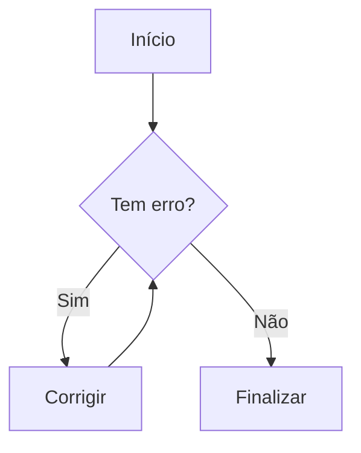
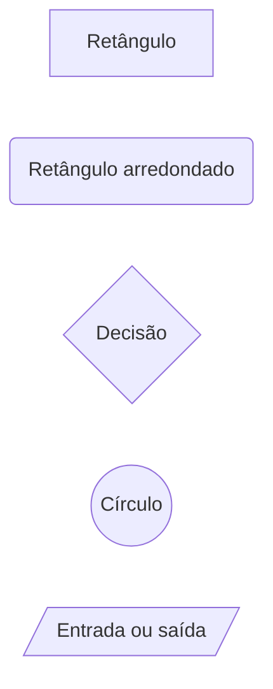
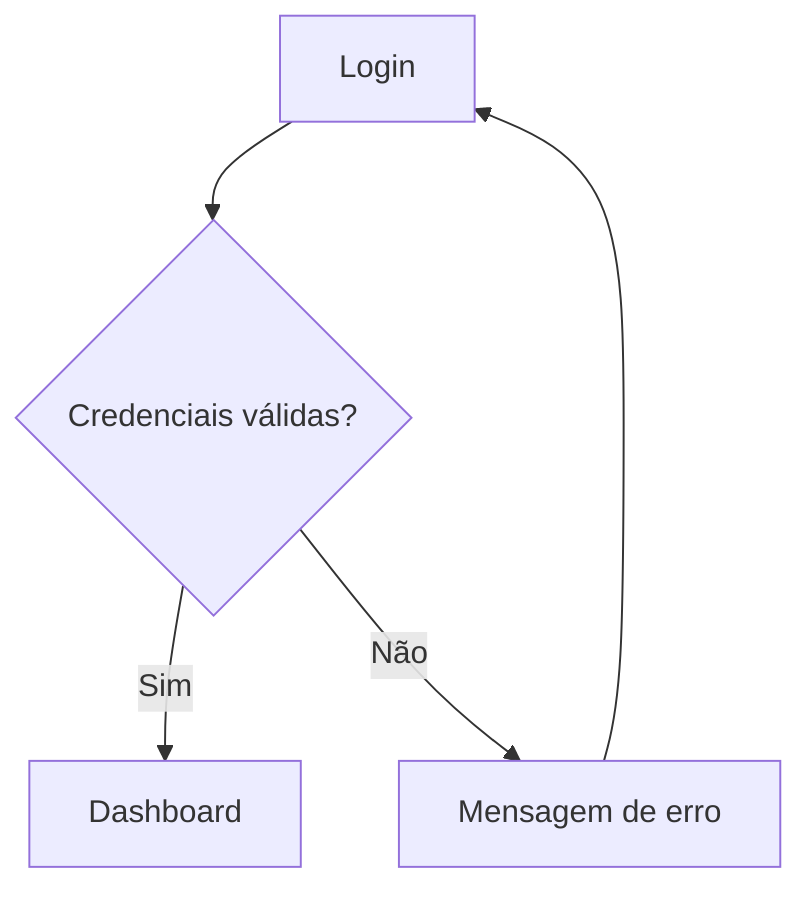

# Guia Definitivo de Markdown / MD

[](./LICENSE)
[](#indice)
[](https://github.github.com/gfm/)
[](https://github.github.com/gfm/)
[](#indice)
[](#01-introducao)
[](#03-regras-essenciais-antes-de-comecar)
[](./GUIA_MERMAID.md)
[](#25-math-latex)
[](./LISTA_EMOJIs.md)
[](#37-referencias-uteis)
[](#01-introducao)
[](#01-introducao)
[](https://github.com/Diego-Ch4m4X/ANOTACOES)
[](https://diego-ch4m4x.github.io/ANOTACOES/)


> **Material de referência completo e prático**  
> Guia organizado para escrever documentos `.md` com clareza, compatibilidade e boa formatação, usando Markdown comum, GitHub Flavored Markdown, alguns recursos HTML permitidos e exemplos prontos para copiar.

---

<a id="indice"></a>

## Índice

- [Introdução](#01-introducao)
  - [Laboratório prático para testar Markdown](#01a-laboratorio-pratico-para-testar-markdown)
- [01. O que é Markdown / MD](#02-o-que-e-markdown-md)
- [02. Regras essenciais antes de começar](#03-regras-essenciais-antes-de-comecar)
- [03. Títulos](#04-titulos)
- [04. Parágrafos, linhas e quebras de linha](#05-paragrafos-linhas-e-quebras-de-linha)
- [05. Ênfase: negrito, itálico, negrito + itálico e riscado](#06-enfase-negrito-italico-negrito-italico-e-riscado)
- [06. Sublinhado com HTML](#07-sublinhado-com-html)
- [07. Caracteres especiais, entidades HTML e escape](#08-caracteres-especiais-e-escape)
  - [Entidades HTML úteis](#08a-entidades-html-uteis)
- [08. Espaçamento e recuo visual](#09-espacamento-e-recuo-visual)
- [09. Linhas horizontais](#10-linhas-horizontais)
- [10. Citações / Blockquote](#11-citacoes-blockquote)
- [11. Código inline / Inline Code](#12-codigo-inline-inline-code)
- [12. Blocos de código](#13-blocos-de-codigo)
  - [Diff — destaque de linhas adicionadas e removidas](#13a-diff-destaque-de-linhas-adicionadas-e-removidas)
- [13. Listas ordenadas](#14-listas-ordenadas)
- [14. Listas desordenadas](#15-listas-desordenadas)
- [15. Listas aninhadas](#16-listas-aninhadas)
- [16. Lista de tarefas / Task List](#17-lista-de-tarefas-task-list)
- [17. Links](#18-links)
  - [Links de referência / Reference-style links](#18a-links-de-referencia-reference-style-links)
- [18. Âncoras internas](#19-ancoras-internas)
- [19. Imagens](#20-imagens)
  - [Imagem clicável / imagem como link](#20a-imagem-clicavel-imagem-como-link)
  - [Badges / Shields](#20b-badges-shields)
- [20. Imagens com HTML](#21-imagens-com-html)
  - [Vídeos no GitHub e em Markdown com HTML](#21a-videos-no-github-e-em-markdown-com-html)
- [21. SVG inline](#22-svg-inline)
- [22. Tabelas](#23-tabelas)
- [23. Notas de rodapé / Footnotes](#24-notas-de-rodape-footnotes)
- [24. Math / LaTeX](#25-math-latex)
- [25. Seção retrátil com details / summary](#26-secao-retratil-com-details-summary)
- [26. Emojis no padrão GitHub](#27-emojis-no-padrao-github)
- [27. Alertas do GitHub](#28-alertas-do-github)
- [28. Fluxogramas e diagramas Mermaid](#29-fluxogramas-e-diagramas-mermaid)
- [29. HTML dentro do Markdown](#30-html-dentro-do-markdown)
  - [Teclas de teclado com kbd](#30a-teclas-de-teclado-com-kbd)
  - [Sobrescrito e subscrito com sup/sub](#30b-sobrescrito-e-subscrito-com-supsub)
- [30. Comentários em Markdown](#31-comentarios-em-markdown)
- [31. Menções e referências automáticas do GitHub](#32-mencoes-e-referencias-automaticas-do-github)
- [32. Boas práticas de organização de README](#33-boas-praticas-de-organizacao-de-readme)
- [33. Pegadinhas comuns](#34-pegadinhas-comuns)
- [34. Checklist final](#35-checklist-final)
- [35. Projeto complementar: ANOTAÇÕES](#36-projeto-complementar-anotacoes)
- [36. Referências úteis](#37-referencias-uteis)
- [37. Licença](#38-licenca)
- [Conclusão](#39-conclusao)

---

<a id="01-introducao"></a>

## Introdução

Markdown, também chamado de **MD**, é uma forma simples de escrever texto formatado usando símbolos comuns do teclado.

A ideia é escrever um arquivo que continue legível mesmo sem renderização, mas que também possa virar uma página bem formatada quando aberto em editores como GitHub, VS Code, Obsidian, StackEdit, GitLab, Notion, MkDocs, Docusaurus e outros.

Este guia usa como foco principal:

- Markdown básico;
- GitHub Flavored Markdown, também chamado de GFM;
- recursos muito usados em README;
- recursos comuns em documentação técnica, como `diff`, badges, `<kbd>`, vídeos, Math/LaTeX e Mermaid;
- compatibilidade prática entre editores;
- exemplos simples, diretos e fáceis de copiar.

> **Escopo e compatibilidade:** este guia é uma referência prática e abrangente sobre Markdown comum, GitHub Flavored Markdown e HTML frequentemente usado em documentação técnica. Markdown não é igual em todos os renderizadores: GitHub, VS Code, Obsidian, GitLab, StackEdit e outras ferramentas podem aceitar recursos diferentes. Sempre que algo depender do GitHub ou de HTML, isso será indicado e deve ser testado no ambiente final.

<a id="01a-laboratorio-pratico-para-testar-markdown"></a>

### Laboratório prático para testar Markdown

Quer testar os exemplos deste guia em arquivos `.md` reais?

Use o **ANOTAÇÕES**, projeto local-first criado pelo mesmo autor para editar, organizar e visualizar arquivos `.txt` e `.md` diretamente pelo navegador.

- [Ver repositório ANOTAÇÕES](https://github.com/Diego-Ch4m4X/ANOTACOES)
- [Testar no GitHub Pages](https://diego-ch4m4x.github.io/ANOTACOES/)

Com ele, você pode praticar títulos, listas, tabelas, blocos de código, Mermaid, Math / LaTeX, emojis, notas de rodapé, imagens e outros recursos explicados neste guia em um fluxo mais próximo do uso real.

> Use o ANOTAÇÕES como **laboratório prático complementar**: este guia explica a sintaxe; o projeto ajuda a testar o Markdown em arquivos reais.

[Voltar ao índice](#indice)

---

<a id="02-o-que-e-markdown-md"></a>

## 01. O que é Markdown / MD

Markdown é uma linguagem de marcação leve.

Ela serve para escrever documentos usando texto puro, mas com marcações simples para gerar títulos, listas, links, imagens, tabelas, blocos de código, citações e outros elementos.

Exemplo simples:

```md
# Meu título

Este é um parágrafo com **negrito**, _itálico_ e um [link](https://github.com).
```

Resultado visual esperado:

```text
[H1] Meu título

Este é um parágrafo com negrito, itálico e um link clicável.
```

### Extensão do arquivo

Normalmente o arquivo Markdown usa:

```txt
.md
```

Exemplos:

```txt
README.md
CHANGELOG.md
GUIA_MERMAID.md
LISTA_EMOJIs.md
```

### Para que serve

Markdown é muito usado para:

- arquivos `README.md`;
- documentação técnica;
- anotações;
- changelog;
- guias de estudo;
- tutoriais;
- issues e pull requests no GitHub;
- páginas estáticas;
- documentação de projetos.

[Voltar ao índice](#indice)

---

<a id="03-regras-essenciais-antes-de-comecar"></a>

## 02. Regras essenciais antes de começar

### Regra 1 — Linha em branco separa blocos

Sempre deixe uma linha em branco entre blocos diferentes.

Correto:

```md
Primeiro parágrafo.

Segundo parágrafo.
```

Resultado:

Primeiro parágrafo.

Segundo parágrafo.

Ruim:

```md
Primeiro parágrafo.
Segundo parágrafo.
```

Resultado provável:

Primeiro parágrafo.
Segundo parágrafo.

Nesse caso, dependendo do renderizador, o texto pode aparecer como um único bloco visual.

### Regra 2 — Markdown é sensível ao contexto

O mesmo símbolo pode ter significados diferentes.

Exemplo:

```md
# Título
```

Aqui `#` cria título.

Mas em:

```md
Número #123
```

Aqui `#` é apenas texto comum.

### Regra 3 — Espaço depois do marcador é importante

Correto:

```md
# Título
- Item
> Citação
```

Errado ou arriscado:

```md
#Título
-Item
>Citação
```

### Regra 4 — Compatibilidade muda conforme o editor

| Recurso | Markdown básico | GitHub | Observação |
|---|---:|---:|---|
| Títulos | Sim | Sim | Muito compatível |
| Negrito / itálico | Sim | Sim | Muito compatível |
| Links | Sim | Sim | Muito compatível |
| Imagens | Sim | Sim | Muito compatível |
| Tabelas | Não é do Markdown original | Sim | GFM |
| Lista de tarefas | Não é do Markdown original | Sim | GFM |
| Emoji `:joy:` | Não é universal | Sim | GitHub renderiza |
| Mermaid | Não é universal | Sim | GitHub renderiza blocos `mermaid` |
| Math / LaTeX | Não é universal | Sim | GitHub renderiza expressões matemáticas |
| Bloco `diff` | Bloco de código | Sim | Realce depende do renderizador |
| Badges / Shields | Imagem comum | Sim | Depende de imagem externa |
| `<kbd>` | HTML | Sim | Útil para teclas de teclado |
| `<sup>` / `<sub>` | HTML | Sim | Útil para expoentes e índices |
| Vídeo | HTML/anexo | Sim, com ressalvas | Compatibilidade depende do contexto |
| SVG inline | HTML/SVG | Parcial, com ressalvas | Normalmente funciona no VS Code, mas pode ser sanitizado ou bloqueado no GitHub e em outros renderizadores |
| `<details>` | HTML | Sim | Pode variar em outros editores |

[Voltar ao índice](#indice)

---

<a id="04-titulos"></a>

## 03. Títulos

Títulos são criados com `#` no começo da linha.

```md
# TÍTULO 1
## TÍTULO 2
### TÍTULO 3
#### TÍTULO 4
##### TÍTULO 5
###### TÍTULO 6
```

Resultado visual esperado:

```text
[H1] TÍTULO 1
[H2] TÍTULO 2
[H3] TÍTULO 3
[H4] TÍTULO 4
[H5] TÍTULO 5
[H6] TÍTULO 6
```

### Quantos níveis existem?

Markdown aceita de `#` até `######`.

| Sintaxe | Nome comum | Uso recomendado |
|---|---|---|
| `#` | H1 | Título principal do documento |
| `##` | H2 | Seção principal |
| `###` | H3 | Subtópico |
| `####` | H4 | Detalhe do subtópico |
| `#####` | H5 | Raro |
| `######` | H6 | Muito raro |

### Boa prática

Use apenas **um H1** por documento, principalmente em `README.md`.

Bom:

```md
# Guia de Markdown

## Introdução
## Títulos
## Listas
## Links
```

Ruim:

```md
# Guia de Markdown
# Introdução
# Títulos
# Listas
```

### Não pule níveis sem necessidade

Evite sair de `##` direto para `####` sem motivo.

Melhor:

```md
## Listas
### Lista ordenada
### Lista desordenada
```

Pior:

```md
## Listas
#### Lista ordenada
```

### Título alternativo com underline

Alguns renderizadores aceitam:

```md
Título nível 1
==============

Título nível 2
--------------
```

Resultado visual esperado:

```text
[H1] Título nível 1
[H2] Título nível 2
```

Mas para manter padrão, prefira `#`, `##`, `###`.

[Voltar ao índice](#indice)

---

<a id="05-paragrafos-linhas-e-quebras-de-linha"></a>

## 04. Parágrafos, linhas e quebras de linha

### Parágrafo comum

Para criar um novo parágrafo, deixe uma linha em branco.

```md
Este é o primeiro parágrafo.

Este é o segundo parágrafo.
```

Resultado:

Este é o primeiro parágrafo.

Este é o segundo parágrafo.

### Quebra de linha sem novo parágrafo

Para quebrar linha sem criar outro parágrafo, use dois espaços no final da linha e depois pressione `[Enter]`.

```md
Linha 1 com dois espaços no final.  
Linha 2 logo abaixo.
```

Resultado:

Linha 1 com dois espaços no final.  
Linha 2 logo abaixo.

### Alternativa com `<br>`

Também é possível usar HTML:

```md
Linha 1<br>
Linha 2
```

Resultado:

Linha 1<br>
Linha 2

### Quando usar cada um?

| Necessidade | Melhor opção |
|---|---|
| Separar ideias | Linha em branco |
| Quebrar linha dentro do mesmo bloco | Dois espaços no final da linha |
| Forçar quebra visual em local específico | `<br>` |
| Criar espaçamento grande | Melhor repensar a estrutura do documento |

### Regra prática

Use `<br>` com moderação. Em Markdown puro, normalmente a linha em branco já resolve.

[Voltar ao índice](#indice)

---

<a id="06-enfase-negrito-italico-negrito-italico-e-riscado"></a>

## 05. Ênfase: negrito, itálico, negrito + itálico e riscado

### Negrito

Sintaxe recomendada:

```md
**Texto em negrito**
```

Resultado:

**Texto em negrito**

Também funciona:

```md
__Texto em negrito__
```

Resultado:

__Texto em negrito__

> **Recomendação:** prefira `**negrito**`, porque é mais comum e mais fácil de ler.

### Itálico

Sintaxe recomendada:

```md
_Texto em itálico_
```

Resultado:

_Texto em itálico_

Também funciona:

```md
*Texto em itálico*
```

Resultado:

*Texto em itálico*

> **Recomendação:** prefira `_itálico_` quando quiser diferenciar visualmente de `**negrito**`.

### Negrito + itálico

```md
***Texto em negrito e itálico***
```

Resultado:

***Texto em negrito e itálico***

Também pode usar:

```md
**_Texto em negrito e itálico_**
```

Resultado:

**_Texto em negrito e itálico_**

### Texto riscado

```md
~~Texto riscado~~
```

Resultado:

~~Texto riscado~~

Muito usado para indicar algo removido, descontinuado ou corrigido.

Exemplo:

```md
Versão antiga: ~~usar senha fixa~~  
Versão correta: usar variável de ambiente.
```

Resultado:

Versão antiga: ~~usar senha fixa~~  
Versão correta: usar variável de ambiente.

### Cuidado com espaços

Correto:

```md
**texto**
```

Errado:

```md
** texto **
```

O segundo pode não renderizar como esperado em alguns lugares.

[Voltar ao índice](#indice)

---

<a id="07-sublinhado-com-html"></a>

## 06. Sublinhado com HTML

Markdown puro não possui marcação própria para sublinhado.

Para sublinhar, use HTML.

### Com `<u>`

```md
<u>Texto sublinhado</u>
```

Resultado:

<u>Texto sublinhado</u>

### Com `<ins>`

```md
<ins>Texto inserido / sublinhado</ins>
```

Resultado:

<ins>Texto inserido / sublinhado</ins>

### Diferença entre `<u>` e `<ins>`

| Tag | Significado | Quando usar |
|---|---|---|
| `<u>` | sublinhado visual | Quando quiser apenas sublinhar |
| `<ins>` | texto inserido/adicionado | Quando quiser indicar uma adição/correção |

### Cuidado

Sublinhado pode ser confundido com link. Use com moderação.

[Voltar ao índice](#indice)

---

<a id="08-caracteres-especiais-e-escape"></a>

## 07. Caracteres especiais, entidades HTML e escape

Alguns caracteres têm função especial no Markdown.

Exemplos:

| Caractere | Uso comum no Markdown |
|---|---|
| `#` | título |
| `*` | itálico, negrito ou lista |
| `_` | itálico ou negrito |
| `-` | lista ou linha horizontal |
| `+` | lista |
| `>` | citação |
| `` ` `` | código |
| `[` e `]` | texto de link |
| `(` e `)` | URL do link |
| `!` | imagem |
| `|` | tabela |
| `\` | escape |

### Como exibir um caractere especial como texto comum

Use barra invertida `\` antes do caractere.

```md
\# Isto não vira título
\* Isto não vira lista nem itálico
\- Isto não vira lista
\> Isto não vira citação
\` Isto não vira código
```

Resultado esperado:

\# Isto não vira título  
\* Isto não vira lista nem itálico  
\- Isto não vira lista  
\> Isto não vira citação  
\` Isto não vira código

### Exemplo clássico com número e ponto

Se uma linha começa com número + ponto, pode virar lista ordenada.

```md
1990. Isso pode virar item de lista.
```

Para impedir:

```md
1990\. Isso não vira lista.
```

Resultado:

1990\. Isso não vira lista.

### Escape dentro de tabelas

Para mostrar `|` dentro de uma célula de tabela, use:

```md
\|
```

Exemplo:

```md
| Operador | Descrição |
|---|---|
| `A \| B` | pipe escapado dentro da célula |
```

Resultado:

| Operador | Descrição |
|---|---|
| `A \| B` | pipe escapado dentro da célula |


<a id="08a-entidades-html-uteis"></a>

### Entidades HTML úteis

Entidades HTML são códigos que representam caracteres especiais.

Elas são úteis quando você quer mostrar um caractere que poderia ser interpretado como HTML, Markdown ou símbolo especial.

### Tabela de entidades comuns

| Entidade | Resultado | Uso comum |
|---|---:|---|
| `&lt;` | &lt; | mostrar o sinal menor que sem abrir tag HTML |
| `&gt;` | &gt; | mostrar o sinal maior que sem fechar tag HTML |
| `&amp;` | &amp; | mostrar o caractere `&` literalmente |
| `&quot;` | &quot; | aspas duplas |
| `&apos;` | &apos; | aspas simples/apóstrofo |
| `&copy;` | &copy; | copyright |
| `&reg;` | &reg; | marca registrada |
| `&trade;` | &trade; | trademark |
| `&mdash;` | &mdash; | travessão longo |
| `&ndash;` | &ndash; | meia-risca |
| `&hellip;` | &hellip; | reticências |
| `&nbsp;` | &nbsp; | espaço não quebrável |
| `&ensp;` | &ensp; | espaço médio |
| `&emsp;` | &emsp; | espaço maior, parecido com TAB visual |

### Exemplo com tags HTML aparecendo como texto

Se você escrever assim:

```md
<div>conteúdo</div>
```

Dependendo do renderizador, isso pode ser entendido como HTML.

Para mostrar os sinais como texto, use entidades:

```md
&lt;div&gt;conteúdo&lt;/div&gt;
```

Resultado esperado:

&lt;div&gt;conteúdo&lt;/div&gt;

### Exemplo com E comercial `&`

```md
HTML &amp; Markdown
```

Resultado:

HTML &amp; Markdown

### Exemplo com copyright

```md
&copy; 2026 Meu Projeto
```

Resultado:

&copy; 2026 Meu Projeto

### Exemplo com travessão

```md
Markdown &mdash; guia prático e completo.
```

Resultado:

Markdown &mdash; guia prático e completo.

### Cuidado

Use entidades quando elas realmente forem necessárias.

Para texto comum, normalmente é melhor escrever o caractere direto:

```md
© 2026 Meu Projeto
```

Mas quando o caractere interfere no HTML ou no Markdown, a entidade deixa o resultado mais seguro.

[Voltar ao índice](#indice)

---

<a id="09-espacamento-e-recuo-visual"></a>

## 08. Espaçamento e recuo visual

Markdown não foi criado para controlar layout com precisão. Ele foi criado para estrutura textual.

Mesmo assim, existem alguns recursos.

### Entidades HTML de espaço

| Entidade | Resultado | Explicação |
|---|---|---|
| `&nbsp;` | &nbsp; | espaço não quebrável |
| `&ensp;` | &ensp; | espaço médio |
| `&emsp;` | &emsp; | espaço maior, parecido com TAB visual |

Exemplo:

```md
Texto normal

&nbsp;&nbsp;&nbsp;&nbsp;Texto com recuo usando quatro `&nbsp;`.

&emsp;Texto com recuo usando `&emsp;`.
```

Resultado:

Texto normal

&nbsp;&nbsp;&nbsp;&nbsp;Texto com recuo usando quatro `&nbsp;`.

&emsp;Texto com recuo usando `&emsp;`.

### Cuidado com espaço como layout

Evite usar muitos `&nbsp;` para alinhar conteúdo.

Ruim:

```md
Nome:&nbsp;&nbsp;&nbsp;&nbsp;&nbsp;&nbsp;Diego
Cargo:&nbsp;&nbsp;&nbsp;&nbsp;&nbsp;Analista
```

Melhor usar tabela:

```md
| Campo | Valor |
|---|---|
| Nome | Diego |
| Cargo | Analista |
```

Resultado:

| Campo | Valor |
|---|---|
| Nome | Diego |
| Cargo | Analista |

[Voltar ao índice](#indice)

---

<a id="10-linhas-horizontais"></a>

## 09. Linhas horizontais

Linhas horizontais servem para separar grandes blocos do documento.

Você pode usar:

```md
---
```

```md
***
```

```md
___
```

Resultado:

---

### Recomendações

Prefira:

```md
---
```

Porque é simples, comum e fácil de ler.

### Cuidado com `---` logo abaixo de texto

Isto pode virar título nível 2 em alguns renderizadores:

```md
Meu título
---
```

Resultado visual esperado em alguns renderizadores:

```text
[H2] Meu título
```

Para linha horizontal, deixe uma linha em branco antes:

```md
Texto anterior.

---

Texto depois.
```

[Voltar ao índice](#indice)

---

<a id="11-citacoes-blockquote"></a>

## 10. Citações / Blockquote

Citação é criada com `>` no começo da linha.

```md
> Esta é uma citação.
```

Resultado:

> Esta é uma citação.

### Citação com várias linhas

```md
> Primeira linha da citação.
> Segunda linha da citação.
> Terceira linha da citação.
```

Resultado:

> Primeira linha da citação.
> Segunda linha da citação.
> Terceira linha da citação.

### Citação com parágrafos

Use uma linha com `>` vazia entre os parágrafos.

```md
> Primeiro parágrafo da citação.
>
> Segundo parágrafo da citação.
```

Resultado:

> Primeiro parágrafo da citação.
>
> Segundo parágrafo da citação.

### Citação com Markdown dentro

```md
> **Importante:** use `README.md` para documentar o projeto.
>
> - Explique o objetivo.
> - Mostre como instalar.
> - Mostre como usar.
```

Resultado:

> **Importante:** use `README.md` para documentar o projeto.
>
> - Explique o objetivo.
> - Mostre como instalar.
> - Mostre como usar.

### Citação aninhada

```md
> Citação principal.
>
> > Citação dentro da citação.
```

Resultado:

> Citação principal.
>
> > Citação dentro da citação.

[Voltar ao índice](#indice)

---

<a id="12-codigo-inline-inline-code"></a>

## 11. Código inline / Inline Code

Código inline é usado para mostrar comandos, nomes de arquivos, funções, variáveis, tags e trechos curtos de código dentro de uma frase.

Use crase simples:

```md
Use o comando `git status` para verificar o estado do repositório.
```

Resultado:

Use o comando `git status` para verificar o estado do repositório.

### Exemplos comuns

```md
O arquivo principal é `README.md`.
A função `create_access_token()` cria um token.
A tag `<details>` cria uma seção retrátil.
A propriedade `display: flex` ativa Flexbox.
```

Resultado:

O arquivo principal é `README.md`.  
A função `create_access_token()` cria um token.  
A tag `<details>` cria uma seção retrátil.  
A propriedade `display: flex` ativa Flexbox.

### Como mostrar crase dentro de código inline

Se precisar mostrar uma crase dentro do próprio código, use duas crases ao redor.

```md
Use `` `codigo` `` para mostrar crases.
```

Resultado:

Use `` `codigo` `` para mostrar crases.

### Quando usar código inline

Use para:

- comandos: `npm install`;
- arquivos: `index.html`;
- funções: `map()`;
- variáveis: `userName`;
- propriedades CSS: `color`;
- tags HTML: `<summary>`;
- extensões: `.md`.

[Voltar ao índice](#indice)

---

<a id="13-blocos-de-codigo"></a>

## 12. Blocos de código

Bloco de código é usado para trechos maiores de código, comandos, logs ou exemplos que precisam manter a formatação.

### Com três crases

````md
```js
console.log("Olá, mundo!");
```
````

Resultado:

```js
console.log("Olá, mundo!");
```

### Com três tils

Também pode usar `~~~`.

```md
~~~python
print("Olá, mundo!")
~~~
```

Resultado:

~~~python
print("Olá, mundo!")
~~~

### Qual usar?

| Sintaxe | Uso |
|---|---|
| ``` | Mais comum |
| `~~~` | Útil quando o conteúdo contém muitas crases |

### Linguagem depois das crases

Depois das crases, informe a linguagem para ativar destaque de sintaxe.

Exemplos:

````md
```html
<h1>Título</h1>
```

```css
body { color: #111; }
```

```js
const nome = "Diego";
```

```bash
git status
```

```json
{
  "nome": "README"
}
```
````

### Bloco sem linguagem

````md
```
Texto puro.
Sem destaque de sintaxe.
```
````

Resultado:

```
Texto puro.
Sem destaque de sintaxe.
```

### Mostrar um bloco Markdown dentro de outro Markdown

Quando quiser ensinar Markdown dentro de Markdown, use quatro crases por fora.

`````md
````md

````
`````

Resultado esperado no arquivo:

````md

````

### Bloco de código por indentação

Também existe bloco de código com quatro espaços no começo da linha:

```md
    git status
    git add .
```

Resultado:

    git status
    git add .


Mas prefira blocos com crases, porque são mais claros e aceitam linguagem.

<a id="13a-diff-destaque-de-linhas-adicionadas-e-removidas"></a>

### Diff — destaque de linhas adicionadas e removidas

`diff` é um tipo de bloco de código muito usado para mostrar alteração.

Ele é excelente em README, changelog, revisão de código e documentação de correção.

### Sintaxe

````md
```diff
- linha removida
+ linha adicionada
  linha sem alteração
```
````

Resultado esperado em renderizadores com destaque `diff`:

```diff
- linha removida
+ linha adicionada
  linha sem alteração
```

### Como ler

| Símbolo | Significado |
|---|---|
| `-` | linha removida |
| `+` | linha adicionada |
| espaço no começo | linha sem alteração |

### Exemplo prático em documentação

````md
```diff
- const tema = "claro";
+ const tema = "escuro";
```
````

Resultado:

```diff
- const tema = "claro";
+ const tema = "escuro";
```

### Exemplo em CHANGELOG

````md
```diff
+ Adicionado suporte a Mermaid.
+ Adicionada lista de emojis.
- Removido exemplo duplicado de tabela.
```
````

Resultado:

```diff
+ Adicionado suporte a Mermaid.
+ Adicionada lista de emojis.
- Removido exemplo duplicado de tabela.
```

### Pegadinha importante

Para o destaque funcionar, o sinal precisa estar logo no começo da linha dentro do bloco `diff`.

Correto:

```diff
+ linha adicionada
- linha removida
```

Ruim:

```diff
  + linha adicionada com espaços antes do sinal
  - linha removida com espaços antes do sinal
```

[Voltar ao índice](#indice)

---

<a id="14-listas-ordenadas"></a>

## 13. Listas ordenadas

Listas ordenadas usam número + ponto.

```md
1. Primeiro item
2. Segundo item
3. Terceiro item
```

Resultado:

1. Primeiro item
2. Segundo item
3. Terceiro item

### Numeração automática

Em muitos renderizadores, você pode repetir `1.` e o Markdown corrige a numeração visual.

```md
1. Primeiro item
1. Segundo item
1. Terceiro item
```

Resultado:

1. Primeiro item
1. Segundo item
1. Terceiro item

### Números fora de ordem

```md
1. Primeiro
3. Segundo no arquivo
2. Terceiro no arquivo
```

Resultado visual geralmente será corrigido:

1. Primeiro
3. Segundo no arquivo
2. Terceiro no arquivo

### Começar em número específico com números fora de sequência

Também é possível começar uma lista em um número específico usando o primeiro número da lista.

Exemplo escrito:

```md
10. Começando em número específico
15. É a mesma regra
13. Do exemplo anterior
```

Resultado esperado em renderizadores como GitHub:

10. Começando em número específico
15. É a mesma regra
13. Do exemplo anterior

Observe a regra principal:

- o primeiro número define onde a lista começa;
- os próximos números escritos podem estar fora de ordem;
- o renderizador normalmente exibe a sequência visual correta a partir do primeiro número.

### Começar em número específico

Se quiser começar em `10`, coloque `10.` no primeiro item.

```md
10. Décimo item
11. Décimo primeiro item
12. Décimo segundo item
```

Resultado:

10. Décimo item
11. Décimo primeiro item
12. Décimo segundo item

### Forçar início com HTML

```html
<ol start="10">
  <li>Primeiro item, iniciando no 10</li>
  <li>Segundo item</li>
  <li>Terceiro item</li>
</ol>
```

Resultado:

<ol start="10">
  <li>Primeiro item, iniciando no 10</li>
  <li>Segundo item</li>
  <li>Terceiro item</li>
</ol>

### Lista ordenada com parágrafo dentro do item

```md
1. Primeiro item.

   Continuação do primeiro item.

2. Segundo item.
```

Resultado:

1. Primeiro item.

   Continuação do primeiro item.

2. Segundo item.

A continuação precisa estar indentada para continuar dentro do mesmo item.

### Subtítulo e sub-subtítulo com lista ordenada

Uma lista ordenada pode ter níveis internos. Isso é útil quando você quer representar uma estrutura parecida com:

```txt
1. Título
   1.1 Subtítulo
      1.1.1 Sub-subtítulo
```

Em Markdown puro, a lista aninhada cria níveis, mas **não gera automaticamente numeração composta** como `1.1` ou `1.1.1`.

Exemplo de lista aninhada normal:

```md
1. Instalação
   1. Requisitos
      1. Sistema operacional
      2. Editor de código
   2. Configuração
      1. Variáveis de ambiente
      2. Permissões
2. Uso
   1. Abrir o projeto
   2. Executar comandos
```

Resultado:

1. Instalação
   1. Requisitos
      1. Sistema operacional
      2. Editor de código
   2. Configuração
      1. Variáveis de ambiente
      2. Permissões
2. Uso
   1. Abrir o projeto
   2. Executar comandos

Se você quiser que apareça literalmente `1.1`, `1.2`, `1.1.1` e `1.1.2`, escreva essa numeração como parte do texto do item.

```md
1. Fundamentos
   1. 1.1 Títulos
   2. 1.2 Parágrafos
      1. 1.2.1 Quebra de linha
      2. 1.2.2 Linha em branco
2. Recursos avançados
   1. 2.1 Tabelas
   2. 2.2 Mermaid
      1. 2.2.1 Fluxograma
      2. 2.2.2 Diagrama de estados
```

Resultado:

1. Fundamentos
   1. 1.1 Títulos
   2. 1.2 Parágrafos
      1. 1.2.1 Quebra de linha
      2. 1.2.2 Linha em branco
2. Recursos avançados
   1. 2.1 Tabelas
   2. 2.2 Mermaid
      1. 2.2.1 Fluxograma
      2. 2.2.2 Diagrama de estados

Também é possível usar uma numeração textual no estilo romano.

```md
1. Parte I
   1. I.I Fundamentos
   2. I.II Sintaxe básica
      1. I.II.I Títulos
      2. I.II.II Parágrafos
2. Parte II
   1. II.I Recursos GitHub
   2. II.II Mermaid
```

Resultado:

1. Parte I
   1. I.I Fundamentos
   2. I.II Sintaxe básica
      1. I.II.I Títulos
      2. I.II.II Parágrafos
2. Parte II
   1. II.I Recursos GitHub
   2. II.II Mermaid

> **Regra de ouro:** se a numeração composta precisa aparecer exatamente como `1.1.1` ou `I.II.I`, trate essa numeração como texto. O Markdown organiza os níveis, mas não calcula esse tipo de numeração composta sozinho.

[Voltar ao índice](#indice)

---

<a id="15-listas-desordenadas"></a>

## 14. Listas desordenadas

Listas desordenadas usam `-`, `*` ou `+`.

### Com hífen

```md
- Item A
- Item B
- Item C
```

Resultado:

- Item A
- Item B
- Item C

### Com asterisco

```md
* Item A
* Item B
* Item C
```

Resultado:

* Item A
* Item B
* Item C

### Com sinal de mais

```md
+ Item A
+ Item B
+ Item C
```

Resultado:

+ Item A
+ Item B
+ Item C

### Recomendação

Prefira sempre `-`.

Motivo:

- é mais comum;
- é visualmente limpo;
- reduz confusão com itálico/negrito;
- evita inconsistência.

### Não misture marcadores na mesma lista

Evite:

```md
* Item com asterisco
+ Item com mais
- Item com hífen
```

Prefira:

```md
- Item 1
- Item 2
- Item 3
```

### Item desordenado que começa com número

Quando uma linha começa diretamente com número + ponto, o Markdown pode interpretar como lista ordenada.

Para mostrar o número como texto comum, escape o ponto com barra invertida `\`.

```md
1990\. Ano escrito como texto, não como lista ordenada.
100\. Segundo exemplo escrito como texto.
```

Resultado:

1990\. Ano escrito como texto, não como lista ordenada.
100\. Segundo exemplo escrito como texto.

Dentro de uma lista desordenada, o marcador `-` já indica que aquilo é um item comum. Mesmo assim, você pode usar o escape para deixar a intenção mais explícita.

```md
- 1990\. Lista não ordenada que começa com número
- 100\. Segundo exemplo
```

Resultado:

- 1990\. Lista não ordenada que começa com número
- 100\. Segundo exemplo

### Subtítulo e sub-subtítulo com lista desordenada

A lista desordenada costuma ser a melhor opção quando você quer mostrar uma estrutura de tópicos com numeração composta, porque ela não adiciona uma segunda numeração automática na frente.

Exemplo com `1.1`, `1.2`, `1.1.1` e `1.1.2`:

```md
- 1. Fundamentos
  - 1.1 Títulos
    - 1.1.1 Sintaxe com `#`
    - 1.1.2 Hierarquia correta
  - 1.2 Parágrafos
    - 1.2.1 Linha em branco
    - 1.2.2 Quebra de linha
- 2. Recursos avançados
  - 2.1 Tabelas
  - 2.2 Mermaid
    - 2.2.1 Fluxograma
    - 2.2.2 Diagrama de estados
```

Resultado:

- 1. Fundamentos
  - 1.1 Títulos
    - 1.1.1 Sintaxe com `#`
    - 1.1.2 Hierarquia correta
  - 1.2 Parágrafos
    - 1.2.1 Linha em branco
    - 1.2.2 Quebra de linha
- 2. Recursos avançados
  - 2.1 Tabelas
  - 2.2 Mermaid
    - 2.2.1 Fluxograma
    - 2.2.2 Diagrama de estados

Exemplo com numeração textual no estilo romano:

```md
- I. Fundamentos
  - I.I Títulos
    - I.I.I Sintaxe básica
    - I.I.II Boas práticas
  - I.II Parágrafos
    - I.II.I Linha em branco
    - I.II.II Quebra forçada
- II. Recursos GitHub
  - II.I Emojis
  - II.II Mermaid
```

Resultado:

- I. Fundamentos
  - I.I Títulos
    - I.I.I Sintaxe básica
    - I.I.II Boas práticas
  - I.II Parágrafos
    - I.II.I Linha em branco
    - I.II.II Quebra forçada
- II. Recursos GitHub
  - II.I Emojis
  - II.II Mermaid

> **Regra prática:** para sumários, mapas de conteúdo e tópicos numerados manualmente, a lista desordenada costuma deixar o resultado mais limpo.

[Voltar ao índice](#indice)

---

<a id="16-listas-aninhadas"></a>

## 15. Listas aninhadas

Lista aninhada é uma lista dentro de outra lista.

Use indentação.

### Lista desordenada dentro de lista desordenada

```md
- Front-end
  - HTML
  - CSS
  - JavaScript
- Back-end
  - Node.js
  - C#
  - Python
```

Resultado:

- Front-end
  - HTML
  - CSS
  - JavaScript
- Back-end
  - Node.js
  - C#
  - Python

### Lista ordenada dentro de lista ordenada

```md
1. Instalação
   1. Baixar o projeto
   2. Instalar dependências
   3. Rodar o servidor
2. Uso
   1. Abrir a página
   2. Testar as funções
```

Resultado:

1. Instalação
   1. Baixar o projeto
   2. Instalar dependências
   3. Rodar o servidor
2. Uso
   1. Abrir a página
   2. Testar as funções

### Lista ordenada dentro de lista desordenada

```md
- Processo de publicação:
  1. Revisar o arquivo
  2. Atualizar o CHANGELOG
  3. Criar a tag
  4. Publicar a release
```

Resultado:

- Processo de publicação:
  1. Revisar o arquivo
  2. Atualizar o CHANGELOG
  3. Criar a tag
  4. Publicar a release

### Lista desordenada dentro de lista ordenada

```md
1. Preparar ambiente
   - Instalar Git
   - Instalar VS Code
   - Instalar Node.js
2. Executar projeto
   - Abrir terminal
   - Rodar comando
```

Resultado:

1. Preparar ambiente
   - Instalar Git
   - Instalar VS Code
   - Instalar Node.js
2. Executar projeto
   - Abrir terminal
   - Rodar comando

### Pegadinha: lista ordenada escrita dentro de item desordenado

Isto não cria uma lista ordenada real no nível principal:

```md
- 1. Texto
- 3. Texto
- 6. Texto
```

Resultado:

- 1. Texto
- 3. Texto
- 6. Texto

Aqui os números são apenas parte do texto do item.

[Voltar ao índice](#indice)

---

<a id="17-lista-de-tarefas-task-list"></a>

## 16. Lista de tarefas / Task List

Lista de tarefas é muito usada no GitHub.

### Item pendente

```md
- [ ] Tarefa pendente
```

Resultado:

- [ ] Tarefa pendente

### Item concluído

```md
- [x] Tarefa concluída
```

Resultado:

- [x] Tarefa concluída

### Exemplo completo

```md
- [x] Criar README
- [x] Adicionar índice
- [ ] Revisar exemplos
- [ ] Publicar no GitHub
```

Resultado:

- [x] Criar README
- [x] Adicionar índice
- [ ] Revisar exemplos
- [ ] Publicar no GitHub

### Com subitens

```md
- [ ] Melhorar documentação
  - [x] Criar introdução
  - [x] Criar seção de links
  - [ ] Criar seção de exemplos avançados
```

Resultado:

- [ ] Melhorar documentação
  - [x] Criar introdução
  - [x] Criar seção de links
  - [ ] Criar seção de exemplos avançados

### Cuidado com espaço

Correto:

```md
- [ ] Tarefa
- [x] Feita
```

Errado:

```md
-[ ] Tarefa
-[] Tarefa
- [x]Tarefa
```

[Voltar ao índice](#indice)

---

<a id="18-links"></a>

## 17. Links

### Link simples

```md
[Texto do link](https://google.com)
```

Resultado:

[Texto do link](https://google.com)

### Link com título / comentário

```md
[Google](https://google.com "Ir para o Google")
```

Resultado:

[Google](https://google.com "Ir para o Google")

O texto entre aspas pode aparecer quando passa o mouse em cima do link, dependendo do renderizador.

### URL automática

```md
https://google.com
```

Resultado:

https://google.com

### URL automática com `< >`

```md
<https://google.com>
```

Resultado:

<https://google.com>

### E-mail

```md
<email@exemplo.com>
```

Resultado:

<email@exemplo.com>

### Link relativo para arquivo na mesma pasta

```md
[Abrir guia Mermaid](./GUIA_MERMAID.md)
```

Resultado:

[Abrir guia Mermaid](./GUIA_MERMAID.md)

### Link relativo para pasta

```md
[Abrir pasta docs](./docs/)
```

### Link relativo para arquivo em subpasta

```md
[Abrir imagem](./assets/imagem.png)
```

### Link para arquivo subindo pasta

```md
[Abrir arquivo da pasta acima](../README.md)
```

### Links importantes deste pacote

Estes links assumem que os arquivos estão na mesma pasta raiz deste README:

- [Abrir lista completa de emojis GitHub](./LISTA_EMOJIs.md)

- [Abrir guia completo de Mermaid](./GUIA_MERMAID.md)

<a id="18a-links-de-referencia-reference-style-links"></a>

### Links de referência / Reference-style links

Link de referência é uma forma de criar links sem deixar a URL no meio do parágrafo.

É muito útil quando o texto tem muitos links ou quando você quer deixar o conteúdo mais limpo.

### Sintaxe básica

```md
Acesse a [documentação do GitHub][github-docs].

[github-docs]: https://docs.github.com "Documentação oficial do GitHub"
```

Resultado:

Acesse a [documentação do GitHub][github-docs-exemplo].

[github-docs-exemplo]: https://docs.github.com "Documentação oficial do GitHub"

### Vários links usando a mesma referência

```md
Leia a [documentação][docs] antes de abrir uma issue.
Depois consulte novamente a [documentação][docs] durante a revisão.

[docs]: https://docs.github.com
```

Resultado:

Leia a [documentação][docs-exemplo] antes de abrir uma issue.  
Depois consulte novamente a [documentação][docs-exemplo] durante a revisão.

[docs-exemplo]: https://docs.github.com

### Link de referência com ID curto

```md
O projeto está hospedado no [GitHub][gh].

[gh]: https://github.com
```

Resultado:

O projeto está hospedado no [GitHub][gh-exemplo].

[gh-exemplo]: https://github.com

### Link de referência sem texto diferente

Alguns renderizadores aceitam este formato:

```md
Acesse [GitHub].

[GitHub]: https://github.com
```

Resultado esperado:

Acesse [GitHub].

[GitHub]: https://github.com

### Quando usar link inline ou link de referência?

| Tipo | Quando usar |
|---|---|
| Link inline | quando há poucos links |
| Link de referência | quando há muitos links ou URLs longas |
| Link relativo | quando aponta para arquivo do próprio projeto |
| Âncora interna | quando aponta para seção do mesmo documento |

### Regra de ouro

Se o link está atrapalhando a leitura do texto, use referência.

[Voltar ao índice](#indice)

---

<a id="19-ancoras-internas"></a>

## 18. Âncoras internas

Âncoras internas são links para partes do próprio documento.

### Exemplo

```md
[Ir para Listas](#15-listas-desordenadas)
```

Resultado:

[Ir para Listas](#15-listas-desordenadas)

### Como o GitHub gera âncoras automaticamente

Em geral:

```md
## Meu Título de Exemplo
```

vira algo parecido com:

```txt
#meu-título-de-exemplo
```

Mas há detalhes:

- letras viram minúsculas;
- espaços viram hífens;
- alguns sinais são removidos;
- títulos repetidos recebem sufixo;
- acentos podem variar conforme o renderizador.

### Forma mais segura: criar ID manual

Use HTML:

```html
<a id="meu-topico"></a>

## Meu tópico
```

Depois chame:

```md
[Ir para meu tópico](#meu-topico)
```

Essa técnica foi usada neste guia para deixar o índice mais previsível.

[Voltar ao índice](#indice)

---

<a id="20-imagens"></a>

## 19. Imagens

Imagem usa a sintaxe parecida com link, mas começa com `!`.

```md

```

Resultado:


### Estrutura

```md

```

| Parte | Função |
|---|---|
| `!` | indica que é imagem |
| `[texto alternativo]` | texto para acessibilidade ou falha de carregamento |
| `(caminho)` | URL ou caminho local da imagem |
| `"título"` | texto opcional ao passar mouse |

### Imagem local

```md

```

### Imagem remota

```md

```

### Imagem com título

```md

```

### Boa prática de acessibilidade

Ruim:

```md

```

Melhor:

```md

```

### Placeholders úteis

```md

```

Resultado:


### Gradiente com placeholder

```md
https://placeholder.pics/svg/385x185/FF0000-0000FF/FFFFFF/Texto-imagem
```

Em alguns editores, a URL sozinha aparece como link. Para mostrar como imagem, use ``.

```md

```

<a id="20a-imagem-clicavel-imagem-como-link"></a>

### Imagem clicável / imagem como link

Imagem clicável é uma imagem colocada dentro de um link.

A estrutura é:

```md
[](https://link.com)
```

Modelo mental:

```txt
[ imagem ]( link de destino )
```

### Exemplo com imagem local

```md
[](https://github.com/usuario/projeto)
```

### Exemplo com imagem remota

```md
[](https://github.com)
```

Resultado:

[](https://github.com)

### Quando usar

Use imagem clicável para:

- banner de projeto;
- logo que leva para site oficial;
- imagem de demonstração que abre uma página;
- botão visual;
- badge customizada com link.

### Boa prática

Sempre preencha o texto alternativo:

```md
[](./docs/README.md)
```

Ruim:

```md
[](./docs/README.md)
```

<a id="20b-badges-shields"></a>

### Badges / Shields

Badges são pequenas imagens usadas no começo de READMEs para mostrar estado do projeto.

Exemplos comuns:

- versão;
- licença;
- status do build;
- cobertura de testes;
- linguagem principal;
- tamanho do repositório;
- última versão publicada.

A forma mais comum é usar imagem Markdown normal:

```md

```

Resultado:


### Badge clicável

Normalmente badge é imagem clicável:

```md
[](./LICENSE)
```

Resultado:

[](./LICENSE)

### Exemplos prontos

```md


```

Resultado:


### Badge com logo

```md

```

Resultado:


### Onde colocar badges

Geralmente ficam logo abaixo do título principal:

```md
# Meu Projeto


```

### Cuidado

Badge não é uma marcação especial do Markdown.

Badge é apenas uma imagem. O serviço `shields.io` gera a imagem dinamicamente.

Se o serviço externo sair do ar, a badge pode não carregar.

[Voltar ao índice](#indice)

---

<a id="21-imagens-com-html"></a>

## 20. Imagens com HTML

Markdown básico não permite controlar tamanho da imagem diretamente.

Quando precisar controlar largura, altura ou alinhamento, use HTML.

### Controlar largura

```html

```

### Controlar largura e altura

```html

```

### Imagem centralizada

```html
<p align="center">
  
</p>
```

### Cuidado


Nem todo renderizador aceita todos os atributos HTML. O GitHub aceita muitos casos simples, mas pode bloquear HTML perigoso por segurança.

<a id="21a-videos-no-github-e-em-markdown-com-html"></a>

### Vídeos no GitHub e em Markdown com HTML

Vídeo em Markdown precisa de atenção, porque não existe uma sintaxe Markdown universal igual à sintaxe de imagem.

A forma depende do ambiente.

### Forma 1 — anexar/arrastar vídeo no GitHub

No GitHub, você pode anexar arquivos em campos de comentário, issues, pull requests e arquivos `.md`, dependendo do contexto.

Quando você arrasta ou seleciona um vídeo, o GitHub faz upload do arquivo e insere uma URL no texto.

Formatos comuns aceitos pelo GitHub incluem:

- `.mp4`;
- `.mov`;
- `.webm`.

### Forma 2 — usar HTML com `<video>`

Em renderizadores que aceitam HTML, você pode usar:

```html
<video src="./demo.mp4" controls width="600"></video>
```

### Exemplo com vídeo local

```html
<video src="./assets/demo.mp4" controls width="600"></video>
```

### Exemplo com fallback textual

```html
<video src="./assets/demo.mp4" controls width="600">
  Seu navegador não suporta vídeo HTML5.
</video>
```

### Exemplo centralizado

```html
<p align="center">
  <video src="./assets/demo.mp4" controls width="600"></video>
</p>
```

### Atributos úteis

| Atributo | Função |
|---|---|
| `src` | caminho do vídeo |
| `controls` | mostra botões de play, pause e volume |
| `width` | largura visual |
| `height` | altura visual |
| `muted` | inicia sem som |
| `loop` | repete automaticamente |
| `poster` | imagem de capa antes de tocar |

Exemplo com capa:

```html
<video src="./assets/demo.mp4" controls width="600" poster="./assets/capa.png"></video>
```

### Cuidado importante

Vídeo em Markdown não é tão portátil quanto imagem.

| Ambiente | O que esperar |
|---|---|
| GitHub | suporta upload de vídeo em vários contextos, com limites de tamanho |
| GitHub Pages / HTML | `<video>` funciona como HTML normal |
| VS Code Preview | pode variar |
| Obsidian / editores locais | pode variar |
| renderizadores restritivos | podem remover a tag `<video>` |

### Regra prática

Para README no GitHub, prefira vídeo curto, em `.mp4`, com caminho relativo ou arquivo anexado.

Para máxima compatibilidade, ofereça também um link textual:

```md
[Baixar ou assistir ao vídeo de demonstração](./assets/demo.mp4)
```

[Voltar ao índice](#indice)

---

<a id="22-svg-inline"></a>

## 21. SVG inline

SVG pode ser inserido diretamente no Markdown usando HTML.

Exemplo:

```html
<svg xmlns="http://www.w3.org/2000/svg" width="32" height="32" viewBox="0 0 32 32">
  <circle cx="16" cy="16" r="14" fill="currentColor" />
</svg>
```

Resultado local esperado em renderizadores que aceitam SVG inline:

<svg xmlns="http://www.w3.org/2000/svg" width="32" height="32" viewBox="0 0 32 32">
  <circle cx="16" cy="16" r="14" fill="currentColor" />
</svg>

### Quando usar

Use SVG inline quando:

- quiser um ícone vetorial simples;
- quiser ícone que acompanha a cor do texto com `currentColor`;
- estiver controlando o ambiente de renderização;
- o arquivo for usado principalmente em ambiente local ou em um renderizador conhecido.

### Visualização no VS Code

No **VS Code da Microsoft**, a visualização Markdown Preview normalmente exibe tags SVG inline simples, como `<svg>`, `<circle>`, `<path>` e `currentColor`.

Isso é útil para testar rapidamente ícones vetoriais dentro de arquivos `.md` sem precisar abrir o Markdown no navegador.

### SVG inline no GitHub

Para publicação pública no GitHub, não trate SVG inline como garantia universal. O GitHub aceita arquivos `.svg` como imagem/mídia anexada ou referenciada, mas HTML/SVG inline pode ser tratado de forma diferente conforme o contexto e as regras de sanitização da plataforma.

Forma mais segura para README público:

```md

```

Ou, quando precisar controlar tamanho:

```html

```

### Cuidado

Por segurança, alguns renderizadores removem ou bloqueiam SVG inline.

Regra prática:

- para **VS Code/local**, SVG inline simples costuma funcionar bem;
- para **GitHub público**, prefira SVG como arquivo referenciado por Markdown ou por ``;
- para **máxima compatibilidade**, teste sempre no renderizador final.

[Voltar ao índice](#indice)

---

<a id="23-tabelas"></a>

## 22. Tabelas

Tabelas são muito usadas no GitHub Flavored Markdown.

### Tabela básica

```md
| Coluna 1 | Coluna 2 | Coluna 3 |
|---|---|---|
| A | B | C |
| D | E | F |
```

Resultado:

| Coluna 1 | Coluna 2 | Coluna 3 |
|---|---|---|
| A | B | C |
| D | E | F |

### Estrutura obrigatória

Uma tabela precisa de:

1. linha de cabeçalho;
2. linha separadora;
3. linhas de conteúdo.

```md
| Cabeçalho A | Cabeçalho B |
|---|---|
| Valor A | Valor B |
```

### Alinhamento

```md
| Esquerda | Centro | Direita |
|:---|:---:|---:|
| A | B | C |
| Texto | Texto | 100 |
```

Resultado:

| Esquerda | Centro | Direita |
|:---|:---:|---:|
| A | B | C |
| Texto | Texto | 100 |

| Sintaxe | Alinhamento |
|---|---|
| `:---` | esquerda |
| `:---:` | centro |
| `---:` | direita |

### Markdown dentro de tabela

```md
| Tipo | Exemplo |
|---|---|
| Negrito | **texto** |
| Código | `git status` |
| Link | [GitHub](https://github.com) |
```

Resultado:

| Tipo | Exemplo |
|---|---|
| Negrito | **texto** |
| Código | `git status` |
| Link | [GitHub](https://github.com) |

### Quebra de linha dentro da célula

Use `<br>`.

```md
| Campo | Descrição |
|---|---|
| Etapas | 1. Criar arquivo<br>2. Revisar<br>3. Publicar |
```

Resultado:

| Campo | Descrição |
|---|---|
| Etapas | 1. Criar arquivo<br>2. Revisar<br>3. Publicar |

### Pipe dentro da célula

Use escape:

```md
| Exemplo | Explicação |
|---|---|
| `A \| B` | pipe escapado |
```

Resultado:

| Exemplo | Explicação |
|---|---|
| `A \| B` | pipe escapado |

### Cuidado com tabela muito grande

Tabela é ótima para comparação. Mas para conteúdo longo, prefira listas ou seções.

Bom uso:

| Recurso | Quando usar |
|---|---|
| Tabela | comparação lado a lado |
| Lista | sequência simples |
| Seções | explicação longa |

[Voltar ao índice](#indice)

---

<a id="24-notas-de-rodape-footnotes"></a>

## 23. Notas de rodapé / Footnotes

Notas de rodapé servem para colocar explicações ou referências sem interromper o fluxo do texto.

### Sintaxe básica

```md
Markdown é muito usado em documentação técnica.[^1]

[^1]: Markdown é uma linguagem de marcação leve criada para ser legível em texto puro.
```

Resultado esperado em renderizadores compatíveis:

Markdown é muito usado em documentação técnica.[^1]

[^1]: Markdown é uma linguagem de marcação leve criada para ser legível em texto puro.

### Nome da referência

Você pode usar número:

```md
Texto com nota.[^1]

[^1]: Conteúdo da nota.
```

Ou nome:

```md
Texto com nota.[^markdown]

[^markdown]: Conteúdo da nota sobre Markdown.
```

### Nota longa

```md
Texto com nota longa.[^nota-longa]

[^nota-longa]: Esta é uma nota maior.
    Ela pode continuar em outra linha, desde que esteja indentada.
```

### Boas práticas

- Use notas para complemento, não para conteúdo principal.
- Não abuse de notas de rodapé em README curto.
- Prefira nomes claros quando houver muitas notas.

[Voltar ao índice](#indice)

---

<a id="25-math-latex"></a>

## 24. Math / LaTeX

Math / LaTeX serve para escrever fórmulas matemáticas dentro do Markdown.

No GitHub, fórmulas matemáticas podem ser renderizadas em Markdown usando sintaxe LaTeX.

### Fórmula inline

Use `$...$` para fórmula no meio do texto.

```md
A fórmula de Euler é $e^{i\pi} + 1 = 0$.
```

Resultado esperado no GitHub:

A fórmula de Euler é $e^{i\pi} + 1 = 0$.

### Quando usar fórmula inline

Use inline quando a fórmula faz parte da frase:

```md
A área do círculo é $A = \pi r^2$.
```

Resultado esperado:

A área do círculo é $A = \pi r^2$.

### Fórmula em bloco com `$$`

Use `$$` quando a fórmula merece destaque em uma linha própria.

```md
$$
\frac{a}{b} = c
$$
```

Resultado esperado no GitHub:

$$
\frac{a}{b} = c
$$

### Fórmula em bloco com linguagem `math`

O GitHub também aceita bloco cercado com linguagem `math`.

````md
```math
\left( \sum_{k=1}^{n} a_k b_k \right)^2 \leq
\left( \sum_{k=1}^{n} a_k^2 \right)
\left( \sum_{k=1}^{n} b_k^2 \right)
```
````

Resultado esperado:

```math
\left( \sum_{k=1}^{n} a_k b_k \right)^2 \leq
\left( \sum_{k=1}^{n} a_k^2 \right)
\left( \sum_{k=1}^{n} b_k^2 \right)
```

### Exemplos comuns

| Objetivo | Markdown |
|---|---|
| Potência | `$x^2$` |
| Índice | `$a_1$` |
| Fração | `$\frac{a}{b}$` |
| Raiz | `$\sqrt{x}$` |
| Somatório | `$\sum_{i=1}^{n} i$` |
| Gregas | `$\alpha, \beta, \pi$` |
| Comparação | `$x \leq y$` |
| Aproximação | `$x \approx 3.14$` |

### Exemplos renderizados

```md
$x^2 + y^2 = z^2$
```

Resultado esperado:

$x^2 + y^2 = z^2$

```md
$\sqrt{3x - 1} + (1 + x)^2$
```

Resultado esperado:

$\sqrt{3x - 1} + (1 + x)^2$

```md
$\alpha + \beta = \gamma$
```

Resultado esperado:

$\alpha + \beta = \gamma$

### Cuidado com o símbolo `$`

O símbolo `$` pode ser confundido com início ou fim de fórmula.

Para mostrar dólar como texto dentro de fórmula, escape com barra invertida:

```md
$\sqrt{\$4}$
```

Para mostrar dólar fora da fórmula, no mesmo trecho de texto, pode ser necessário usar HTML:

```md
O valor <span>$</span>100 dividido por 2 é $100/2$.
```

### Math / LaTeX x HTML `<sup>` e `<sub>`

Para fórmulas completas, prefira Math / LaTeX:

```md
$x^2 + y^2 = z^2$
```

Para casos simples em texto técnico, HTML também funciona:

```md
x<sup>2</sup>
```

### Cuidado de compatibilidade

Math / LaTeX no Markdown não funciona em todo renderizador.

| Ambiente | Compatibilidade |
|---|---|
| GitHub | suporta fórmulas matemáticas |
| VS Code puro | pode precisar de extensão |
| Obsidian | costuma suportar matemática |
| alguns parsers Markdown simples | podem mostrar `$...$` literalmente |

[Voltar ao índice](#indice)

---

<a id="26-secao-retratil-com-details-summary"></a>

## 25. Seção retrátil com details / summary

Seção retrátil é criada com HTML usando `<details>` e `<summary>`.

Ela permite esconder um conteúdo e abrir apenas quando necessário.

### Exemplo simples

```html
<details>
  <summary>Clique para expandir</summary>

  Conteúdo escondido.
</details>
```

Resultado:

<details>
  <summary>Clique para expandir</summary>

  Conteúdo escondido.
</details>

### Exemplo com Markdown dentro

````html
<details>
  <summary>Ver comandos Git</summary>

```bash
git status
git add .
git commit -m "mensagem"
```

</details>
````

> **Atenção:** dentro de `<details>`, alguns renderizadores exigem linha em branco depois do `<summary>` para renderizar Markdown corretamente.

### Forma recomendada para Markdown dentro

````md
<details>
  <summary>Ver comandos Git</summary>

```bash
git status
git add .
git commit -m "mensagem"
```

</details>
````

Resultado:

<details>
  <summary>Ver comandos Git</summary>

```bash
git status
git add .
git commit -m "mensagem"
```

</details>

### Começar aberto

Use o atributo `open`.

```html
<details open>
  <summary>Aberto por padrão</summary>

  Este conteúdo já começa visível.
</details>
```

Resultado:

<details open>
  <summary>Aberto por padrão</summary>

  Este conteúdo já começa visível.
</details>

### Quando usar

Use para:

- esconder respostas longas;
- esconder gabaritos;
- colocar logs extensos;
- organizar exemplos avançados;
- reduzir poluição visual no README.

### Quando evitar

Evite esconder conteúdo essencial, porque o leitor pode não abrir a seção.

[Voltar ao índice](#indice)

---

<a id="27-emojis-no-padrao-github"></a>

## 26. Emojis no padrão GitHub

No GitHub, emojis podem ser usados de duas formas:

1. colando o emoji diretamente: `😄`;
2. usando código curto: `:joy:`.

### Emoji direto

```md
Documentação finalizada 😄
```

Resultado:

Documentação finalizada 😄

### Emoji por código GitHub

```md
Documentação finalizada :joy:
```

Resultado no GitHub:

Documentação finalizada :joy:

### Exemplos comuns

| Código | Significado comum |
|---|---|
| `:joy:` | rindo |
| `:smile:` | sorriso |
| `:rocket:` | lançamento |
| `:warning:` | aviso |
| `:x:` | erro |
| `:white_check_mark:` | concluído |
| `:memo:` | anotação |
| `:books:` | estudo/documentação |
| `:fire:` | destaque |
| `:bug:` | bug |

### Link para lista auxiliar de emojis

Para manter este guia limpo, a consulta de emojis fica em arquivo separado:

- [Abrir LISTA_EMOJIs.md](./LISTA_EMOJIs.md)

### Créditos e fonte da lista de emojis

O arquivo `LISTA_EMOJIs.md` deste pacote traz uma lista prática e selecionada de emojis comuns no padrão GitHub. A fonte externa usada como referência para códigos curtos foi o gist público de `rxaviers`:

- Fonte original: <https://gist.github.com/rxaviers/7360908>

Para publicação pública, a opção mais segura é manter uma seleção prática no repositório e apontar para a fonte original quando for necessário consultar uma lista mais ampla ou atualizada.

### Boas práticas

Use emoji para ajudar a leitura, não para substituir informação técnica.

Bom:

```md
## Correções :bug:

- Corrigido erro na renderização de tabelas.
```

Exagerado:

```md
🔥🔥🔥 CORRIGIDO BUG MASTER TOP 🚀🚀🚀
```

### Cuidado com compatibilidade

`😄` funciona em quase todo lugar moderno.

`:joy:` depende do renderizador. No GitHub funciona, mas em alguns editores pode aparecer literalmente como texto.

[Voltar ao índice](#indice)

---

<a id="28-alertas-do-github"></a>

## 27. Alertas do GitHub

O GitHub aceita alertas especiais usando citação com marcador.

### Nota

```md
> [!NOTE]
> Informação complementar importante.
```

Resultado no GitHub:

> [!NOTE]
> Informação complementar importante.

### Dica

```md
> [!TIP]
> Dica prática para melhorar o uso.
```

Resultado no GitHub:

> [!TIP]
> Dica prática para melhorar o uso.

### Importante

```md
> [!IMPORTANT]
> Informação que o leitor precisa observar.
```

Resultado no GitHub:

> [!IMPORTANT]
> Informação que o leitor precisa observar.

### Aviso

```md
> [!WARNING]
> Algo que pode causar problema.
```

Resultado no GitHub:

> [!WARNING]
> Algo que pode causar problema.

### Cuidado / perigo

```md
> [!CAUTION]
> Algo que pode causar perda, erro grave ou risco.
```

Resultado no GitHub:

> [!CAUTION]
> Algo que pode causar perda, erro grave ou risco.

### Quando usar

| Alerta | Uso recomendado |
|---|---|
| `[!NOTE]` | observação complementar |
| `[!TIP]` | dica ou melhoria |
| `[!IMPORTANT]` | informação essencial |
| `[!WARNING]` | risco ou erro provável |
| `[!CAUTION]` | risco alto, perda, ação perigosa |

### Cuidado

Fora do GitHub, pode aparecer apenas como uma citação comum.

[Voltar ao índice](#indice)

---

<a id="29-fluxogramas-e-diagramas-mermaid"></a>

## 28. Fluxogramas e diagramas Mermaid

Mermaid permite criar diagramas usando texto dentro de blocos Markdown.

No GitHub, blocos com linguagem `mermaid` podem ser renderizados como diagramas.

### Exemplo básico de fluxograma

````md

````

Resultado esperado em renderizadores com Mermaid:


### Estrutura mental

```txt
flowchart TD
```

Significa:

```txt
crie um fluxograma de cima para baixo
```

| Direção | Significado |
|---|---|
| `TD` | top down, de cima para baixo |
| `TB` | top bottom, de cima para baixo |
| `LR` | left right, esquerda para direita |
| `RL` | right left, direita para esquerda |
| `BT` | bottom top, baixo para cima |

### Formas básicas



Código:

````md

````

### Setas comuns

| Sintaxe | Resultado mental |
|---|---|
| `A --> B` | seta simples |
| `A --- B` | linha sem seta |
| `A -.-> B` | seta tracejada |
| `A ==> B` | seta grossa |
| `A -->|texto| B` | seta com rótulo |

### Exemplo com rótulos



### Link para guia completo de Mermaid

Este README explica apenas a base essencial. Para aula completa, personalizações, `stateDiagram`, `classDef`, temas, SVG, CSS e correções em página HTML local-first, use:

- [Abrir GUIA_MERMAID.md](./GUIA_MERMAID.md)

### Referência útil para `stateDiagram`

Além da documentação geral do Mermaid, a página específica de `stateDiagram` também é muito útil, porque traz vários exemplos prontos de estados, transições, direção, notas, estado inicial/final, `choice`, `fork`, `join`, estados compostos e personalização.

- Mermaid Docs — State diagrams: <https://mermaid.js.org/syntax/stateDiagram.html>

### Cuidado

Mermaid depende do renderizador. No GitHub funciona em muitos contextos, mas em alguns editores Markdown locais você precisa instalar extensão ou biblioteca.

[Voltar ao índice](#indice)

---

<a id="30-html-dentro-do-markdown"></a>

## 29. HTML dentro do Markdown

Markdown permite usar HTML em muitos renderizadores.

Isso é útil quando Markdown puro não resolve.

### Exemplos úteis

#### Quebra de linha

```html
Linha 1<br>
Linha 2
```

#### Sublinhado

```html
<u>Texto sublinhado</u>
```

#### Seção retrátil

```html
<details>
  <summary>Abrir</summary>

  Conteúdo.
</details>
```

#### Imagem com largura

```html

```

#### Texto centralizado

```html
<p align="center">Texto centralizado</p>
```

### Cuidado com HTML no Markdown

| Risco | Explicação |
|---|---|
| Compatibilidade | Nem todo editor aceita o mesmo HTML |
| Segurança | Alguns renderizadores removem HTML perigoso |
| Manutenção | HTML demais deixa o Markdown menos limpo |
| Acessibilidade | Usar HTML sem semântica pode piorar leitura |

### Regra prática

Use Markdown puro primeiro. Use HTML apenas quando o Markdown não tiver recurso nativo suficiente.

<a id="30a-teclas-de-teclado-com-kbd"></a>

### Teclas de teclado com `<kbd>`

A tag `<kbd>` representa uma tecla ou combinação de teclas.

É muito usada em documentação técnica.

### Exemplo simples

```md
Pressione <kbd>Enter</kbd> para confirmar.
```

Resultado:

Pressione <kbd>Enter</kbd> para confirmar.

### Combinação de teclas

```md
Pressione <kbd>Ctrl</kbd> + <kbd>C</kbd> para copiar.
```

Resultado:

Pressione <kbd>Ctrl</kbd> + <kbd>C</kbd> para copiar.

### Exemplos úteis

```md
<kbd>Ctrl</kbd> + <kbd>S</kbd> = salvar
<kbd>Ctrl</kbd> + <kbd>Z</kbd> = desfazer
<kbd>Alt</kbd> + <kbd>Tab</kbd> = alternar janela
<kbd>Shift</kbd> + <kbd>Enter</kbd> = quebrar linha em alguns editores
```

Resultado:

<kbd>Ctrl</kbd> + <kbd>S</kbd> = salvar  
<kbd>Ctrl</kbd> + <kbd>Z</kbd> = desfazer  
<kbd>Alt</kbd> + <kbd>Tab</kbd> = alternar janela  
<kbd>Shift</kbd> + <kbd>Enter</kbd> = quebrar linha em alguns editores

### Boa prática

Use `<kbd>` apenas para teclas reais.

Bom:

```md
Pressione <kbd>Esc</kbd> para sair.
```

Ruim:

```md
<kbd>Importante</kbd>
```

Para destacar texto comum, use **negrito**, `código inline` ou alerta.

<a id="30b-sobrescrito-e-subscrito-com-supsub"></a>

### Sobrescrito e subscrito com `<sup>` e `<sub>`

Markdown comum não tem sintaxe universal para sobrescrito e subscrito.

Por isso, em Markdown com HTML, use:

| Tag | Nome | Uso |
|---|---|---|
| `<sup>` | superscript / sobrescrito | expoente, nota elevada, potência simples |
| `<sub>` | subscript / subscrito | fórmula química, índice inferior |

### Subscrito com `<sub>`

```md
H<sub>2</sub>O
CO<sub>2</sub>
```

Resultado:

H<sub>2</sub>O  
CO<sub>2</sub>

### Sobrescrito com `<sup>`

```md
x<sup>2</sup>
10<sup>3</sup>
```

Resultado:

x<sup>2</sup>  
10<sup>3</sup>

### Exemplos práticos

| Markdown | Resultado |
|---|---|
| `H<sub>2</sub>O` | H<sub>2</sub>O |
| `CO<sub>2</sub>` | CO<sub>2</sub> |
| `x<sup>2</sup>` | x<sup>2</sup> |
| `m<sup>3</sup>` | m<sup>3</sup> |
| `1<sup>o</sup>` | 1<sup>o</sup> |

### Quando preferir Math / LaTeX

Para fórmulas matemáticas maiores, prefira a seção de Math / LaTeX:

```md
$x^2 + y^2 = z^2$
```

Para texto técnico simples, `<sup>` e `<sub>` resolvem bem.

[Voltar ao índice](#indice)

---

<a id="31-comentarios-em-markdown"></a>

## 30. Comentários em Markdown

Markdown não possui comentário nativo universal.

Mas você pode usar comentário HTML.

```md
<!-- Este comentário não deve aparecer na renderização -->
```

Resultado esperado:

<!-- Este comentário não deve aparecer na renderização -->

### Quando usar

Use comentários para:

- anotações internas;
- lembretes para edição futura;
- marcações temporárias;
- explicar por que uma seção existe.

Exemplo:

```md
<!-- TODO: adicionar prints quando a versão final estiver pronta -->
```

### Cuidado

Mesmo que o comentário não apareça na página renderizada, ele continua existindo no arquivo-fonte. Não coloque senhas, tokens ou dados sensíveis.

[Voltar ao índice](#indice)

---

<a id="32-mencoes-e-referencias-automaticas-do-github"></a>

## 31. Menções e referências automáticas do GitHub

No GitHub, alguns textos viram links automaticamente.

Isso é muito usado em issues, pull requests, discussões, commits e comentários.

> **Importante:** isso é recurso do GitHub. Em outros editores Markdown, pode aparecer apenas como texto comum.

### Mencionar usuário

```md
Corrigido por @usuario.
```

No GitHub, `@usuario` pode virar link para o perfil e pode notificar a pessoa, dependendo das permissões do repositório.

### Mencionar time de organização

```md
@organizacao/time revisar este PR.
```

Use com cuidado, porque pode notificar várias pessoas.

### Referenciar issue ou pull request do mesmo repositório

```md
Relacionado ao #42.
```

No GitHub, `#42` pode virar link para a issue ou pull request número 42 do mesmo repositório.

### Referenciar issue ou PR de outro repositório

```md
Relacionado a usuario/repositorio#42.
```

Exemplo:

```md
Ver também octocat/Hello-World#42.
```

### Referenciar commit por SHA

```md
Corrigido no commit abc1234.
```

No GitHub, um SHA de commit pode virar link para o commit correspondente quando o GitHub reconhece o contexto.

### Exemplo de changelog com referências

```md
## Correções

- Corrigido problema de renderização de tabelas em #42.
- Revisão feita por @usuario.
- Ajuste aplicado no commit abc1234.
```

### Boas práticas

| Recurso | Quando usar | Cuidado |
|---|---|---|
| `@usuario` | chamar uma pessoa específica | pode notificar |
| `@org/time` | chamar um time | pode notificar muita gente |
| `#42` | ligar issue/PR do mesmo repositório | só faz sentido no GitHub |
| `usuario/repo#42` | ligar issue/PR de outro repositório | precisa do caminho correto |
| SHA de commit | apontar alteração exata | SHA curto pode ser ambíguo fora do repo |

### Regra de ouro

Use referências automáticas quando elas ajudam a rastrear decisões, bugs, PRs e commits.

Evite usar `@usuario` sem necessidade, porque menções podem gerar notificações.

[Voltar ao índice](#indice)

---

<a id="33-boas-praticas-de-organizacao-de-readme"></a>

## 32. Boas práticas de organização de README

Um bom `README.md` precisa ser fácil de ler, navegar e manter.

### Estrutura recomendada

```md
# Nome do projeto

Breve descrição do projeto.

## Índice

- [Sobre](#sobre)
- [Instalação](#instalacao)
- [Uso](#uso)
- [Exemplos](#exemplos)
- [Licença](#licenca)

## Sobre

Explique o objetivo.

## Instalação

Mostre comandos.

## Uso

Mostre exemplos.

## Licença

Informe a licença.
```

### Para guia de estudo

```md
# Guia de estudo

## Índice

## Introdução
## Conceitos principais
## Exemplos
## Pegadinhas
## Exercícios
## Resumo rápido
## Conclusão
```

### Para documentação técnica

```md
# Nome do sistema

## Visão geral
## Arquitetura
## Requisitos
## Instalação
## Configuração
## Execução
## Testes
## Troubleshooting
## Changelog
```

### Regras de ouro

- Use títulos consistentes.
- Não crie seções gigantes sem subtítulos.
- Use tabelas para comparação.
- Use listas para passos e itens.
- Use blocos de código para comandos.
- Use links relativos para arquivos do projeto.
- Use imagens com texto alternativo.
- Evite HTML excessivo.
- Teste a renderização no GitHub, se o destino for GitHub.

[Voltar ao índice](#indice)

---

<a id="34-pegadinhas-comuns"></a>

## 33. Pegadinhas comuns

### 1. Esquecer linha em branco antes de lista

Ruim:

```md
Texto antes
- item
- item
```

Melhor:

```md
Texto antes

- item
- item
```

### 2. Usar `#Título` sem espaço

Ruim:

```md
#Título
```

Bom:

```md
# Título
```

### 3. Quebrar tabela com pipe não escapado

Ruim:

```md
| Expressão | Descrição |
|---|---|
| A | B | Isso quebra a tabela |
```

Bom:

```md
| Expressão | Descrição |
|---|---|
| A \| B | pipe escapado |
```

### 4. Achar que todo editor renderiza Mermaid

Bloco Mermaid pode aparecer como código puro em editores sem suporte.

### 5. Achar que `:joy:` funciona em qualquer lugar

No GitHub funciona. Em outros editores pode aparecer literalmente `:joy:`.

### 6. Usar HTML demais

HTML resolve muita coisa, mas pode deixar o documento menos portável.

### 7. Criar índice manual e depois mudar títulos

Se mudar o título, verifique o link do índice.

### 8. Imagem sem texto alternativo

Ruim:

```md

```

Bom:

```md

```

### 9. Misturar idioma e padrão de títulos

Ruim:

```md
## LINKS
## imagens
## Lista De Tarefas
```

Melhor:

```md
## Links
## Imagens
## Lista de tarefas
```

### 10. Usar espaços para alinhar texto

Prefira tabelas ou listas.

[Voltar ao índice](#indice)

---

<a id="35-checklist-final"></a>

## 34. Checklist final

Use este checklist antes de considerar um arquivo Markdown finalizado.

### Estrutura

- [ ] O documento tem título principal `#`.
- [ ] O documento tem introdução.
- [ ] O documento tem índice, se for longo.
- [ ] Os links do índice apontam para os títulos corretos.
- [ ] A numeração do índice bate com a numeração dos títulos.
- [ ] Os títulos seguem hierarquia lógica.
- [ ] Não há pulos estranhos de `##` para `#####`.
- [ ] O documento tem conclusão, se for guia ou material de estudo.

### Formatação

- [ ] Há linha em branco entre blocos.
- [ ] Listas estão indentadas corretamente.
- [ ] Blocos de código estão fechados.
- [ ] Blocos `diff` usam `+`, `-` ou espaço no começo da linha.
- [ ] Tabelas têm cabeçalho, separador e linhas válidas.
- [ ] Caracteres especiais foram escapados quando necessário.
- [ ] Entidades HTML, como `&lt;`, `&gt;`, `&amp;`, `&copy;`, `&mdash;` e `&ndash;`, foram usadas somente quando fazem sentido.
- [ ] `<kbd>` foi usado apenas para teclas reais.
- [ ] `<sup>` e `<sub>` foram usados quando a notação simples for suficiente; Math / LaTeX foi usado quando a fórmula for mais complexa.

### Links, imagens e arquivos

- [ ] Links externos funcionam.
- [ ] Links internos do índice funcionam.
- [ ] Links relativos apontam para arquivos existentes.
- [ ] Links de referência estão definidos no final ou em local fácil de encontrar.
- [ ] Imagens têm texto alternativo.
- [ ] Imagens locais usam caminho correto.
- [ ] Imagens clicáveis abrem o destino esperado.
- [ ] Badges / Shields carregam corretamente.
- [ ] Badges clicáveis apontam para páginas úteis.
- [ ] Vídeos têm `controls` e largura definida quando usados com HTML.
- [ ] Links para projetos complementares ou laboratórios práticos foram testados, quando existirem.

### GitHub

- [ ] Task lists usam `- [ ]` e `- [x]`.
- [ ] Emojis em formato `:nome:` foram testados no GitHub.
- [ ] Alertas `[!NOTE]`, `[!TIP]`, `[!WARNING]` e similares foram testados.
- [ ] Blocos Mermaid foram testados no GitHub.
- [ ] Footnotes foram testadas no GitHub.
- [ ] Fórmulas Math / LaTeX foram testadas no GitHub.
- [ ] Menções `@usuario`, referências `#issue` e SHAs foram revisadas para evitar notificações ou links indevidos.
- [ ] Vídeos e assets anexados foram conferidos no repositório, issue ou pull request onde serão usados.

### Manutenção

- [ ] O conteúdo está organizado em seções pequenas.
- [ ] Exemplos estão próximos da explicação.
- [ ] Não há duplicação desnecessária.
- [ ] A conclusão menciona os principais recursos abordados no guia.
- [ ] O arquivo pode ser entendido por alguém que não participou da criação.

[Voltar ao índice](#indice)

---

<a id="36-projeto-complementar-anotacoes"></a>

## 35. Projeto complementar: ANOTAÇÕES

Este guia ensina a escrever Markdown. Para praticar em arquivos reais, o projeto **ANOTAÇÕES** funciona como um laboratório complementar criado pelo mesmo autor.

O ANOTAÇÕES é um workspace web local-first para trabalhar com uma pasta real do computador, editar arquivos `.txt` e `.md`, alternar entre editor e preview Markdown, usar abas, busca, árvore lateral e personalização visual.

Use o projeto quando quiser:

- testar exemplos deste guia em arquivos `.md` reais;
- comparar o texto bruto com o preview renderizado;
- praticar tabelas, listas, links, imagens, blocos de código, Mermaid, Math / LaTeX, emojis e notas de rodapé;
- organizar anotações técnicas em uma pasta local;
- experimentar um fluxo local-first sem backend obrigatório, login ou banco de dados proprietário.

Links do projeto:

- [Repositório ANOTAÇÕES](https://github.com/Diego-Ch4m4X/ANOTACOES)
- [Versão publicada no GitHub Pages](https://diego-ch4m4x.github.io/ANOTACOES/)

> Recomenda-se testar inicialmente com uma pasta de teste, principalmente quando o fluxo envolver criação, renomeação, movimentação, exclusão, importação ou sincronização de muitos arquivos.

[Voltar ao índice](#indice)

---

<a id="37-referencias-uteis"></a>

## 36. Referências úteis

Esta seção reúne links externos importantes para consultar a documentação oficial e ferramentas relacionadas aos recursos explicados neste guia.

- GitHub Docs — Sintaxe básica de escrita e formatação: <https://docs.github.com/pt/get-started/writing-on-github/getting-started-with-writing-and-formatting-on-github/basic-writing-and-formatting-syntax>
- GitHub Docs — Expressões matemáticas: <https://docs.github.com/en/get-started/writing-on-github/working-with-advanced-formatting/writing-mathematical-expressions>
- GitHub Docs — Criar diagramas: <https://docs.github.com/en/get-started/writing-on-github/working-with-advanced-formatting/creating-diagrams>
- GitHub Docs — Formatação avançada: <https://docs.github.com/en/get-started/writing-on-github/working-with-advanced-formatting>
- GitHub Docs — Anexar arquivos: <https://docs.github.com/en/get-started/writing-on-github/working-with-advanced-formatting/attaching-files>
- GitHub Flavored Markdown Spec: <https://github.github.com/gfm/>
- Lista de emojis GitHub — gist `rxaviers`: <https://gist.github.com/rxaviers/7360908>
- Mermaid Docs: <https://mermaid.js.org/>
- Mermaid Docs — State diagrams: <https://mermaid.js.org/syntax/stateDiagram.html>
- Shields.io: <https://shields.io/>
- Projeto ANOTAÇÕES — repositório: <https://github.com/Diego-Ch4m4X/ANOTACOES>
- Projeto ANOTAÇÕES — GitHub Pages: <https://diego-ch4m4x.github.io/ANOTACOES/>

[Voltar ao índice](#indice)

---

<a id="38-licenca"></a>

## 37. Licença

Este material é disponibilizado sob a licença **Creative Commons Attribution 4.0 International**, também conhecida como **CC BY 4.0**.

Para este guia, essa licença faz mais sentido do que uma licença de software como MIT, porque o repositório é principalmente um **material educacional e documental**, não uma biblioteca, aplicação ou pacote de código.

Em termos práticos, a CC BY 4.0 permite que outras pessoas:

- copiem e compartilhem o material;
- adaptem, remixem e modifiquem o conteúdo;
- usem o material em projetos pessoais, acadêmicos, profissionais ou comerciais;
- publiquem versões derivadas, desde que mantenham a atribuição adequada.

A condição principal é dar crédito ao autor original e indicar mudanças quando houver adaptação.

Arquivo de licença do repositório:

- [LICENSE](./LICENSE)

> Observação: nomes de ferramentas, marcas, links oficiais e materiais de terceiros citados neste guia pertencem aos seus respectivos titulares. A licença cobre o conteúdo autoral deste guia e não altera direitos de terceiros.

[Voltar ao índice](#indice)

---

<a id="39-conclusao"></a>

## Conclusão

Markdown é simples na aparência, mas fica muito poderoso quando usado com organização.

O básico cobre títulos, parágrafos, listas, links, imagens, citações, linhas horizontais e código. Depois, o GitHub Flavored Markdown amplia o documento com tabelas, listas de tarefas, notas de rodapé, emojis, alertas, Mermaid, Math / LaTeX, blocos `diff`, menções, referências automáticas e recursos úteis para documentação técnica.

Além disso, o Markdown aceita alguns recursos com HTML, como `<details>`, `<summary>`, `<kbd>`, `<sup>`, `<sub>`, imagens com controle de tamanho e vídeos com `<video>`. Em README de projetos, também são muito comuns imagens clicáveis, badges / Shields, links de referência e links relativos para arquivos complementares.

A regra principal é:

> Escreva primeiro para ser claro em texto puro. Depois use marcações para melhorar a leitura visual.

Para documentos pequenos, use poucos recursos e mantenha simplicidade.

Para guias grandes, use:

- introdução;
- índice;
- títulos bem hierarquizados;
- exemplos copiáveis;
- tabelas de comparação;
- blocos de código bem identificados;
- links de referência quando houver muitos links;
- imagens com texto alternativo;
- badges quando ajudarem a mostrar status do projeto;
- alertas quando necessário;
- Mermaid quando o fluxo visual for melhor que texto puro;
- Math / LaTeX quando houver fórmulas;
- links relativos para arquivos complementares;
- checklist final;
- conclusão.

Links complementares deste pacote e do ecossistema do autor:

- [Projeto ANOTAÇÕES no GitHub](https://github.com/Diego-Ch4m4X/ANOTACOES)
- [Testar ANOTAÇÕES no GitHub Pages](https://diego-ch4m4x.github.io/ANOTACOES/)
- [Lista prática de emojis GitHub](./LISTA_EMOJIs.md)
- [Guia completo de Mermaid](./GUIA_MERMAID.md)
- [Licença do projeto](./LICENSE)

[Voltar ao índice](#indice)
