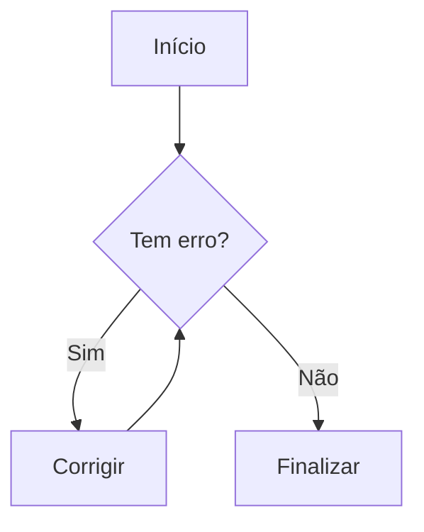
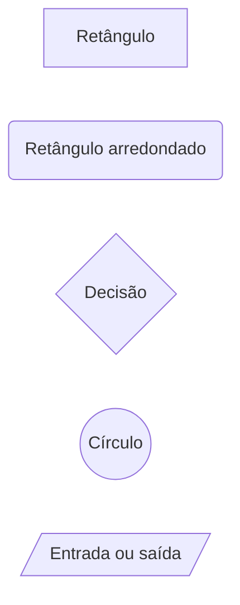

# Guia Definitivo de Markdown / MD

[](./LICENSE)
[](#indice)
[](https://github.github.com/gfm/)
[](https://github.github.com/gfm/)
[](https://spec.commonmark.org/0.31.2/)
[](#indice)
[](#01-introducao)
[](#03-regras-essenciais-antes-de-comecar)
[](./GUIA_MERMAID.md)
[](#25-math-latex)
[](./LISTA_EMOJIs.md)
[](#37-referencias-uteis)
[](#01-introducao)
[](#01-introducao)
[](https://github.com/Diego-Ch4m4X/ANOTACOES)
[](https://diego-ch4m4x.github.io/ANOTACOES/)


> **Material de referência público, estável e prático**  
> Guia organizado para escrever documentos `.md` com clareza, compatibilidade e boa formatação, usando CommonMark como base interoperável, GitHub Flavored Markdown (GFM), recursos adicionais do GitHub, HTML quando apropriado e exemplos prontos para copiar.

### Metadados técnicos desta revisão

| Campo | Referência usada neste guia |
|---|---|
| Última revisão técnica | **2026-08-21** |
| Núcleo de sintaxe interoperável | **CommonMark 0.31.2** |
| Especificação formal do GitHub Flavored Markdown | **GFM 0.29-gfm** |
| Recursos específicos do GitHub | documentação oficial do GitHub revisada em **2026-08-21** |
| Diagramas Mermaid | introdução neste guia + referência aprofundada em [`GUIA_MERMAID.md`](./GUIA_MERMAID.md) |
| Objetivo editorial | referência pública para iniciantes e profissionais, com distinção explícita entre sintaxe normativa e comportamento dependente de plataforma |

> **Importante:** a especificação formal do GFM e os recursos oferecidos pela interface do GitHub não são a mesma coisa. O GitHub usa GFM e acrescenta funcionalidades próprias. Este guia identifica essas camadas sempre que a distinção for relevante.

---

<a name="indice"></a>

## Índice

- [Introdução](#01-introducao)
  - [Como interpretar este guia: Markdown, CommonMark, GFM e GitHub](#01b-camadas-markdown-commonmark-gfm-github)
  - [Referência rápida / Cheat Sheet](#01c-referencia-rapida)
  - [Laboratório prático para testar Markdown](#01a-laboratorio-pratico-para-testar-markdown)
- [01. O que é Markdown / MD](#02-o-que-e-markdown-md)
- [02. Regras essenciais antes de começar](#03-regras-essenciais-antes-de-comecar)
- [03. Títulos](#04-titulos)
- [04. Parágrafos, linhas e quebras de linha](#05-paragrafos-linhas-e-quebras-de-linha)
- [05. Ênfase: negrito, itálico, negrito + itálico e riscado](#06-enfase-negrito-italico-negrito-italico-e-riscado)
- [06. Sublinhado com HTML](#07-sublinhado-com-html)
- [07. Caracteres especiais, entidades HTML e escape](#08-caracteres-especiais-e-escape)
  - [Entidades HTML úteis](#08a-entidades-html-uteis)
- [08. Espaçamento e recuo visual](#09-espacamento-e-recuo-visual)
- [09. Linhas horizontais](#10-linhas-horizontais)
- [10. Citações / Blockquote](#11-citacoes-blockquote)
- [11. Código inline / Inline Code](#12-codigo-inline-inline-code)
- [12. Blocos de código](#13-blocos-de-codigo)
  - [Diff — destaque de linhas adicionadas e removidas](#13a-diff-destaque-de-linhas-adicionadas-e-removidas)
- [13. Listas ordenadas](#14-listas-ordenadas)
- [14. Listas desordenadas](#15-listas-desordenadas)
- [15. Listas aninhadas](#16-listas-aninhadas)
- [16. Lista de tarefas / Task List](#17-lista-de-tarefas-task-list)
- [17. Links](#18-links)
  - [Links de referência / Reference-style links](#18a-links-de-referencia-reference-style-links)
- [18. Âncoras internas](#19-ancoras-internas)
- [19. Imagens](#20-imagens)
  - [Imagem clicável / imagem como link](#20a-imagem-clicavel-imagem-como-link)
  - [Badges / Shields](#20b-badges-shields)
- [20. Imagens com HTML](#21-imagens-com-html)
  - [Vídeos no GitHub e em Markdown com HTML](#21a-videos-no-github-e-em-markdown-com-html)
- [21. SVG inline](#22-svg-inline)
- [22. Tabelas](#23-tabelas)
- [23. Notas de rodapé / Footnotes](#24-notas-de-rodape-footnotes)
- [24. Math / LaTeX](#25-math-latex)
- [25. Seção retrátil com details / summary](#26-secao-retratil-com-details-summary)
- [26. Emojis no padrão GitHub](#27-emojis-no-padrao-github)
- [27. Alertas do GitHub](#28-alertas-do-github)
- [28. Fluxogramas e diagramas Mermaid](#29-fluxogramas-e-diagramas-mermaid)
- [29. HTML dentro do Markdown](#30-html-dentro-do-markdown)
  - [Teclas de teclado com kbd](#30a-teclas-de-teclado-com-kbd)
  - [Sobrescrito e subscrito com sup/sub](#30b-sobrescrito-e-subscrito-com-supsub)
- [30. Comentários em Markdown](#31-comentarios-em-markdown)
- [31. Menções e referências automáticas do GitHub](#32-mencoes-e-referencias-automaticas-do-github)
- [31A. Contextos e recursos adicionais do GitHub](#32a-contextos-e-recursos-adicionais-do-github)
- [32. Boas práticas de organização de README](#33-boas-praticas-de-organizacao-de-readme)
- [32A. YAML Front Matter e metadados de ferramentas](#33a-yaml-front-matter)
- [32B. Qualidade, lint e validação](#33b-qualidade-lint-validacao)
- [33. Pegadinhas comuns](#34-pegadinhas-comuns)
- [34. Checklist final](#35-checklist-final)
- [35. Projeto complementar: ANOTAÇÕES](#36-projeto-complementar-anotacoes)
- [36. Referências úteis](#37-referencias-uteis)
  - [Glossário técnico](#37a-glossario-tecnico)
- [37. Licença](#38-licenca)
- [Conclusão](#39-conclusao)

---

<a name="01-introducao"></a>

## Introdução

Markdown é uma linguagem de marcação leve criada para produzir documentos estruturados a partir de texto puro. O arquivo-fonte continua legível sem renderização e pode ser convertido em HTML ou apresentado visualmente por ferramentas como GitHub, VS Code, Obsidian, GitLab, MkDocs, Docusaurus e outras.

Este guia usa como foco principal:

- sintaxe interoperável baseada em **CommonMark**;
- extensões formais do **GitHub Flavored Markdown (GFM)**;
- recursos adicionais oferecidos pela plataforma **GitHub**;
- HTML usado de forma controlada quando Markdown não oferece um recurso equivalente;
- recursos de ecossistema, como YAML Front Matter, Mermaid, Math/LaTeX, lint e validação;
- compatibilidade prática entre renderizadores;
- exemplos simples para quem está começando e notas técnicas úteis para quem já trabalha com documentação.

> **Escopo e compatibilidade:** não existe um único comportamento universal para todos os arquivos chamados de “Markdown”. CommonMark define uma base precisa; GFM adiciona extensões formais; plataformas e ferramentas podem acrescentar outros recursos. Sempre teste funcionalidades dependentes de plataforma no ambiente final de publicação.

<a name="01b-camadas-markdown-commonmark-gfm-github"></a>

### Como interpretar este guia: Markdown, CommonMark, GFM e GitHub

Para evitar ambiguidades, use este modelo mental:

```text
Markdown
│
├── Markdown original
│   └── proposta histórica de 2004 e sintaxe inicial
│
├── CommonMark
│   └── especificação precisa e interoperável do núcleo da linguagem
│
├── GitHub Flavored Markdown — GFM
│   ├── CommonMark
│   ├── tabelas
│   ├── listas de tarefas
│   ├── tachado / strikethrough
│   ├── extended autolinks
│   └── tagfilter para determinados HTMLs brutos
│
├── Recursos adicionais do GitHub
│   ├── notas de rodapé
│   ├── alerts
│   ├── Mermaid
│   ├── Math / LaTeX via MathJax
│   ├── emoji shortcodes
│   ├── menções e referências contextuais
│   ├── preview de cores
│   └── outros recursos da interface
│
└── Extensões do ambiente
    ├── HTML permitido pelo renderizador
    ├── YAML Front Matter
    ├── plugins
    ├── extensões do editor
    └── recursos específicos de geradores de site
```

#### Legenda usada ao longo do guia

| Camada | O que significa |
|---|---|
| **CommonMark** | sintaxe do núcleo formal e amplamente interoperável |
| **GFM** | extensão definida na especificação formal do GitHub Flavored Markdown |
| **GitHub** | funcionalidade oferecida pela plataforma GitHub além do GFM formal |
| **HTML** | elemento HTML embutido; não é sintaxe Markdown |
| **Ferramenta/ecossistema** | comportamento fornecido por editor, gerador de site, plugin ou pipeline específico |
| **Boa prática editorial** | recomendação de organização; não é uma regra sintática |

> **Regra de interpretação:** quando este guia recomendar uma forma “preferida”, isso pode ser uma boa prática de legibilidade ou portabilidade, e não necessariamente a única sintaxe válida.

<a name="01c-referencia-rapida"></a>

### Referência rápida / Cheat Sheet

| Quero fazer | Sintaxe | Camada principal |
|---|---|---|
| H1 | `# Título` | CommonMark |
| H2 | `## Título` | CommonMark |
| Negrito | `**texto**` | CommonMark |
| Itálico | `*texto*` ou `_texto_` | CommonMark |
| Tachado | `~~texto~~` | GFM |
| Link | `[texto](https://exemplo.com)` | CommonMark |
| Imagem | `` | CommonMark |
| Código inline | `` `código` `` | CommonMark |
| Bloco de código | três crases antes/depois | CommonMark |
| Lista | `- item` | CommonMark |
| Lista ordenada | `1. item` | CommonMark |
| Citação | `> texto` | CommonMark |
| Quebra de linha explícita | dois espaços, `\` no fim da linha ou `<br>` | CommonMark / HTML |
| Task list | `- [ ] tarefa` | GFM |
| Tabela | `\| A \| B \|` + linha delimitadora | GFM |
| Nota de rodapé | `[^1]` | GitHub |
| Fórmula | `$x^2$` | GitHub |
| Diagrama | bloco cercado com linguagem `mermaid` | GitHub + Mermaid |
| Seção retrátil | `<details>` / `<summary>` | HTML |

<a name="01a-laboratorio-pratico-para-testar-markdown"></a>

### Laboratório prático para testar Markdown

Quer testar os exemplos deste guia em arquivos `.md` reais?

Use o **ANOTAÇÕES**, projeto local-first criado pelo mesmo autor para editar, organizar e visualizar arquivos `.txt` e `.md` diretamente pelo navegador.

- [Ver repositório ANOTAÇÕES](https://github.com/Diego-Ch4m4X/ANOTACOES)
- [Testar no GitHub Pages](https://diego-ch4m4x.github.io/ANOTACOES/)

Com ele, você pode praticar títulos, listas, tabelas, blocos de código, Mermaid, Math / LaTeX, emojis, notas de rodapé, imagens e outros recursos explicados neste guia em um fluxo mais próximo do uso real.

> Use o ANOTAÇÕES como **laboratório prático complementar**: este guia explica a sintaxe e as diferenças de compatibilidade; o projeto ajuda a testar o Markdown em arquivos reais.

[Voltar ao índice](#indice)

---

<a name="02-o-que-e-markdown-md"></a>

## 01. O que é Markdown / MD

> **Camada principal:** CommonMark como referência do núcleo + contexto histórico do Markdown.

Markdown é uma linguagem de marcação leve.

Ela serve para escrever documentos usando texto puro, mas com marcações simples para gerar títulos, listas, links, imagens, tabelas, blocos de código, citações e outros elementos.

Exemplo simples:

```md
# Meu título

Este é um parágrafo com **negrito**, _itálico_ e um [link](https://github.com).
```

Resultado visual esperado:

```text
[H1] Meu título

Este é um parágrafo com negrito, itálico e um link clicável.
```

### Extensão do arquivo

Normalmente o arquivo Markdown usa:

```txt
.md
```

Exemplos:

```txt
README.md
CHANGELOG.md
GUIA_MERMAID.md
LISTA_EMOJIs.md
```

### Para que serve

Markdown é muito usado para:

- arquivos `README.md`;
- documentação técnica;
- anotações;
- changelog;
- guias de estudo;
- tutoriais;
- issues e pull requests no GitHub;
- páginas estáticas;
- documentação de projetos.

[Voltar ao índice](#indice)

---

<a name="03-regras-essenciais-antes-de-comecar"></a>

## 02. Regras essenciais antes de começar

> **Camada principal:** CommonMark + GFM + comportamento de plataforma, explicitamente diferenciados.

### Regra 1 — Linha em branco separa blocos

Em Markdown, uma linha em branco é a forma mais clara de separar parágrafos e muitos outros blocos. Alguns blocos conseguem iniciar sem linha em branco, mas depender disso pode reduzir a legibilidade do arquivo-fonte e a compatibilidade entre ferramentas.

Recomendado:

```md
Primeiro parágrafo.

Segundo parágrafo.
```

Sem linha em branco:

```md
Primeira linha.
Segunda linha.
```

Em um arquivo `.md` no GitHub, isso normalmente forma um único parágrafo visual. Em campos de conversa do GitHub, como issues, pull requests e discussions, o tratamento de quebras simples pode ser diferente.

### Regra 2 — Markdown é sensível ao contexto

O mesmo símbolo pode ter significados diferentes conforme a posição.

```md
# Título
```

Aqui `#` cria um título ATX.

```md
Número #123
```

Aqui `#` é texto comum.

### Regra 3 — Espaço depois do marcador: regra e recomendação não são a mesma coisa

Use espaço depois de marcadores porque isso melhora a legibilidade e, em alguns casos, é obrigatório para a sintaxe ser reconhecida.

| Exemplo | Situação |
|---|---|
| `# Título` | válido e recomendado |
| `#Título` | não é um título ATX CommonMark |
| `- Item` | válido |
| `-Item` | não é marcador de lista |
| `> Citação` | válido e recomendado por legibilidade |
| `>Citação` | **também é válido** em CommonMark; o espaço após `>` pode ser omitido |

Portanto, não trate `>Texto` como erro sintático. Prefira `> Texto` porque a intenção fica mais clara no arquivo-fonte.

### Regra 4 — Compatibilidade muda conforme o editor e o contexto

| Recurso | CommonMark | GFM formal | GitHub | Observação |
|---|---:|---:|---:|---|
| Títulos | Sim | Sim | Sim | alta interoperabilidade |
| Negrito / itálico | Sim | Sim | Sim | alta interoperabilidade |
| Links | Sim | Sim | Sim | alta interoperabilidade |
| Imagens | Sim | Sim | Sim | alta interoperabilidade |
| Tabelas | Não | Sim | Sim | extensão GFM |
| Lista de tarefas | Não | Sim | Sim | extensão GFM |
| Tachado | Não | Sim | Sim | extensão GFM |
| Extended autolinks | Não | Sim | Sim | URLs sem `< >` em situações definidas pelo GFM |
| Footnotes | Não | Não | Sim | recurso adicional do GitHub; não funciona em GitHub Wikis |
| Emoji `:joy:` | Não | Não | Sim | recurso da plataforma; Unicode direto é mais portátil |
| Mermaid | Não | Não | Sim | integração adicional do GitHub |
| Math / LaTeX | Não | Não | Sim | GitHub usa MathJax |
| Alerts `[!NOTE]` | Não | Não | Sim | recurso adicional do GitHub |
| Bloco `diff` | bloco de código | bloco de código | destaque visual | realce depende do renderer |
| Badges / Shields | imagem comum | imagem comum | imagem comum | depende de serviço/asset externo |
| `<kbd>` / `<sup>` / `<sub>` | HTML bruto | HTML bruto | aceitos em vários contextos | dependem da política de sanitização |
| `<details>` | HTML bruto | HTML bruto | suportado | pode variar em outros renderizadores |
| YAML Front Matter | Não | Não | depende da ferramenta | metadados de Jekyll/GitHub Pages e outros geradores |

### Regra 5 — Diferencie sintaxe de comportamento de plataforma

Uma construção pode ser sintaticamente válida em Markdown e ainda assim receber tratamento diferente no ambiente final.

Exemplos:

- CommonMark pode reconhecer HTML bruto, mas o GitHub aplica filtragem e sanitização;
- um bloco cercado pode ser Markdown válido, mas o destaque de sintaxe depende do renderizador;
- `#42` pode virar referência automática em conversas do GitHub, mas não recebe o mesmo autolink em arquivos `.md` do repositório;
- Mermaid e Math são recursos de renderização fornecidos pela plataforma, não extensões do GFM formal.

[Voltar ao índice](#indice)

---

<a name="04-titulos"></a>

## 03. Títulos

> **Camada principal:** CommonMark; recomendações de H1/hierarquia são boas práticas editoriais.

Títulos estruturam o documento. Em Markdown, a forma ATX usa de um a seis caracteres `#` no começo da linha.

```md
# TÍTULO 1
## TÍTULO 2
### TÍTULO 3
#### TÍTULO 4
##### TÍTULO 5
###### TÍTULO 6
```

Resultado conceitual:

```text
H1 → título de primeiro nível
H2 → título de segundo nível
H3 → título de terceiro nível
H4 → título de quarto nível
H5 → título de quinto nível
H6 → título de sexto nível
```

### Quantos níveis existem?

CommonMark aceita H1 até H6.

| Sintaxe | Nome comum | Uso editorial recomendado |
|---|---|---|
| `#` | H1 | título principal do documento |
| `##` | H2 | seção principal |
| `###` | H3 | subseção |
| `####` | H4 | detalhamento |
| `#####` | H5 | nível profundo; use com parcimônia |
| `######` | H6 | nível muito profundo; reavalie a estrutura se aparecer com frequência |

### Um único H1: boa prática, não limitação sintática

Markdown permite mais de um H1. Entretanto, para README, documentação técnica, páginas e guias, normalmente é melhor manter **um H1 principal** e organizar o restante abaixo dele.

Essa convenção melhora:

- hierarquia visual;
- navegação;
- acessibilidade;
- consistência editorial;
- previsibilidade para ferramentas de lint e geração de documentação.

Recomendado:

```md
# Guia de Markdown

## Introdução
## Títulos
## Listas
## Links
```

Evite criar vários H1 apenas para obter texto grande:

```md
# Guia de Markdown
# Introdução
# Títulos
# Listas
```

### Não pule níveis sem necessidade

Recomendado:

```md
## Listas
### Lista ordenada
### Lista desordenada
```

Evite:

```md
## Listas
#### Lista ordenada
```

Pular níveis não torna o Markdown inválido, mas prejudica a estrutura lógica e pode afetar navegação e acessibilidade.

### Títulos Setext

CommonMark e GFM também aceitam a forma **Setext** para H1 e H2:

```md
Título nível 1
==============

Título nível 2
--------------
```

Setext é sintaxe formal, não apenas uma convenção de alguns renderizadores. Mesmo assim, para documentação técnica moderna, prefira ATX (`#`, `##`, `###`) porque:

- a hierarquia fica explícita no arquivo-fonte;
- H3 a H6 só existem na forma ATX;
- é mais simples manter um padrão único;
- ferramentas de lint costumam recomendar consistência de estilo.

### Outline automático do GitHub

Quando um arquivo renderizado no GitHub contém dois ou mais títulos, a interface gera automaticamente uma **estrutura de tópicos / Outline** acessível no cabeçalho do arquivo.

Isso não substitui necessariamente um índice escrito manualmente:

| Recurso | Característica |
|---|---|
| Índice manual | faz parte do conteúdo e continua existindo fora do GitHub |
| Outline do GitHub | faz parte da interface do GitHub e é gerado automaticamente |

[Voltar ao índice](#indice)

---

<a name="05-paragrafos-linhas-e-quebras-de-linha"></a>

## 04. Parágrafos, linhas e quebras de linha

> **Camada principal:** CommonMark + alternativa HTML para `<br>` + diferença de contexto no GitHub.

### Parágrafo comum

Para criar um novo parágrafo, deixe uma linha em branco.

```md
Este é o primeiro parágrafo.

Este é o segundo parágrafo.
```

### Soft break: quebra no arquivo-fonte sem quebra visual obrigatória

```md
Primeira linha no arquivo.
Segunda linha no arquivo.
```

Em um arquivo `.md` renderizado pelo GitHub, essas linhas normalmente pertencem ao mesmo parágrafo e aparecem na mesma linha visual, separadas por espaço.

> **Contexto GitHub:** em campos de conversa como issues, pull requests e discussions, uma quebra simples pode ser apresentada como quebra visual. Não use esse comportamento de conversa como regra para arquivos `.md`.

### Hard break: quebra de linha explícita sem novo parágrafo

CommonMark permite duas formas nativas principais.

#### Forma 1 — dois espaços no final da linha

```md
Linha 1 com dois espaços no final.  
Linha 2 logo abaixo.
```

#### Forma 2 — barra invertida no final da linha

```md
Linha 1 com barra invertida no final.\
Linha 2 logo abaixo.
```

A forma com `\` é visualmente mais explícita no arquivo-fonte e evita que editores removam espaços finais automaticamente.

### Forma HTML com `<br>`

```md
Linha 1<br>
Linha 2
```

`<br>` é HTML, não sintaxe Markdown. Use quando o ambiente aceitar HTML e a intenção de quebra precisar ficar evidente.

### Quando usar cada um?

| Necessidade | Melhor opção |
|---|---|
| separar ideias em parágrafos | linha em branco |
| manter o mesmo parágrafo e forçar quebra | `\` no final ou dois espaços |
| controlar quebra em conteúdo HTML | `<br>` |
| criar “espaço grande” | repensar a estrutura; Markdown não é ferramenta de layout |

### Regra prática

Para documentação técnica versionada, prefira a barra invertida `\` quando quiser uma quebra explícita e seu editor costuma remover trailing spaces. Use `<br>` com moderação para preservar portabilidade.

[Voltar ao índice](#indice)

---

<a name="06-enfase-negrito-italico-negrito-italico-e-riscado"></a>

## 05. Ênfase: negrito, itálico, negrito + itálico e riscado

> **Camada principal:** CommonMark para ênfase; GFM para strikethrough.

### Negrito

Sintaxe recomendada:

```md
**Texto em negrito**
```

Resultado:

**Texto em negrito**

Também funciona:

```md
__Texto em negrito__
```

Resultado:

__Texto em negrito__

> **Recomendação:** prefira `**negrito**`, porque é mais comum e mais fácil de ler.

### Itálico

Sintaxe recomendada:

```md
_Texto em itálico_
```

Resultado:

_Texto em itálico_

Também funciona:

```md
*Texto em itálico*
```

Resultado:

*Texto em itálico*

> **Recomendação:** prefira `_itálico_` quando quiser diferenciar visualmente de `**negrito**`.

### Negrito + itálico

```md
***Texto em negrito e itálico***
```

Resultado:

***Texto em negrito e itálico***

Também pode usar:

```md
**_Texto em negrito e itálico_**
```

Resultado:

**_Texto em negrito e itálico_**

### Texto riscado / Strikethrough

> **Camada:** extensão formal do GFM; não faz parte do núcleo CommonMark.

Forma recomendada para maior reconhecimento entre ferramentas:

```md
~~Texto riscado~~
```

O GFM formal também reconhece um único til em pares:

```md
~Texto riscado~
```

Como nem todo dialeto Markdown aceita a forma com um único `~`, prefira `~~texto~~` quando a portabilidade for importante.

Muito usado para indicar algo removido, descontinuado ou corrigido.

Exemplo:

```md
Versão antiga: ~~usar senha fixa~~  
Versão correta: usar variável de ambiente.
```

Resultado:

Versão antiga: ~~usar senha fixa~~  
Versão correta: usar variável de ambiente.

### Cuidado com espaços

Correto:

```md
**texto**
```

Errado:

```md
** texto **
```

O segundo pode não renderizar como esperado em alguns lugares.

[Voltar ao índice](#indice)

---

<a name="07-sublinhado-com-html"></a>

## 06. Sublinhado com HTML

> **Camada principal:** HTML; não existe sintaxe de sublinhado no núcleo CommonMark.

Markdown puro não possui marcação própria para sublinhado.

Para sublinhar, use HTML.

### Com `<u>`

```md
<u>Texto sublinhado</u>
```

Resultado:

<u>Texto sublinhado</u>

### Com `<ins>`

```md
<ins>Texto inserido / sublinhado</ins>
```

Resultado:

<ins>Texto inserido / sublinhado</ins>

### Diferença entre `<u>` e `<ins>`

| Tag | Significado | Quando usar |
|---|---|---|
| `<u>` | sublinhado visual | Quando quiser apenas sublinhar |
| `<ins>` | texto inserido/adicionado | Quando quiser indicar uma adição/correção |

### Cuidado

Sublinhado pode ser confundido com link. Use com moderação.

[Voltar ao índice](#indice)

---

<a name="08-caracteres-especiais-e-escape"></a>

## 07. Caracteres especiais, entidades HTML e escape

> **Camada principal:** CommonMark para escapes e referências de entidade; HTML para semântica das entidades.

Alguns caracteres têm função especial no Markdown.

Exemplos:

| Caractere | Uso comum no Markdown |
|---|---|
| `#` | título |
| `*` | itálico, negrito ou lista |
| `_` | itálico ou negrito |
| `-` | lista ou linha horizontal |
| `+` | lista |
| `>` | citação |
| `` ` `` | código |
| `[` e `]` | texto de link |
| `(` e `)` | URL do link |
| `!` | imagem |
| `\|` | tabela |
| `\` | escape |

### Como exibir um caractere especial como texto comum

Use barra invertida `\` antes do caractere.

```md
\# Isto não vira título
\* Isto não vira lista nem itálico
\- Isto não vira lista
\> Isto não vira citação
\` Isto não vira código
```

Resultado esperado:

\# Isto não vira título  
\* Isto não vira lista nem itálico  
\- Isto não vira lista  
\> Isto não vira citação  
\` Isto não vira código

### Exemplo clássico com número e ponto

Se uma linha começa com número + ponto, pode virar lista ordenada.

```md
1990. Isso pode virar item de lista.
```

Para impedir:

```md
1990\. Isso não vira lista.
```

Resultado:

1990\. Isso não vira lista.

### Escape dentro de tabelas

Para mostrar `|` dentro de uma célula de tabela, use:

```md
\|
```

Exemplo:

```md
| Operador | Descrição |
|---|---|
| `A \| B` | pipe escapado dentro da célula |
```

Resultado:

| Operador | Descrição |
|---|---|
| `A \| B` | pipe escapado dentro da célula |


<a name="08a-entidades-html-uteis"></a>

### Entidades HTML úteis

Entidades HTML são códigos que representam caracteres especiais.

Elas são úteis quando você quer mostrar um caractere que poderia ser interpretado como HTML, Markdown ou símbolo especial.

### Tabela de entidades comuns

| Entidade | Resultado | Uso comum |
|---|---:|---|
| `&lt;` | &lt; | mostrar o sinal menor que sem abrir tag HTML |
| `&gt;` | &gt; | mostrar o sinal maior que sem fechar tag HTML |
| `&amp;` | &amp; | mostrar o caractere `&` literalmente |
| `&quot;` | &quot; | aspas duplas |
| `&apos;` | &apos; | aspas simples/apóstrofo |
| `&copy;` | &copy; | copyright |
| `&reg;` | &reg; | marca registrada |
| `&trade;` | &trade; | trademark |
| `&mdash;` | &mdash; | travessão longo |
| `&ndash;` | &ndash; | meia-risca |
| `&hellip;` | &hellip; | reticências |
| `&nbsp;` | &nbsp; | espaço não quebrável |
| `&ensp;` | &ensp; | espaço médio |
| `&emsp;` | &emsp; | espaço maior, parecido com TAB visual |

### Exemplo com tags HTML aparecendo como texto

Se você escrever assim:

```md
<div>conteúdo</div>
```

Dependendo do renderizador, isso pode ser entendido como HTML.

Para mostrar os sinais como texto, use entidades:

```md
&lt;div&gt;conteúdo&lt;/div&gt;
```

Resultado esperado:

&lt;div&gt;conteúdo&lt;/div&gt;

### Exemplo com E comercial `&`

```md
HTML &amp; Markdown
```

Resultado:

HTML &amp; Markdown

### Exemplo com copyright

```md
&copy; 2026 Meu Projeto
```

Resultado:

&copy; 2026 Meu Projeto

### Exemplo com travessão

```md
Markdown &mdash; guia prático e completo.
```

Resultado:

Markdown &mdash; guia prático e completo.

### Cuidado

Use entidades quando elas realmente forem necessárias.

Para texto comum, normalmente é melhor escrever o caractere direto:

```md
© 2026 Meu Projeto
```

Mas quando o caractere interfere no HTML ou no Markdown, a entidade deixa o resultado mais seguro.

[Voltar ao índice](#indice)

---

<a name="09-espacamento-e-recuo-visual"></a>

## 08. Espaçamento e recuo visual

> **Camada principal:** HTML/entidades; Markdown não é uma linguagem de layout.

Markdown não foi criado para controlar layout com precisão. Ele foi criado para estrutura textual.

Mesmo assim, existem alguns recursos.

### Entidades HTML de espaço

| Entidade | Resultado | Explicação |
|---|---|---|
| `&nbsp;` | &nbsp; | espaço não quebrável |
| `&ensp;` | &ensp; | espaço médio |
| `&emsp;` | &emsp; | espaço maior, parecido com TAB visual |

Exemplo:

```md
Texto normal

&nbsp;&nbsp;&nbsp;&nbsp;Texto com recuo usando quatro `&nbsp;`.

&emsp;Texto com recuo usando `&emsp;`.
```

Resultado:

Texto normal

&nbsp;&nbsp;&nbsp;&nbsp;Texto com recuo usando quatro `&nbsp;`.

&emsp;Texto com recuo usando `&emsp;`.

### Cuidado com espaço como layout

Evite usar muitos `&nbsp;` para alinhar conteúdo.

Ruim:

```md
Nome:&nbsp;&nbsp;&nbsp;&nbsp;&nbsp;&nbsp;Diego
Cargo:&nbsp;&nbsp;&nbsp;&nbsp;&nbsp;Analista
```

Melhor usar tabela:

```md
| Campo | Valor |
|---|---|
| Nome | Diego |
| Cargo | Analista |
```

Resultado:

| Campo | Valor |
|---|---|
| Nome | Diego |
| Cargo | Analista |

[Voltar ao índice](#indice)

---

<a name="10-linhas-horizontais"></a>

## 09. Linhas horizontais

> **Camada principal:** CommonMark.

Linhas horizontais servem para separar grandes blocos do documento.

Você pode usar:

```md
---
```

```md
***
```

```md
___
```

Resultado:

---

### Recomendações

Prefira:

```md
---
```

Porque é simples, comum e fácil de ler.

### Cuidado com `---` logo abaixo de texto

Isto pode virar título nível 2 em alguns renderizadores:

```md
Meu título
---
```

Resultado visual esperado em alguns renderizadores:

```text
[H2] Meu título
```

Para linha horizontal, deixe uma linha em branco antes:

```md
Texto anterior.

---

Texto depois.
```

[Voltar ao índice](#indice)

---

<a name="11-citacoes-blockquote"></a>

## 10. Citações / Blockquote

> **Camada principal:** CommonMark.

Citação é criada com `>` no começo da linha.

O espaço depois de `>` é recomendado por legibilidade, mas não é obrigatório em CommonMark. Portanto, `>Texto` e `> Texto` podem formar blockquotes; prefira a segunda forma.

```md
> Esta é uma citação.
```

Resultado:

> Esta é uma citação.

### Citação com várias linhas

```md
> Primeira linha da citação.
> Segunda linha da citação.
> Terceira linha da citação.
```

Resultado:

> Primeira linha da citação.
> Segunda linha da citação.
> Terceira linha da citação.

### Citação com parágrafos

Use uma linha com `>` vazia entre os parágrafos.

```md
> Primeiro parágrafo da citação.
>
> Segundo parágrafo da citação.
```

Resultado:

> Primeiro parágrafo da citação.
>
> Segundo parágrafo da citação.

### Citação com Markdown dentro

```md
> **Importante:** use `README.md` para documentar o projeto.
>
> - Explique o objetivo.
> - Mostre como instalar.
> - Mostre como usar.
```

Resultado:

> **Importante:** use `README.md` para documentar o projeto.
>
> - Explique o objetivo.
> - Mostre como instalar.
> - Mostre como usar.

### Citação aninhada

```md
> Citação principal.
>
> > Citação dentro da citação.
```

Resultado:

> Citação principal.
>
> > Citação dentro da citação.

[Voltar ao índice](#indice)

---

<a name="12-codigo-inline-inline-code"></a>

## 11. Código inline / Inline Code

> **Camada principal:** CommonMark.

Código inline é usado para mostrar comandos, nomes de arquivos, funções, variáveis, tags e trechos curtos de código dentro de uma frase.

Use crase simples:

```md
Use o comando `git status` para verificar o estado do repositório.
```

Resultado:

Use o comando `git status` para verificar o estado do repositório.

### Exemplos comuns

```md
O arquivo principal é `README.md`.
A função `create_access_token()` cria um token.
A tag `<details>` cria uma seção retrátil.
A propriedade `display: flex` ativa Flexbox.
```

Resultado:

O arquivo principal é `README.md`.  
A função `create_access_token()` cria um token.  
A tag `<details>` cria uma seção retrátil.  
A propriedade `display: flex` ativa Flexbox.

### Como mostrar crase dentro de código inline

Se precisar mostrar uma crase dentro do próprio código, use duas crases ao redor.

```md
Use `` `codigo` `` para mostrar crases.
```

Resultado:

Use `` `codigo` `` para mostrar crases.

### Quando usar código inline

Use para:

- comandos: `npm install`;
- arquivos: `index.html`;
- funções: `map()`;
- variáveis: `userName`;
- propriedades CSS: `color`;
- tags HTML: `<summary>`;
- extensões: `.md`.

[Voltar ao índice](#indice)

---

<a name="13-blocos-de-codigo"></a>

## 12. Blocos de código

> **Camada principal:** CommonMark; realce de sintaxe depende do renderizador.

Bloco de código é usado para trechos maiores de código, comandos, logs ou exemplos que precisam manter a formatação.

### Com três crases

````md
```js
console.log("Olá, mundo!");
```
````

Resultado:

```js
console.log("Olá, mundo!");
```

### Com três tils

Também pode usar `~~~`.

```md
~~~python
print("Olá, mundo!")
~~~
```

Resultado:

~~~python
print("Olá, mundo!")
~~~

### Qual usar?

| Sintaxe | Uso |
|---|---|
| ``` | Mais comum |
| `~~~` | Útil quando o conteúdo contém muitas crases |

### Linguagem depois das crases

Depois das crases, informe uma **info string** — normalmente o nome da linguagem — para que renderizadores compatíveis possam aplicar destaque de sintaxe. CommonMark define o fenced code block e sua info string, mas não define as cores nem o mecanismo de syntax highlighting.

Exemplos:

````md
```html
<h1>Título</h1>
```

```css
body { color: #111; }
```

```js
const nome = "Diego";
```

```bash
git status
```

```json
{
  "nome": "README"
}
```
````

### Bloco sem linguagem

````md
```
Texto puro.
Sem destaque de sintaxe.
```
````

Resultado:

```
Texto puro.
Sem destaque de sintaxe.
```

### Mostrar um bloco Markdown dentro de outro Markdown

Quando quiser ensinar Markdown dentro de Markdown, use quatro crases por fora.

`````md
````md

````
`````

Resultado esperado no arquivo:

````md

````

### Bloco de código por indentação

Também existe bloco de código com quatro espaços no começo da linha:

```md
    git status
    git add .
```

Resultado:

    git status
    git add .


Mas prefira blocos com crases, porque são mais claros e aceitam linguagem.

<a name="13a-diff-destaque-de-linhas-adicionadas-e-removidas"></a>

### Diff — destaque de linhas adicionadas e removidas

`diff` não é um novo tipo estrutural de bloco Markdown. Ele é uma **info string** usada em um fenced code block para pedir ao renderizador destaque semelhante a um diff.

É útil em README, changelog, revisão de código e documentação de correção, mas as cores e o realce dependem do renderizador.

### Sintaxe

````md
```diff
- linha removida
+ linha adicionada
  linha sem alteração
```
````

Resultado esperado em renderizadores com destaque `diff`:

```diff
- linha removida
+ linha adicionada
  linha sem alteração
```

### Como ler

| Símbolo | Significado |
|---|---|
| `-` | linha removida |
| `+` | linha adicionada |
| espaço no começo | linha sem alteração |

### Exemplo prático em documentação

````md
```diff
- const tema = "claro";
+ const tema = "escuro";
```
````

Resultado:

```diff
- const tema = "claro";
+ const tema = "escuro";
```

### Exemplo em CHANGELOG

````md
```diff
+ Adicionado suporte a Mermaid.
+ Adicionada lista de emojis.
- Removido exemplo duplicado de tabela.
```
````

Resultado:

```diff
+ Adicionado suporte a Mermaid.
+ Adicionada lista de emojis.
- Removido exemplo duplicado de tabela.
```

### Pegadinha importante

Para o destaque funcionar, o sinal precisa estar logo no começo da linha dentro do bloco `diff`.

Correto:

```diff
+ linha adicionada
- linha removida
```

Ruim:

```diff
  + linha adicionada com espaços antes do sinal
  - linha removida com espaços antes do sinal
```

[Voltar ao índice](#indice)

---

<a name="14-listas-ordenadas"></a>

## 13. Listas ordenadas

> **Camada principal:** CommonMark.

Listas ordenadas usam uma sequência de **1 a 9 dígitos** seguida de `.` ou `)`. A forma com ponto é a mais comum e é a recomendada neste guia.

```md
1. Primeiro item
2. Segundo item
3. Terceiro item
```

Também é válido em CommonMark:

```md
1) Primeiro item
2) Segundo item
3) Terceiro item
```

> **Nota técnica:** itens consecutivos pertencem à mesma lista ordenada quando usam o mesmo tipo de delimitador (`.` ou `)`). Evite alternar delimitadores dentro da mesma lista.

Forma recomendada:

```md
1. Primeiro item
2. Segundo item
3. Terceiro item
```

Resultado:

1. Primeiro item
2. Segundo item
3. Terceiro item

### Numeração automática

Em muitos renderizadores, você pode repetir `1.` e o Markdown corrige a numeração visual.

```md
1. Primeiro item
1. Segundo item
1. Terceiro item
```

Resultado:

1. Primeiro item
1. Segundo item
1. Terceiro item

### Números fora de ordem

```md
1. Primeiro
3. Segundo no arquivo
2. Terceiro no arquivo
```

Resultado visual geralmente será corrigido:

1. Primeiro
3. Segundo no arquivo
2. Terceiro no arquivo

### Começar em número específico com números fora de sequência

Também é possível começar uma lista em um número específico usando o primeiro número da lista.

Exemplo escrito:

```md
10. Começando em número específico
15. É a mesma regra
13. Do exemplo anterior
```

Resultado esperado em renderizadores como GitHub:

10. Começando em número específico
15. É a mesma regra
13. Do exemplo anterior

Observe a regra principal:

- o primeiro número define onde a lista começa;
- os próximos números escritos podem estar fora de ordem;
- o renderizador normalmente exibe a sequência visual correta a partir do primeiro número.

### Começar em número específico

Se quiser começar em `10`, coloque `10.` no primeiro item.

```md
10. Décimo item
11. Décimo primeiro item
12. Décimo segundo item
```

Resultado:

10. Décimo item
11. Décimo primeiro item
12. Décimo segundo item

### Forçar início com HTML

```html
<ol start="10">
  <li>Primeiro item, iniciando no 10</li>
  <li>Segundo item</li>
  <li>Terceiro item</li>
</ol>
```

Resultado:

<ol start="10">
  <li>Primeiro item, iniciando no 10</li>
  <li>Segundo item</li>
  <li>Terceiro item</li>
</ol>

### Lista ordenada com parágrafo dentro do item

```md
1. Primeiro item.

   Continuação do primeiro item.

2. Segundo item.
```

Resultado:

1. Primeiro item.

   Continuação do primeiro item.

2. Segundo item.

A continuação precisa estar indentada para continuar dentro do mesmo item.

### Subtítulo e sub-subtítulo com lista ordenada

Uma lista ordenada pode ter níveis internos. Isso é útil quando você quer representar uma estrutura parecida com:

```txt
1. Título
   1.1 Subtítulo
      1.1.1 Sub-subtítulo
```

Em Markdown puro, a lista aninhada cria níveis, mas **não gera automaticamente numeração composta** como `1.1` ou `1.1.1`.

Exemplo de lista aninhada normal:

```md
1. Instalação
   1. Requisitos
      1. Sistema operacional
      2. Editor de código
   2. Configuração
      1. Variáveis de ambiente
      2. Permissões
2. Uso
   1. Abrir o projeto
   2. Executar comandos
```

Resultado:

1. Instalação
   1. Requisitos
      1. Sistema operacional
      2. Editor de código
   2. Configuração
      1. Variáveis de ambiente
      2. Permissões
2. Uso
   1. Abrir o projeto
   2. Executar comandos

Se você quiser que apareça literalmente `1.1`, `1.2`, `1.1.1` e `1.1.2`, escreva essa numeração como parte do texto do item.

```md
1. Fundamentos
   1. 1.1 Títulos
   2. 1.2 Parágrafos
      1. 1.2.1 Quebra de linha
      2. 1.2.2 Linha em branco
2. Recursos avançados
   1. 2.1 Tabelas
   2. 2.2 Mermaid
      1. 2.2.1 Fluxograma
      2. 2.2.2 Diagrama de estados
```

Resultado:

1. Fundamentos
   1. 1.1 Títulos
   2. 1.2 Parágrafos
      1. 1.2.1 Quebra de linha
      2. 1.2.2 Linha em branco
2. Recursos avançados
   1. 2.1 Tabelas
   2. 2.2 Mermaid
      1. 2.2.1 Fluxograma
      2. 2.2.2 Diagrama de estados

Também é possível usar uma numeração textual no estilo romano.

```md
1. Parte I
   1. I.I Fundamentos
   2. I.II Sintaxe básica
      1. I.II.I Títulos
      2. I.II.II Parágrafos
2. Parte II
   1. II.I Recursos GitHub
   2. II.II Mermaid
```

Resultado:

1. Parte I
   1. I.I Fundamentos
   2. I.II Sintaxe básica
      1. I.II.I Títulos
      2. I.II.II Parágrafos
2. Parte II
   1. II.I Recursos GitHub
   2. II.II Mermaid

> **Regra de ouro:** se a numeração composta precisa aparecer exatamente como `1.1.1` ou `I.II.I`, trate essa numeração como texto. O Markdown organiza os níveis, mas não calcula esse tipo de numeração composta sozinho.

[Voltar ao índice](#indice)

---

<a name="15-listas-desordenadas"></a>

## 14. Listas desordenadas

> **Camada principal:** CommonMark.

Listas desordenadas usam `-`, `*` ou `+`.

### Com hífen

```md
- Item A
- Item B
- Item C
```

Resultado:

- Item A
- Item B
- Item C

### Com asterisco

```md
* Item A
* Item B
* Item C
```

Resultado:

* Item A
* Item B
* Item C

### Com sinal de mais

```md
+ Item A
+ Item B
+ Item C
```

Resultado:

+ Item A
+ Item B
+ Item C

### Recomendação

Prefira sempre `-`.

Motivo:

- é mais comum;
- é visualmente limpo;
- reduz confusão com itálico/negrito;
- evita inconsistência.

### Não misture marcadores na mesma lista

Evite:

```md
* Item com asterisco
+ Item com mais
- Item com hífen
```

Prefira:

```md
- Item 1
- Item 2
- Item 3
```

### Item desordenado que começa com número

Quando uma linha começa diretamente com número + ponto, o Markdown pode interpretar como lista ordenada.

Para mostrar o número como texto comum, escape o ponto com barra invertida `\`.

```md
1990\. Ano escrito como texto, não como lista ordenada.
100\. Segundo exemplo escrito como texto.
```

Resultado:

1990\. Ano escrito como texto, não como lista ordenada.
100\. Segundo exemplo escrito como texto.

Dentro de uma lista desordenada, o marcador `-` já indica que aquilo é um item comum. Mesmo assim, você pode usar o escape para deixar a intenção mais explícita.

```md
- 1990\. Lista não ordenada que começa com número
- 100\. Segundo exemplo
```

Resultado:

- 1990\. Lista não ordenada que começa com número
- 100\. Segundo exemplo

### Subtítulo e sub-subtítulo com lista desordenada

A lista desordenada costuma ser a melhor opção quando você quer mostrar uma estrutura de tópicos com numeração composta, porque ela não adiciona uma segunda numeração automática na frente.

Exemplo com `1.1`, `1.2`, `1.1.1` e `1.1.2`:

```md
- 1. Fundamentos
  - 1.1 Títulos
    - 1.1.1 Sintaxe com `#`
    - 1.1.2 Hierarquia correta
  - 1.2 Parágrafos
    - 1.2.1 Linha em branco
    - 1.2.2 Quebra de linha
- 2. Recursos avançados
  - 2.1 Tabelas
  - 2.2 Mermaid
    - 2.2.1 Fluxograma
    - 2.2.2 Diagrama de estados
```

Resultado:

- 1. Fundamentos
  - 1.1 Títulos
    - 1.1.1 Sintaxe com `#`
    - 1.1.2 Hierarquia correta
  - 1.2 Parágrafos
    - 1.2.1 Linha em branco
    - 1.2.2 Quebra de linha
- 2. Recursos avançados
  - 2.1 Tabelas
  - 2.2 Mermaid
    - 2.2.1 Fluxograma
    - 2.2.2 Diagrama de estados

Exemplo com numeração textual no estilo romano:

```md
- I. Fundamentos
  - I.I Títulos
    - I.I.I Sintaxe básica
    - I.I.II Boas práticas
  - I.II Parágrafos
    - I.II.I Linha em branco
    - I.II.II Quebra forçada
- II. Recursos GitHub
  - II.I Emojis
  - II.II Mermaid
```

Resultado:

- I. Fundamentos
  - I.I Títulos
    - I.I.I Sintaxe básica
    - I.I.II Boas práticas
  - I.II Parágrafos
    - I.II.I Linha em branco
    - I.II.II Quebra forçada
- II. Recursos GitHub
  - II.I Emojis
  - II.II Mermaid

> **Regra prática:** para sumários, mapas de conteúdo e tópicos numerados manualmente, a lista desordenada costuma deixar o resultado mais limpo.

[Voltar ao índice](#indice)

---

<a name="16-listas-aninhadas"></a>

## 15. Listas aninhadas

> **Camada principal:** CommonMark; ferramentas de lint podem impor estilos de indentação adicionais.

Lista aninhada é uma lista dentro de outra lista.

Use indentação suficiente para que o conteúdo do subitem pertença ao item pai. Em CommonMark, a regra formal considera a largura do marcador e os espaços que o seguem; por isso, “sempre use exatamente dois espaços” não é uma regra universal.

### Modelo mental de indentação

Alinhe o conteúdo subordinado de forma consistente abaixo do conteúdo do item pai.

```md
1. Item curto
   - Subitem
   - Subitem

10. Item com marcador mais largo
    - Subitem
    - Subitem
```

Para listas simples, dois ou quatro espaços costumam aparecer em exemplos e ferramentas de lint, mas listas ordenadas com marcadores mais largos podem exigir alinhamento diferente. O critério final é o **parse correto no renderizador alvo** e a consistência visual do arquivo-fonte.

### Lista desordenada dentro de lista desordenada

```md
- Front-end
  - HTML
  - CSS
  - JavaScript
- Back-end
  - Node.js
  - C#
  - Python
```

Resultado:

- Front-end
  - HTML
  - CSS
  - JavaScript
- Back-end
  - Node.js
  - C#
  - Python

### Lista ordenada dentro de lista ordenada

```md
1. Instalação
   1. Baixar o projeto
   2. Instalar dependências
   3. Rodar o servidor
2. Uso
   1. Abrir a página
   2. Testar as funções
```

Resultado:

1. Instalação
   1. Baixar o projeto
   2. Instalar dependências
   3. Rodar o servidor
2. Uso
   1. Abrir a página
   2. Testar as funções

### Lista ordenada dentro de lista desordenada

```md
- Processo de publicação:
  1. Revisar o arquivo
  2. Atualizar o CHANGELOG
  3. Criar a tag
  4. Publicar a release
```

Resultado:

- Processo de publicação:
  1. Revisar o arquivo
  2. Atualizar o CHANGELOG
  3. Criar a tag
  4. Publicar a release

### Lista desordenada dentro de lista ordenada

```md
1. Preparar ambiente
   - Instalar Git
   - Instalar VS Code
   - Instalar Node.js
2. Executar projeto
   - Abrir terminal
   - Rodar comando
```

Resultado:

1. Preparar ambiente
   - Instalar Git
   - Instalar VS Code
   - Instalar Node.js
2. Executar projeto
   - Abrir terminal
   - Rodar comando

### Pegadinha: lista ordenada escrita dentro de item desordenado

Isto não cria uma lista ordenada real no nível principal:

```md
- 1. Texto
- 3. Texto
- 6. Texto
```

Resultado:

- 1. Texto
- 3. Texto
- 6. Texto

Aqui os números são apenas parte do texto do item.

[Voltar ao índice](#indice)

---

<a name="17-lista-de-tarefas-task-list"></a>

## 16. Lista de tarefas / Task List

> **Camada principal:** Extensão formal do GFM.

Lista de tarefas é uma **extensão formal do GFM** baseada em itens de lista. O marcador contém `[ ]` para pendente ou `[x]` / `[X]` para concluído. A especificação define a marcação; a possibilidade de clicar na caixa depende da implementação.

### Item pendente

```md
- [ ] Tarefa pendente
```

Resultado:

- [ ] Tarefa pendente

### Item concluído

```md
- [x] Tarefa concluída
```

Resultado:

- [x] Tarefa concluída

### Exemplo completo

```md
- [x] Criar README
- [x] Adicionar índice
- [ ] Revisar exemplos
- [ ] Publicar no GitHub
```

Resultado:

- [x] Criar README
- [x] Adicionar índice
- [ ] Revisar exemplos
- [ ] Publicar no GitHub

### Com subitens

```md
- [ ] Melhorar documentação
  - [x] Criar introdução
  - [x] Criar seção de links
  - [ ] Criar seção de exemplos avançados
```

Resultado:

- [ ] Melhorar documentação
  - [x] Criar introdução
  - [x] Criar seção de links
  - [ ] Criar seção de exemplos avançados

### Cuidado com espaço

Correto:

```md
- [ ] Tarefa
- [x] Feita
```

Errado:

```md
-[ ] Tarefa
-[] Tarefa
- [x]Tarefa
```

[Voltar ao índice](#indice)

---

<a name="18-links"></a>

## 17. Links

> **Camada principal:** CommonMark + extended autolinks do GFM + comportamento de caminhos do GitHub.

### Link inline

```md
[Texto do link](https://example.com)
```

### Link com título opcional

```md
[Example](https://example.com "Abrir Example")
```

O título pode aparecer como tooltip, dependendo do renderizador e do dispositivo. Não coloque informação essencial somente no atributo de título.

### URL sem delimitadores — extended autolink do GFM

```md
https://example.com
```

O GFM reconhece URLs em texto puro em condições específicas e cria links automaticamente. Isso é uma extensão em relação ao CommonMark.

Exemplos de formas cobertas pelo conceito de extended autolink incluem URLs com esquema e, em condições definidas pela especificação, endereços iniciados por `www.` e endereços de e-mail sem `< >`. Para documentação crítica, links Markdown explícitos continuam sendo a forma mais inequívoca.

### Autolink CommonMark com `< >`

```md
<https://example.com>
```

Esse formato faz parte do núcleo CommonMark.

### E-mail como autolink

```md
<email@example.com>
```

### Link relativo para arquivo na mesma pasta

```md
[Abrir guia Mermaid](./GUIA_MERMAID.md)
```

### Link relativo para pasta

```md
[Abrir pasta docs](./docs/)
```

### Link relativo para arquivo em subpasta

```md
[Abrir imagem](./assets/imagem.png)
```

### Link subindo uma pasta

```md
[Abrir arquivo da pasta acima](../README.md)
```

No GitHub, links relativos em arquivos renderizados são resolvidos considerando o arquivo e o branch atuais. Eles são preferíveis a URLs absolutas para arquivos do próprio repositório porque continuam úteis em clones e forks.

### Links importantes deste pacote

- [Abrir lista prática de emojis GitHub](./LISTA_EMOJIs.md)
- [Abrir guia completo de Mermaid](./GUIA_MERMAID.md)

<a name="18a-links-de-referencia-reference-style-links"></a>

### Links de referência / Reference-style links

Links de referência separam o texto do destino e ajudam a manter parágrafos com muitas URLs mais legíveis.

CommonMark define três formas principais.

#### Full reference link

```md
Acesse a [documentação do GitHub][github-docs].

[github-docs]: https://docs.github.com "Documentação oficial"
```

#### Collapsed reference link

O texto do link também identifica a definição:

```md
Acesse a [Documentação][].

[Documentação]: https://docs.github.com
```

#### Shortcut reference link

```md
Acesse a [Documentação].

[Documentação]: https://docs.github.com
```

Essa forma não é uma simples “peculiaridade de alguns renderizadores”; ela faz parte do modelo de links por referência de CommonMark. Ainda assim, use full reference quando quiser deixar a associação totalmente explícita para leitores iniciantes.

### Reutilizando a mesma referência

```md
Leia a [documentação][docs] antes de abrir uma issue.
Depois consulte novamente a [documentação][docs] durante a revisão.

[docs]: https://docs.github.com
```

### Quando usar cada tipo

| Tipo | Quando usar |
|---|---|
| Link inline | poucos links e URL curta |
| Full reference | muitos links ou necessidade de IDs semânticos |
| Collapsed reference | texto e rótulo de referência são iguais |
| Shortcut reference | documento simples e definição inequívoca |
| Link relativo | arquivo/asset do próprio projeto |
| Âncora interna | seção do mesmo documento |

### Regra de ouro

Se a URL estiver atrapalhando a leitura do parágrafo, use uma referência. Se o destino pertence ao mesmo repositório, prefira caminho relativo quando apropriado.

[Voltar ao índice](#indice)

---

<a name="19-ancoras-internas"></a>

## 18. Âncoras internas

> **Camada principal:** Regras de headings/anchors do GitHub + âncora HTML personalizada.

Âncoras internas são destinos de navegação dentro do próprio documento.

### Exemplo de link para seção

```md
[Ir para Listas](#15-listas-desordenadas)
```

### Como o GitHub gera âncoras para títulos

Para títulos renderizados em arquivos do GitHub, as regras básicas documentadas incluem:

- letras convertidas para minúsculas;
- espaços convertidos em hífens;
- outros espaços em branco e pontuação removidos;
- formatação Markdown do título removida, preservando o conteúdo;
- títulos repetidos recebem sufixos incrementais, como `-1`, `-2`;
- caracteres Unicode permitidos no fragmento podem ser preservados.

Exemplo:

```md
## Sample Section
```

pode ser referenciado por:

```md
[Ir para a seção](#sample-section)
```

> **Portabilidade:** outros renderizadores podem gerar slugs de headings de maneira diferente. Não suponha que a regra do GitHub é universal.

### Âncora personalizada no GitHub

A documentação oficial do GitHub recomenda uma tag HTML com atributo `name`:

```html
<a name="meu-topico"></a>
```

Depois:

```md
[Ir para meu tópico](#meu-topico)
```

Este guia usa âncoras personalizadas em pontos importantes para reduzir o risco de quebra quando um título visível é reescrito.

> **Importante:** âncoras personalizadas não entram automaticamente no Outline/Table of Contents da interface do GitHub. O Outline é baseado nos títulos.

### Índice manual x Outline automático

| Recurso | Vantagem | Limitação |
|---|---|---|
| índice manual | portátil, explícito e controlado pelo autor | precisa ser mantido quando a estrutura muda |
| Outline do GitHub | automático quando existem dois ou mais títulos | existe apenas na interface do GitHub |

[Voltar ao índice](#indice)

---

<a name="20-imagens"></a>

## 19. Imagens

> **Camada principal:** CommonMark + boas práticas de acessibilidade.

Imagem usa a sintaxe parecida com link, mas começa com `!`.

```md

```

Resultado:


### Estrutura

```md

```

| Parte | Função |
|---|---|
| `!` | indica que é imagem |
| `[texto alternativo]` | texto para acessibilidade ou falha de carregamento |
| `(caminho)` | URL ou caminho local da imagem |
| `"título"` | texto opcional ao passar mouse |

### Imagem local

```md

```

### Imagem remota

```md

```

### Imagem com título

```md

```

### Texto alternativo e acessibilidade

Para **imagem informativa**, escreva um texto alternativo curto que transmita a informação relevante.

```md

```

Para **imagem puramente decorativa**, um `alt` vazio pode ser intencionalmente apropriado para que tecnologias assistivas ignorem a decoração:

```md

```

Para **imagem complexa**, como gráfico, arquitetura ou screenshot com muitos dados, use um `alt` curto e forneça uma explicação textual próxima do conteúdo.

> **Regra prática:** `alt` vazio não significa automaticamente “erro”. Ele só é inadequado quando a imagem transmite informação necessária ao leitor.

### Placeholders úteis

```md

```

Resultado:


### Gradiente com placeholder

```md
https://placeholder.pics/svg/385x185/FF0000-0000FF/FFFFFF/Texto-imagem
```

Em alguns editores, a URL sozinha aparece como link. Para mostrar como imagem, use ``.

```md

```

<a name="20a-imagem-clicavel-imagem-como-link"></a>

### Imagem clicável / imagem como link

Imagem clicável é uma imagem colocada dentro de um link.

A estrutura é:

```md
[](https://link.com)
```

Modelo mental:

```txt
[ imagem ]( link de destino )
```

### Exemplo com imagem local

```md
[](https://github.com/usuario/projeto)
```

### Exemplo com imagem remota

```md
[](https://github.com)
```

Resultado:

[](https://github.com)

### Quando usar

Use imagem clicável para:

- banner de projeto;
- logo que leva para site oficial;
- imagem de demonstração que abre uma página;
- botão visual;
- badge customizada com link.

### Boa prática

Sempre preencha o texto alternativo:

```md
[](./docs/README.md)
```

Ruim:

```md
[](./docs/README.md)
```

<a name="20b-badges-shields"></a>

### Badges / Shields

Badges são pequenas imagens usadas no começo de READMEs para mostrar estado do projeto.

Exemplos comuns:

- versão;
- licença;
- status do build;
- cobertura de testes;
- linguagem principal;
- tamanho do repositório;
- última versão publicada.

A forma mais comum é usar imagem Markdown normal:

```md

```

Resultado:


### Badge clicável

Normalmente badge é imagem clicável:

```md
[](./LICENSE)
```

Resultado:

[](./LICENSE)

### Exemplos prontos

```md


```

Resultado:


### Badge com logo

```md

```

Resultado:


### Onde colocar badges

Geralmente ficam logo abaixo do título principal:

```md
# Meu Projeto


```

### Cuidado

Badge não é uma marcação especial do Markdown.

Badge é apenas uma imagem. O serviço `shields.io` gera a imagem dinamicamente.

Se o serviço externo sair do ar, a badge pode não carregar.

[Voltar ao índice](#indice)

---

<a name="21-imagens-com-html"></a>

## 20. Imagens com HTML

> **Camada principal:** HTML + política de renderização/sanitização do ambiente.

Markdown básico não oferece sintaxe nativa para controlar largura, altura ou seleção condicional de imagens. Quando o renderizador aceita HTML, use elementos HTML com moderação.

### Controlar largura

```html

```

### Controlar largura e altura

```html

```

Definir largura e altura pode reduzir mudanças de layout em páginas HTML, mas não distorça a proporção original da imagem.

### Imagem centralizada

```html
<p align="center">
  
</p>
```

`align` é uma prática comum em README, mas não deve ser confundido com CSS moderno para aplicações web.

### Imagem diferente para tema claro e escuro com `<picture>`

O GitHub suporta o elemento HTML `<picture>`, útil para logos e diagramas que precisam de versões diferentes conforme o tema do usuário.

```html
<picture>
  <source media="(prefers-color-scheme: dark)" srcset="./assets/logo-dark.svg">
  <source media="(prefers-color-scheme: light)" srcset="./assets/logo-light.svg">
  
</picture>
```

Boas práticas:

- mantenha um `` como fallback;
- use `alt` no ``;
- teste os dois temas;
- não coloque informação essencial exclusivamente em uma variação de cor.

### Cuidado com HTML em Markdown

CommonMark/GFM podem reconhecer HTML bruto, mas a plataforma final pode aplicar sanitização. O fato de uma tag ser sintaticamente reconhecida não significa que todos os atributos ou comportamentos serão permitidos.

<a name="21a-videos-no-github-e-em-markdown-com-html"></a>

### Vídeos no GitHub e em Markdown com HTML

Markdown não possui uma sintaxe universal de vídeo equivalente à sintaxe de imagem.

#### GitHub: upload de assets

Em contextos de edição suportados pelo GitHub, é possível carregar arquivos de mídia. O GitHub controla o armazenamento e a apresentação desses assets conforme o contexto e as regras da plataforma.

Não trate esse mecanismo como “sintaxe de vídeo do Markdown”.

#### HTML / GitHub Pages

Em uma página HTML ou GitHub Pages controlada por você, `<video>` é HTML normal:

```html
<video src="./assets/demo.mp4" controls width="600"></video>
```

Com poster e fallback:

```html
<video src="./assets/demo.mp4" controls width="600" poster="./assets/capa.png">
  Seu navegador não suporta vídeo HTML5.
</video>
```

Atributos úteis:

| Atributo | Função |
|---|---|
| `src` | caminho do vídeo |
| `controls` | controles de reprodução |
| `width` / `height` | dimensões de apresentação |
| `muted` | inicia sem som quando aplicável |
| `loop` | repete o conteúdo |
| `poster` | imagem exibida antes da reprodução |

#### README renderizado pelo GitHub

Não assuma que um `<video>` escrito manualmente em README será tratado como em uma página HTML própria. O GitHub sanitiza HTML e fornece mecanismos próprios para assets.

Para máxima portabilidade, ofereça também um link textual:

```md
[Baixar ou assistir ao vídeo de demonstração](./assets/demo.mp4)
```

[Voltar ao índice](#indice)

---

<a name="22-svg-inline"></a>

## 21. SVG inline

> **Camada principal:** HTML/SVG; compatibilidade dependente do renderizador.

SVG pode ser inserido diretamente no Markdown usando HTML.

Exemplo:

```html
<svg xmlns="http://www.w3.org/2000/svg" width="32" height="32" viewBox="0 0 32 32">
  <circle cx="16" cy="16" r="14" fill="currentColor" />
</svg>
```

Resultado local esperado em renderizadores que aceitam SVG inline:

<svg xmlns="http://www.w3.org/2000/svg" width="32" height="32" viewBox="0 0 32 32">
  <circle cx="16" cy="16" r="14" fill="currentColor" />
</svg>

### Quando usar

Use SVG inline quando:

- quiser um ícone vetorial simples;
- quiser ícone que acompanha a cor do texto com `currentColor`;
- estiver controlando o ambiente de renderização;
- o arquivo for usado principalmente em ambiente local ou em um renderizador conhecido.

### Visualização no VS Code

No **VS Code da Microsoft**, a visualização Markdown Preview normalmente exibe tags SVG inline simples, como `<svg>`, `<circle>`, `<path>` e `currentColor`.

Isso é útil para testar rapidamente ícones vetoriais dentro de arquivos `.md` sem precisar abrir o Markdown no navegador.

### SVG inline no GitHub

Para publicação pública no GitHub, não trate SVG inline como garantia universal. O GitHub aceita arquivos `.svg` como imagem/mídia anexada ou referenciada, mas HTML/SVG inline pode ser tratado de forma diferente conforme o contexto e as regras de sanitização da plataforma.

Forma mais segura para README público:

```md

```

Ou, quando precisar controlar tamanho:

```html

```

### Cuidado

Por segurança, alguns renderizadores removem ou bloqueiam SVG inline.

Regra prática:

- para **VS Code/local**, SVG inline simples costuma funcionar bem;
- para **GitHub público**, prefira SVG como arquivo referenciado por Markdown ou por ``;
- para **máxima compatibilidade**, teste sempre no renderizador final.

[Voltar ao índice](#indice)

---

<a name="23-tabelas"></a>

## 22. Tabelas

> **Camada principal:** Extensão formal do GFM.

Tabelas são uma **extensão formal do GFM**. Elas não fazem parte do núcleo CommonMark.

### Tabela básica

```md
| Coluna 1 | Coluna 2 | Coluna 3 |
|---|---|---|
| A | B | C |
| D | E | F |
```

### Estrutura formal

Uma tabela GFM contém:

1. **uma linha de cabeçalho**;
2. **uma linha delimitadora** com hífens e, opcionalmente, `:` para alinhamento;
3. **zero ou mais linhas de dados**.

Portanto, esta tabela sem corpo também é válida:

```md
| Campo | Descrição |
|---|---|
```

A quantidade de células do cabeçalho precisa corresponder à quantidade de células da linha delimitadora; caso contrário, a estrutura pode não ser reconhecida como tabela.

### Pipes externos são recomendados, mas não obrigatórios em todos os casos

Forma recomendada por clareza:

```md
| A | B |
|---|---|
| 1 | 2 |
```

O GFM permite omitir pipe inicial/final em muitos casos, mas manter os pipes externos torna o arquivo mais fácil de ler e editar.

### Alinhamento

```md
| Esquerda | Centro | Direita |
|:---|:---:|---:|
| A | B | C |
```

| Sintaxe | Alinhamento |
|---|---|
| `:---` | esquerda |
| `:---:` | centro |
| `---:` | direita |

### Conteúdo inline dentro de células

O GFM processa conteúdo **inline** dentro das células:

```md
| Tipo | Exemplo |
|---|---|
| Negrito | **texto** |
| Código | `git status` |
| Link | [GitHub](https://github.com) |
```

Elementos de bloco arbitrários, como listas complexas ou fenced code blocks independentes, não são um bom encaixe para tabelas GFM. Para conteúdo complexo, reestruture em seções/listas ou use HTML quando o ambiente permitir.

### Quebra de linha dentro da célula

Quando HTML for aceito, `<br>` é a solução prática mais comum:

```md
| Campo | Descrição |
|---|---|
| Etapas | 1. Criar arquivo<br>2. Revisar<br>3. Publicar |
```

### Pipe dentro da célula

Escape o caractere `|`:

```md
| Exemplo | Explicação |
|---|---|
| `A \| B` | pipe escapado |
```

O escape também pode ser necessário dentro de outros elementos inline, como código ou ênfase, dependendo da construção.

### Quantidade de células nas linhas de dados

Na especificação GFM, linhas de dados podem ter quantidade diferente de células do cabeçalho:

- se faltarem células, células vazias são consideradas;
- se sobrarem células, o excedente pode ser ignorado.

Não use esse comportamento como técnica de layout. Para documentação humana, mantenha todas as linhas com a mesma quantidade de colunas.

### Cuidado com tabelas grandes

Tabela é excelente para comparação lado a lado. Para explicações longas, prefira listas ou seções.

[Voltar ao índice](#indice)

---

<a name="24-notas-de-rodape-footnotes"></a>

## 23. Notas de rodapé / Footnotes

> **Camada principal:** Recurso adicional do GitHub; não pertence ao GFM formal.

Notas de rodapé colocam explicações ou referências sem interromper o fluxo principal do texto.

### Sintaxe básica no GitHub

```md
Markdown é muito usado em documentação técnica.[^1]

[^1]: Markdown é uma linguagem de marcação leve.
```

### Identificador numérico ou textual

```md
Texto com nota.[^1]

[^1]: Conteúdo da nota.
```

Também:

```md
Texto com nota.[^markdown]

[^markdown]: Conteúdo da nota sobre Markdown.
```

O identificador no código-fonte serve para relacionar chamada e definição. A numeração visual final é controlada pelo renderizador.

### Nota com várias linhas

```md
Texto com nota longa.[^nota-longa]

[^nota-longa]: Primeira linha da nota.  
    Segunda linha da nota.
```

### A posição da definição não determina a posição visual final

No GitHub, a definição pode aparecer perto da referência no arquivo-fonte e ainda ser renderizada na área de notas ao final do conteúdo.

### Limitação importante do GitHub

**GitHub Wikis não oferecem suporte a footnotes.** Não trate esse recurso como disponível em todos os contextos da plataforma.

### Boas práticas

- use notas para complemento, não para informação essencial;
- use identificadores claros quando houver muitas notas;
- verifique o contexto final de publicação;
- para documentação que precisa ser altamente portátil entre renderizadores, considere links/referências tradicionais como fallback.

[Voltar ao índice](#indice)

---

<a name="25-math-latex"></a>

## 24. Math / LaTeX

> **Camada principal:** Recurso adicional do GitHub via MathJax.

O GitHub usa **MathJax** para renderizar expressões matemáticas escritas com sintaxe LaTeX em Markdown. A renderização matemática está disponível em arquivos Markdown, issues, discussions, pull requests e wikis.

### Fórmula inline com `$...$`

```md
A fórmula de Euler é $e^{i\pi} + 1 = 0$.
```

### Forma inline alternativa com `$` + crases

Quando a expressão contém caracteres que podem conflitar com a sintaxe Markdown, o GitHub também oferece esta forma:

```md
A expressão é $`\sqrt{3x-1}+(1+x)^2`$.
```

Ela continua sendo uma funcionalidade específica do GitHub, não sintaxe CommonMark.

### Fórmula em bloco com `$$`

```md
$$
\frac{a}{b} = c
$$
```

### Fórmula em bloco com fenced code `math`

````md
```math
\left( \sum_{k=1}^{n} a_k b_k \right)^2 \leq
\left( \sum_{k=1}^{n} a_k^2 \right)
\left( \sum_{k=1}^{n} b_k^2 \right)
```
````

### Exemplos comuns

| Objetivo | Sintaxe |
|---|---|
| Potência | `$x^2$` |
| Índice | `$a_1$` |
| Fração | `$\frac{a}{b}$` |
| Raiz | `$\sqrt{x}$` |
| Somatório | `$\sum_{i=1}^{n} i$` |
| Gregas | `$\alpha, \beta, \pi$` |
| Comparação | `$x \leq y$` |
| Aproximação | `$x \approx 3.14$` |

### Cuidado com o símbolo `$`

Dentro de uma expressão, escape dólar quando necessário:

```md
$\sqrt{\$4}$
```

Quando texto comum e matemática se misturam, reescreva a frase para evitar ambiguidade em vez de depender de hacks visuais.

### Math / LaTeX x HTML `<sup>` e `<sub>`

Para fórmulas completas, prefira Math/LaTeX:

```md
$x^2 + y^2 = z^2$
```

Para notação curta em texto técnico, HTML pode ser suficiente:

```md
H<sub>2</sub>O e x<sup>2</sup>
```

### Compatibilidade

| Ambiente | O que esperar |
|---|---|
| GitHub | MathJax disponível nos contextos documentados |
| CommonMark/GFM puro | nenhuma semântica matemática especial |
| VS Code puro | depende do preview/extensões |
| Obsidian | normalmente oferece suporte próprio |
| parsers simples | podem exibir os delimitadores literalmente |

[Voltar ao índice](#indice)

---

<a name="26-secao-retratil-com-details-summary"></a>

## 25. Seção retrátil com `details` / `summary`

> **Camada principal:** HTML nativo. O GitHub documenta o uso de `<details>` para criar seções recolhidas/expansíveis em conteúdo Markdown.

Uma seção retrátil permite mostrar apenas um título inicialmente e revelar o conteúdo quando o leitor aciona a seta ou o texto do `<summary>`.

> **Importante:** `<details>` e `<summary>` **não são comandos do Markdown**. São elementos HTML embutidos no documento. Eles funcionam quando o ambiente de renderização permite esses elementos HTML.

### Sintaxe mínima

```html
<details>
  <summary>Clique para expandir</summary>

  Conteúdo escondido.
</details>
```

### Demonstração funcional

O exemplo abaixo é interativo no GitHub e em navegadores modernos quando o HTML é permitido:

<details>
<summary>Clique para abrir a demonstração</summary>

Este conteúdo começa recolhido e aparece quando o leitor abre a seção.

</details>

### Markdown dentro de `<details>`

O GitHub documenta inclusive o uso de conteúdo Markdown, como tabelas, dentro de uma seção recolhida. Para aumentar a compatibilidade, mantenha **uma linha em branco após `</summary>` e antes de `</details>`** quando houver Markdown interno.

````md
<details>
<summary>Ver comandos Git</summary>

```bash
git status
git add .
git commit -m "mensagem"
```

</details>
````

Resultado:

<details>
<summary>Ver comandos Git</summary>

```bash
git status
git add .
git commit -m "mensagem"
```

</details>

### Exemplo com tabela dentro da seção recolhida

````md
<details>
<summary>Ver compatibilidade resumida</summary>

| Recurso | Situação |
|---|---|
| `<details>` | seção expansível |
| `<summary>` | título clicável da seção |
| `open` | inicia a seção aberta |

</details>
````

Resultado:

<details>
<summary>Ver compatibilidade resumida</summary>

| Recurso | Situação |
|---|---|
| `<details>` | seção expansível |
| `<summary>` | título clicável da seção |
| `open` | inicia a seção aberta |

</details>

### Começar aberto

O atributo booleano `open` faz a seção iniciar expandida:

```html
<details open>
  <summary>Aberto por padrão</summary>

  Este conteúdo já começa visível.
</details>
```

Resultado:

<details open>
<summary>Aberto por padrão</summary>

Este conteúdo já começa visível.

</details>

### Compatibilidade e comportamento

| Ambiente | Situação prática | Observação |
|---|---|---|
| GitHub em conteúdo Markdown compatível | **Suportado** | o GitHub documenta `<details>` para seções recolhidas |
| GitHub Pages / página HTML | **Suportado pelo navegador** | `<details>` e `<summary>` são elementos HTML nativos |
| Navegadores modernos | **Amplo suporte** | MDN classifica `<details>` como recurso amplamente disponível |
| CommonMark / GFM como especificação | HTML bruto, não sintaxe Markdown | o resultado depende do renderer e da política de HTML |
| Renderizador que remove HTML bruto | Pode não funcionar | a tag pode ser removida, escapada ou exibida como texto |

### Boas práticas

- use um texto de `<summary>` que descreva claramente o que será revelado;
- coloque `<summary>` como primeiro elemento dentro de `<details>`;
- mantenha as tags de abertura e fechamento;
- não esconda informações essenciais que o leitor precisa ver para executar uma tarefa com segurança;
- use seções recolhidas para logs longos, exemplos avançados, respostas, detalhes opcionais e material complementar;
- teste no ambiente real de publicação quando o documento precisar funcionar fora do GitHub.

### Base oficial online

- GitHub Docs — Guia rápido de escrita no GitHub, seção **Adicionar uma seção recolhida**: <https://docs.github.com/pt/get-started/writing-on-github/getting-started-with-writing-and-formatting-on-github/quickstart-for-writing-on-github>
- GitHub Docs — Writing on GitHub / Advanced formatting: <https://docs.github.com/en/get-started/writing-on-github>
- MDN — elemento HTML `<details>`: <https://developer.mozilla.org/pt-BR/docs/Web/HTML/Reference/Elements/details>
- MDN — elemento HTML `<summary>`: <https://developer.mozilla.org/pt-BR/docs/Web/HTML/Reference/Elements/summary>

[Voltar ao índice](#indice)

---

<a name="27-emojis-no-padrao-github"></a>

## 26. Emojis no padrão GitHub

> **Camada principal:** Unicode + shortcodes específicos da plataforma GitHub.

No GitHub, emojis podem ser usados de duas formas:

1. colando o emoji diretamente: `😄`;
2. usando código curto: `:joy:`.

### Emoji direto

```md
Documentação finalizada 😄
```

Resultado:

Documentação finalizada 😄

### Emoji por código GitHub

```md
Documentação finalizada :joy:
```

Resultado no GitHub:

Documentação finalizada :joy:

### Exemplos comuns

| Código | Significado comum |
|---|---|
| `:joy:` | rindo |
| `:smile:` | sorriso |
| `:rocket:` | lançamento |
| `:warning:` | aviso |
| `:x:` | erro |
| `:white_check_mark:` | concluído |
| `:memo:` | anotação |
| `:books:` | estudo/documentação |
| `:fire:` | destaque |
| `:bug:` | bug |

### Link para lista auxiliar de emojis

Para manter este guia limpo, a consulta de emojis fica em arquivo separado:

- [Abrir LISTA_EMOJIs.md](./LISTA_EMOJIs.md)

### Créditos e fonte da lista de emojis

O arquivo `LISTA_EMOJIs.md` deste pacote traz uma lista prática e selecionada de emojis comuns no padrão GitHub. A fonte externa usada como referência para códigos curtos foi o gist público de `rxaviers`:

- Fonte original: <https://gist.github.com/rxaviers/7360908>

Para publicação pública, a opção mais segura é manter uma seleção prática no repositório e apontar para a fonte original quando for necessário consultar uma lista mais ampla ou atualizada.

### Boas práticas

Use emoji para ajudar a leitura, não para substituir informação técnica.

Bom:

```md
## Correções :bug:

- Corrigido erro na renderização de tabelas.
```

Exagerado:

```md
🔥🔥🔥 CORRIGIDO BUG MASTER TOP 🚀🚀🚀
```

### Cuidado com compatibilidade

`😄` funciona em quase todo lugar moderno.

`:joy:` depende do renderizador. No GitHub funciona, mas em alguns editores pode aparecer literalmente como texto.

[Voltar ao índice](#indice)

---

<a name="28-alertas-do-github"></a>

## 27. Alertas do GitHub

> **Camada principal:** Recurso adicional do GitHub.

O GitHub oferece cinco tipos de alertas:

```md
> [!NOTE]
> Informação útil que o leitor deve saber.

> [!TIP]
> Conselho para fazer algo melhor ou com mais facilidade.

> [!IMPORTANT]
> Informação essencial para atingir o objetivo.

> [!WARNING]
> Informação urgente para evitar problema.

> [!CAUTION]
> Risco ou consequência negativa importante.
```

### Quando usar

| Alerta | Uso recomendado |
|---|---|
| `[!NOTE]` | informação útil de apoio |
| `[!TIP]` | melhoria, atalho ou conselho |
| `[!IMPORTANT]` | informação essencial |
| `[!WARNING]` | risco provável ou atenção urgente |
| `[!CAUTION]` | risco alto ou consequência negativa |

### Boas práticas atuais do GitHub

- use alertas apenas quando forem realmente importantes para o sucesso do leitor;
- como regra editorial, limite-os a aproximadamente **um ou dois por artigo/seção longa**;
- evite vários alertas consecutivos;
- alertas não devem ser aninhados dentro de outros elementos;
- não use alerta apenas para adicionar cor ou decoração.

### Compatibilidade

Fora do GitHub, a construção pode aparecer como blockquote comum ou não receber o estilo especial. Se a informação for essencial, escreva o texto de forma que continue compreensível mesmo sem o visual do alerta.

[Voltar ao índice](#indice)

---

<a name="29-fluxogramas-e-diagramas-mermaid"></a>

## 28. Fluxogramas e diagramas Mermaid

> **Camada principal:** Integração GitHub + linguagem Mermaid externa ao Markdown.

Mermaid permite descrever diagramas como texto. No GitHub, use um fenced code block com a linguagem `mermaid`.

### Exemplo básico de fluxograma

````md

````

Resultado esperado em renderizadores com Mermaid:


### Estrutura mental de `flowchart`

```text
flowchart TD
```

significa “crie um fluxograma de cima para baixo”.

| Direção | Significado |
|---|---|
| `TD` / `TB` | cima para baixo |
| `LR` | esquerda para direita |
| `RL` | direita para esquerda |
| `BT` | baixo para cima |

### Formas e conexões básicas



| Sintaxe | Resultado mental |
|---|---|
| `A --> B` | seta simples |
| `A --- B` | linha sem seta |
| `A -.-> B` | seta tracejada |
| `A ==> B` | seta grossa |
| `A -->\|texto\| B` | seta com rótulo |

### Mermaid vai muito além de fluxogramas

Entre as famílias disponíveis no ecossistema Mermaid estão diagramas de sequência, classes, estados, entidade-relacionamento, Gantt, timeline, Git graph, arquitetura, Kanban, packet diagrams, radar, treemap e vários outros tipos.

Este Guia Markdown apresenta somente a base necessária para entender o uso dentro de Markdown.

### Guia Mermaid dedicado

Para referência aprofundada de sintaxe, tipos de diagrama, `stateDiagram-v2`, `classDef`, temas, integração HTML, versões, debugging, acessibilidade e compatibilidade, use:

- [Abrir Guia Mermaid completo](./GUIA_MERMAID.md)

### Versão do Mermaid e compatibilidade

Mermaid evolui rapidamente. GitHub, GitLab, extensões de VS Code, Obsidian e outros renderizadores podem utilizar versões diferentes.

No GitHub, quando você precisar verificar a versão do Mermaid disponível, a própria documentação recomenda usar um diagrama `info`.

```mermaid
info
```

Teste recursos recentes no ambiente final antes de publicá-los.

### Diagramas no GitHub além de Mermaid

A documentação do GitHub também oferece renderização para **GeoJSON**, **TopoJSON** e **ASCII STL** em contextos suportados. Esses formatos não fazem parte do Mermaid e não são abordados em profundidade aqui.

[Voltar ao índice](#indice)

---

<a name="30-html-dentro-do-markdown"></a>

## 29. HTML dentro do Markdown

> **Camada principal:** Raw HTML + GFM tagfilter + sanitização da plataforma.

Markdown permite combinar conteúdo com HTML em muitos ambientes. Use isso quando o Markdown não oferecer um recurso adequado e quando você conhecer a política do renderizador final.

### Exemplos úteis

#### Quebra de linha

```html
Linha 1<br>
Linha 2
```

#### Sublinhado

```html
<ins>Texto sublinhado/inserido</ins>
```

#### Seção retrátil

```html
<details>
  <summary>Abrir</summary>

  Conteúdo.
</details>
```

#### Imagem com largura

```html

```

#### Texto centralizado em README

```html
<p align="center">Texto centralizado</p>
```

### Parser Markdown x sanitização da plataforma

É importante separar duas etapas:

```text
arquivo Markdown
      ↓
parser reconhece Markdown e HTML bruto
      ↓
HTML resultante
      ↓
plataforma aplica filtragem/sanitização
      ↓
conteúdo final exibido
```

A especificação formal do GFM inclui uma extensão chamada **tagfilter**. Ela filtra estes nomes de tags de HTML bruto ao gerar HTML:

```text
title
textarea
style
xmp
iframe
noembed
noframes
script
plaintext
```

Isso é apenas a camada definida pela especificação GFM. O **GitHub realiza sanitização adicional** depois da conversão para HTML para aplicar regras de segurança e consistência da plataforma.

Por isso, não conclua que uma tag ou atributo será executado apenas porque o parser o reconhece. Políticas reais de plataforma podem ser mais restritivas do que a gramática do Markdown/GFM.

### Cuidado com HTML no Markdown

| Risco | Explicação |
|---|---|
| Compatibilidade | renderizadores aceitam conjuntos diferentes de HTML |
| Segurança | plataformas podem remover tags e atributos |
| Manutenção | HTML em excesso reduz a legibilidade do Markdown bruto |
| Acessibilidade | HTML sem semântica apropriada pode prejudicar navegação e leitura |
| Portabilidade | um README que depende de HTML específico pode falhar em outro ambiente |

### Regra prática

Use Markdown nativo primeiro. Use HTML somente quando houver uma necessidade clara, documente a dependência do ambiente e teste no renderer final.

<a name="30a-teclas-de-teclado-com-kbd"></a>

### Teclas de teclado com `<kbd>`

A tag `<kbd>` representa uma tecla ou combinação de teclas.

É muito usada em documentação técnica.

### Exemplo simples

```md
Pressione <kbd>Enter</kbd> para confirmar.
```

Resultado:

Pressione <kbd>Enter</kbd> para confirmar.

### Combinação de teclas

```md
Pressione <kbd>Ctrl</kbd> + <kbd>C</kbd> para copiar.
```

Resultado:

Pressione <kbd>Ctrl</kbd> + <kbd>C</kbd> para copiar.

### Exemplos úteis

```md
<kbd>Ctrl</kbd> + <kbd>S</kbd> = salvar
<kbd>Ctrl</kbd> + <kbd>Z</kbd> = desfazer
<kbd>Alt</kbd> + <kbd>Tab</kbd> = alternar janela
<kbd>Shift</kbd> + <kbd>Enter</kbd> = quebrar linha em alguns editores
```

Resultado:

<kbd>Ctrl</kbd> + <kbd>S</kbd> = salvar  
<kbd>Ctrl</kbd> + <kbd>Z</kbd> = desfazer  
<kbd>Alt</kbd> + <kbd>Tab</kbd> = alternar janela  
<kbd>Shift</kbd> + <kbd>Enter</kbd> = quebrar linha em alguns editores

### Boa prática

Use `<kbd>` apenas para teclas reais.

Bom:

```md
Pressione <kbd>Esc</kbd> para sair.
```

Ruim:

```md
<kbd>Importante</kbd>
```

Para destacar texto comum, use **negrito**, `código inline` ou alerta.

<a name="30b-sobrescrito-e-subscrito-com-supsub"></a>

### Sobrescrito e subscrito com `<sup>` e `<sub>`

Markdown comum não tem sintaxe universal para sobrescrito e subscrito.

Por isso, em Markdown com HTML, use:

| Tag | Nome | Uso |
|---|---|---|
| `<sup>` | superscript / sobrescrito | expoente, nota elevada, potência simples |
| `<sub>` | subscript / subscrito | fórmula química, índice inferior |

### Subscrito com `<sub>`

```md
H<sub>2</sub>O
CO<sub>2</sub>
```

Resultado:

H<sub>2</sub>O  
CO<sub>2</sub>

### Sobrescrito com `<sup>`

```md
x<sup>2</sup>
10<sup>3</sup>
```

Resultado:

x<sup>2</sup>  
10<sup>3</sup>

### Exemplos práticos

| Markdown | Resultado |
|---|---|
| `H<sub>2</sub>O` | H<sub>2</sub>O |
| `CO<sub>2</sub>` | CO<sub>2</sub> |
| `x<sup>2</sup>` | x<sup>2</sup> |
| `m<sup>3</sup>` | m<sup>3</sup> |
| `1<sup>o</sup>` | 1<sup>o</sup> |

### Quando preferir Math / LaTeX

Para fórmulas matemáticas maiores, prefira a seção de Math / LaTeX:

```md
$x^2 + y^2 = z^2$
```

Para texto técnico simples, `<sup>` e `<sub>` resolvem bem.

[Voltar ao índice](#indice)

---

<a name="31-comentarios-em-markdown"></a>

## 30. Comentários em Markdown

> **Camada principal:** Comentário HTML em conteúdo Markdown; não é comentário nativo da linguagem.

Markdown não possui uma sintaxe própria e universal de comentário. Em ambientes que processam HTML bruto, incluindo o GitHub em contextos suportados, você pode usar comentário HTML.

```md
<!-- Este comentário não deve aparecer na renderização -->
```

Resultado esperado:

<!-- Este comentário não deve aparecer na renderização -->

### Quando usar

Use comentários para:

- anotações internas;
- lembretes para edição futura;
- marcações temporárias;
- explicar por que uma seção existe.

Exemplo:

```md
<!-- TODO: adicionar prints quando a versão final estiver pronta -->
```

### Cuidado

Mesmo que o comentário não apareça na página renderizada, ele continua existindo no arquivo-fonte. Não coloque senhas, tokens ou dados sensíveis.

[Voltar ao índice](#indice)

---

<a name="32-mencoes-e-referencias-automaticas-do-github"></a>

## 31. Menções e referências automáticas do GitHub

> **Camada principal:** Recurso específico do GitHub e dependente de contexto.

GitHub pode transformar determinados textos em links ou referências enriquecidas, especialmente em **conversas** como issues, pull requests e discussions.

### Menções de pessoas e equipes

```md
@usuario
@organizacao/time
```

Menções podem criar links e gerar notificações dependendo do contexto, permissões e participação da pessoa. Use somente quando houver necessidade real.

### Issues e pull requests em conversas GitHub

Dentro de conversas, o GitHub reconhece formas como:

```md
#42
GH-42
usuario/repositorio#42
organizacao/repositorio#42
```

### Limitação crítica: arquivos e wikis

**Referências automáticas de issues/PRs não são criadas da mesma forma em arquivos do repositório nem em wikis.**

Portanto, não escreva um README supondo que:

```md
Relacionado ao #42.
```

sempre criará o link esperado.

Para um arquivo `.md`, quando o link precisa funcionar de forma inequívoca, use um link Markdown explícito:

```md
[Issue #42](https://github.com/usuario/repositorio/issues/42)
```

ou um link relativo/absoluto apropriado ao projeto.

### URLs

URLs padrão podem ser transformadas em links pelo GitHub. Isso é diferente da referência curta de issue/PR.

```md
https://github.com
```

### Commit SHA

Em contextos suportados, SHAs podem ser convertidos em links para commits reconhecidos:

```md
abc1234
```

Um SHA curto pode ser ambíguo fora do contexto do repositório. Para documentação permanente, prefira link explícito quando a rastreabilidade for importante.

### Boas práticas

| Recurso | Melhor uso | Cuidado |
|---|---|---|
| `@usuario` | chamar pessoa em conversa relevante | pode notificar |
| `@org/time` | chamar equipe | pode notificar muitas pessoas |
| `#42` / `GH-42` | conversa GitHub no repositório adequado | não trate como autolink universal em arquivos |
| `usuario/repo#42` | conversa GitHub entre repositórios | comportamento depende do contexto |
| SHA | rastrear commit | prefira link permanente em documentação formal |
| URL explícita | referência estável e inequívoca | pode ser longa; use link Markdown com texto descritivo |

[Voltar ao índice](#indice)

---

<a name="32a-contextos-e-recursos-adicionais-do-github"></a>

## 31A. Contextos e recursos adicionais do GitHub

> **Camada principal:** Recursos específicos da plataforma GitHub.

O termo “Markdown no GitHub” cobre contextos diferentes. Não presuma que todo recurso funciona igualmente em arquivos, wikis e conversas.

### Matriz prática de contexto

| Recurso | Arquivo `.md` | Issue / PR / Discussion | Wiki | Observação |
|---|---:|---:|---:|---|
| CommonMark / GFM básico | Sim | Sim | Sim | núcleo de formatação |
| Mermaid | Sim | Sim | Sim | versão do renderer pode mudar |
| Math / LaTeX | Sim | Sim | Sim | GitHub usa MathJax |
| Footnotes | Sim | Sim | **Não** | limitação documentada para wikis |
| Alerts | Sim | Sim | depende do contexto suportado | funcionalidade GitHub |
| `#42` como referência automática | **Não como em conversas** | Sim | Não | use link explícito em documentação permanente |
| Preview visual de cores | Não | Sim | Não | issues, PRs e discussions |
| Outline automático de headings | Sim | não é o mesmo fluxo | contexto diferente | aparece na interface de arquivos com 2+ headings |

> **Nota:** a plataforma evolui. Esta tabela descreve o comportamento documentado na revisão de 2026-08-21 e deve ser revalidada quando o conteúdo depender de uma funcionalidade específica.

### Preview de cores

Em issues, pull requests e discussions, valores de cor reconhecidos entre backticks podem exibir uma amostra visual.

```md
`#0969DA`
`rgb(9, 105, 218)`
`hsl(212, 92%, 45%)`
```

Esse preview **não é um recurso de GFM** e não é exibido da mesma forma em arquivos `.md` do repositório.

### Diagramas suportados pelo GitHub

Além de Mermaid, a documentação do GitHub contempla:

- Mermaid;
- GeoJSON;
- TopoJSON;
- ASCII STL.

Use Mermaid para diagramas como código. Use GeoJSON/TopoJSON para dados geográficos e ASCII STL para modelos 3D quando esses formatos fizerem sentido. Cada sintaxe possui regras próprias.

### Regra de ouro de contexto

Quando uma funcionalidade existe somente por causa da interface GitHub, documente-a como **GitHub-specific** e forneça fallback textual ou link explícito quando a informação for essencial.

[Voltar ao índice](#indice)

---

<a name="33-boas-praticas-de-organizacao-de-readme"></a>

## 32. Boas práticas de organização de README

> **Camada principal:** Boa prática editorial; não é regra sintática.

Um bom `README.md` precisa ser fácil de ler, navegar e manter.

### Estrutura recomendada

```md
# Nome do projeto

Breve descrição do projeto.

## Índice

- [Sobre](#sobre)
- [Instalação](#instalacao)
- [Uso](#uso)
- [Exemplos](#exemplos)
- [Licença](#licenca)

## Sobre

Explique o objetivo.

## Instalação

Mostre comandos.

## Uso

Mostre exemplos.

## Licença

Informe a licença.
```

### Para guia de estudo

```md
# Guia de estudo

## Índice

## Introdução
## Conceitos principais
## Exemplos
## Pegadinhas
## Exercícios
## Resumo rápido
## Conclusão
```

### Para documentação técnica

```md
# Nome do sistema

## Visão geral
## Arquitetura
## Requisitos
## Instalação
## Configuração
## Execução
## Testes
## Troubleshooting
## Changelog
```

### Regras de ouro

- Use títulos consistentes.
- Não crie seções gigantes sem subtítulos.
- Use tabelas para comparação.
- Use listas para passos e itens.
- Use blocos de código para comandos.
- Use links relativos para arquivos do projeto.
- Use imagens com texto alternativo.
- Evite HTML excessivo.
- Teste a renderização no GitHub, se o destino for GitHub.

[Voltar ao índice](#indice)

---

<a name="33a-yaml-front-matter"></a>

## 32A. YAML Front Matter e metadados de ferramentas

> **Camada principal:** Ferramenta/ecossistema; não é Markdown/GFM.

Alguns geradores de site e ferramentas usam um bloco YAML no início do arquivo para definir metadados.

Exemplo típico em Jekyll / GitHub Pages:

```yaml
---
layout: page
title: "Guia Markdown"
permalink: /markdown/
---
```

Depois do bloco, começa o conteúdo Markdown normal.

### Modelo mental

```text
Front Matter → metadados para a ferramenta
Markdown     → conteúdo do documento
```

### Campos comuns

| Campo | Uso típico |
|---|---|
| `title` | título da página/post |
| `layout` | template/layout do gerador |
| `permalink` | URL de publicação |
| `date` | data de post ou conteúdo |
| `categories` / `tags` | classificação, quando suportada |

Os nomes disponíveis dependem da ferramenta. Não trate `layout`, `permalink` ou `tags` como palavras reservadas do Markdown. Em GitHub Pages, esse comportamento é típico quando o conteúdo passa pelo pipeline Jekyll; uma publicação estática que não use esse processamento pode tratar o bloco apenas como texto/Markdown comum.

### Cuidado com `---`

No topo de arquivos processados por ferramentas que reconhecem Front Matter, um bloco iniciado e terminado com `---` pode ser interpretado como metadados. Em outras posições, `---` pode ser thematic break ou parte de outra sintaxe.

Sempre conheça o pipeline que processará o arquivo.

[Voltar ao índice](#indice)

---

<a name="33b-qualidade-lint-validacao"></a>

## 32B. Qualidade, lint e validação

> **Camada principal:** Prática profissional de documentação e automação.

Documentação madura deve ser validada como código: estrutura, links, estilo e exemplos precisam ser verificáveis.

### Markdown lint

Ferramentas como **markdownlint** conseguem detectar problemas recorrentes, por exemplo:

- níveis de títulos pulados;
- estilo inconsistente de headings;
- indentação inconsistente de listas;
- espaços problemáticos;
- code fences sem linguagem;
- headings duplicados;
- ausência de H1 conforme a política do projeto.

Exemplo conceitual de configuração:

```json
{
  "default": true,
  "MD013": false,
  "MD033": false
}
```

Não copie uma configuração sem avaliar o projeto. Neste guia, por exemplo, HTML embutido é intencional, então uma regra que proíba qualquer HTML (`MD033`) precisaria ser ajustada ou documentada.

### Validação de links

Para documentação pública, automatize quando possível:

- links internos/âncoras;
- arquivos relativos existentes;
- links externos quebrados;
- imagens/assets ausentes.

Ferramentas de link checking podem ser executadas localmente ou em CI. Escolha uma que suporte sua política de rede, autenticação e rate limits.

### CI para documentação

Um pipeline mínimo pode executar:

```text
1. lint do Markdown
2. validação de links internos
3. validação de assets relativos
4. testes de build do site/documentação
5. verificação manual dos recursos dependentes de plataforma
```

### O que lint não substitui

Lint não verifica sozinho:

- clareza do texto;
- precisão técnica;
- qualidade do texto alternativo;
- legibilidade de diagramas;
- compatibilidade real em cada renderer;
- valor pedagógico.

Automação encontra inconsistências. Revisão humana valida conteúdo e comunicação.

[Voltar ao índice](#indice)

---

<a name="34-pegadinhas-comuns"></a>

## 33. Pegadinhas comuns

> **Camada principal:** Diagnóstico de sintaxe, compatibilidade e boas práticas.

### 1. Depender de lista sem linha em branco

CommonMark permite que determinadas listas interrompam um parágrafo sem uma linha em branco anterior. Isso não significa que omitir a linha em branco seja a melhor escolha editorial.

Menos claro no arquivo-fonte:

```md
Texto antes
- item
- item
```

Mais claro e mais previsível entre ferramentas:

```md
Texto antes

- item
- item
```

> A linha em branco é uma recomendação de legibilidade/compatibilidade aqui, não uma regra universal de validade da lista.

### 2. Usar `#Título` sem espaço

Ruim:

```md
#Título
```

Bom:

```md
# Título
```

### 3. Quebrar tabela com pipe não escapado

Ruim:

```md
| Expressão | Descrição |
|---|---|
| A | B | Isso quebra a tabela |
```

Bom:

```md
| Expressão | Descrição |
|---|---|
| A \| B | pipe escapado |
```

### 4. Achar que todo editor renderiza Mermaid

Bloco Mermaid pode aparecer como código puro em editores sem suporte.

### 5. Achar que `:joy:` funciona em qualquer lugar

No GitHub funciona. Em outros editores pode aparecer literalmente `:joy:`.

### 6. Usar HTML demais

HTML resolve muita coisa, mas pode deixar o documento menos portável.

### 7. Criar índice manual e depois mudar títulos

Se mudar o título, verifique o link do índice.

### 8. Imagem sem texto alternativo

Ruim:

```md

```

Bom:

```md

```

### 9. Misturar idioma e padrão de títulos

Ruim:

```md
## LINKS
## imagens
## Lista De Tarefas
```

Melhor:

```md
## Links
## Imagens
## Lista de tarefas
```

### 10. Usar espaços para alinhar texto

Prefira tabelas ou listas.

### 11. Confundir GFM formal com todos os recursos do GitHub

Tabelas e task lists são extensões formais do GFM. Footnotes, alerts, Mermaid e Math são recursos adicionais do GitHub. Classificar tudo como GFM dificulta entender portabilidade.

### 12. Supor que `#42` vira link dentro de qualquer README

Referências automáticas de issue/PR são voltadas a conversas GitHub e não são criadas da mesma forma em arquivos do repositório ou wikis. Use link explícito em documentação permanente.

### 13. Tratar `alt` vazio como erro em qualquer imagem

Para imagem informativa, `alt` vazio é inadequado. Para imagem puramente decorativa, `alt=""` pode ser a escolha correta de acessibilidade.

### 14. Considerar YAML Front Matter como sintaxe Markdown

Front Matter pertence ao pipeline da ferramenta (por exemplo, Jekyll). Um parser CommonMark puro não atribui significado especial a esses metadados.

### 15. Esquecer que trailing spaces podem ser removidos

Se você depende de dois espaços no fim da linha para hard break, um editor ou formatter pode removê-los. A barra invertida no fim da linha costuma deixar a intenção mais explícita.


[Voltar ao índice](#indice)

---

<a name="35-checklist-final"></a>

## 34. Checklist final

> **Camada principal:** Checklist editorial e técnico.

Use este checklist antes de considerar um arquivo Markdown finalizado.

### Estrutura

- [ ] O documento tem um título principal `#`, quando essa for a convenção editorial adotada.
- [ ] Recomendações editoriais estão diferenciadas de regras sintáticas.
- [ ] O documento tem introdução.
- [ ] O documento tem índice, se for longo.
- [ ] Os links do índice apontam para os títulos corretos.
- [ ] A numeração do índice bate com a numeração dos títulos.
- [ ] Os títulos seguem hierarquia lógica.
- [ ] Não há pulos estranhos de `##` para `#####`.
- [ ] O documento tem conclusão, se for guia ou material de estudo.

### Formatação

- [ ] Há linha em branco entre blocos.
- [ ] Listas estão indentadas corretamente.
- [ ] Blocos de código estão fechados.
- [ ] Blocos `diff` usam `+`, `-` ou espaço no começo da linha.
- [ ] Tabelas têm cabeçalho, separador e linhas válidas.
- [ ] Caracteres especiais foram escapados quando necessário.
- [ ] Entidades HTML, como `&lt;`, `&gt;`, `&amp;`, `&copy;`, `&mdash;` e `&ndash;`, foram usadas somente quando fazem sentido.
- [ ] `<kbd>` foi usado apenas para teclas reais.
- [ ] `<sup>` e `<sub>` foram usados quando a notação simples for suficiente; Math / LaTeX foi usado quando a fórmula for mais complexa.
- [ ] Hard breaks usam uma forma intencional (`\`, dois espaços finais ou `<br>`), sem depender acidentalmente de whitespace invisível.
- [ ] Tabelas GFM mantêm cabeçalho e linha delimitadora com a mesma quantidade de células.

### Links, imagens e arquivos

- [ ] Links externos funcionam.
- [ ] Links internos do índice funcionam.
- [ ] Links relativos apontam para arquivos existentes.
- [ ] Links de referência estão definidos no final ou em local fácil de encontrar.
- [ ] Imagens informativas têm texto alternativo adequado; imagens puramente decorativas usam `alt` vazio quando isso for intencional.
- [ ] Imagens locais usam caminho correto.
- [ ] Imagens clicáveis abrem o destino esperado.
- [ ] Badges / Shields carregam corretamente.
- [ ] Badges clicáveis apontam para páginas úteis.
- [ ] Vídeos têm `controls` e largura definida quando usados com HTML.
- [ ] Links para projetos complementares ou laboratórios práticos foram testados, quando existirem.

### GitHub

- [ ] Task lists usam `- [ ]` e `- [x]`.
- [ ] Emojis em formato `:nome:` foram testados no GitHub.
- [ ] Alertas `[!NOTE]`, `[!TIP]`, `[!WARNING]` e similares foram testados.
- [ ] Seções `<details>/<summary>` foram testadas no ambiente final quando usadas.
- [ ] Blocos Mermaid foram testados no GitHub e a compatibilidade de versão foi considerada.
- [ ] Footnotes foram testadas no GitHub.
- [ ] Fórmulas Math / LaTeX foram testadas no GitHub.
- [ ] Menções `@usuario`, referências de issue/PR e SHAs foram revisadas considerando o contexto (conversa x arquivo `.md` x wiki).
- [ ] Vídeos e assets anexados foram conferidos no repositório, issue ou pull request onde serão usados.

### Manutenção

- [ ] A data de revisão técnica e as referências normativas continuam atuais.
- [ ] Recursos dependentes do GitHub foram revalidados na documentação oficial quando necessário.
- [ ] O Markdown foi submetido a lint/validação compatível com a política do projeto.
- [ ] Links internos, links relativos e assets foram verificados.
- [ ] O conteúdo está organizado em seções pequenas.
- [ ] Exemplos estão próximos da explicação.
- [ ] Não há duplicação desnecessária.
- [ ] A conclusão menciona os principais recursos abordados no guia.
- [ ] O arquivo pode ser entendido por alguém que não participou da criação.

[Voltar ao índice](#indice)

---

<a name="36-projeto-complementar-anotacoes"></a>

## 35. Projeto complementar: ANOTAÇÕES

> **Camada principal:** Conteúdo específico deste projeto.

Este guia ensina a escrever Markdown. Para praticar em arquivos reais, o projeto **ANOTAÇÕES** funciona como um laboratório complementar criado pelo mesmo autor.

O ANOTAÇÕES é um workspace web local-first para trabalhar com uma pasta real do computador, editar arquivos `.txt` e `.md`, alternar entre editor e preview Markdown, usar abas, busca, árvore lateral e personalização visual.

Use o projeto quando quiser:

- testar exemplos deste guia em arquivos `.md` reais;
- comparar o texto bruto com o preview renderizado;
- praticar tabelas, listas, links, imagens, blocos de código, Mermaid, Math / LaTeX, emojis e notas de rodapé;
- organizar anotações técnicas em uma pasta local;
- experimentar um fluxo local-first sem backend obrigatório, login ou banco de dados proprietário.

Links do projeto:

- [Repositório ANOTAÇÕES](https://github.com/Diego-Ch4m4X/ANOTACOES)
- [Versão publicada no GitHub Pages](https://diego-ch4m4x.github.io/ANOTACOES/)

> Recomenda-se testar inicialmente com uma pasta de teste, principalmente quando o fluxo envolver criação, renomeação, movimentação, exclusão, importação ou sincronização de muitos arquivos.

[Voltar ao índice](#indice)

---

<a name="37-referencias-uteis"></a>

## 36. Referências úteis

> **Camada principal:** Fontes normativas e documentação oficial.

Esta seção reúne links externos importantes para consultar a documentação oficial e ferramentas relacionadas aos recursos explicados neste guia.

<a name="37a-glossario-tecnico"></a>

### Glossário técnico

| Termo | Definição objetiva |
|---|---|
| **Markdown** | linguagem de marcação leve baseada em texto puro |
| **CommonMark** | especificação formal que define de maneira precisa um núcleo de sintaxe Markdown |
| **GFM** | GitHub Flavored Markdown; superset do CommonMark com extensões formais |
| **Parser** | componente que analisa o texto-fonte e reconhece sua estrutura sintática |
| **Renderer** | componente que apresenta a estrutura processada, por exemplo como HTML |
| **Fenced code block** | bloco de código cercado por crases ou tils |
| **Info string** | texto depois da abertura de um fenced code block, normalmente usado para indicar linguagem |
| **Raw HTML** | HTML escrito diretamente no documento Markdown |
| **Sanitização** | filtragem/alteração de HTML para reduzir riscos e impor regras da plataforma |
| **Anchor / âncora** | destino usado para navegação por fragmento dentro de uma página/documento |
| **Slug** | representação textual usada como identificador de heading em URL/fragmento |
| **Autolink** | URL/e-mail reconhecido automaticamente como link conforme regras do parser/plataforma |
| **Reference link** | link cujo destino é definido separadamente do texto que o utiliza |
| **Soft break** | quebra no arquivo-fonte que não força necessariamente uma nova linha visual |
| **Hard break** | quebra de linha explícita dentro do mesmo parágrafo |
| **Front Matter** | bloco de metadados usado por ferramentas como Jekyll; não é sintaxe Markdown |
| **Lint** | análise automatizada de estilo e possíveis problemas estruturais |
| **CI** | integração contínua; automação de verificações em commits/pull requests |
| **GFM extension** | recurso definido formalmente como extensão da especificação GFM |
| **GitHub-specific** | recurso oferecido pela plataforma GitHub, mas não definido no GFM formal |


- CommonMark 0.31.2 — especificação: <https://spec.commonmark.org/0.31.2/>
- GitHub Flavored Markdown Spec 0.29-gfm: <https://github.github.com/gfm/>
- GitHub Docs — Sobre escrita e formatação: <https://docs.github.com/en/get-started/writing-on-github/getting-started-with-writing-and-formatting-on-github/about-writing-and-formatting-on-github>
- GitHub Docs — Sintaxe básica de escrita e formatação: <https://docs.github.com/pt/get-started/writing-on-github/getting-started-with-writing-and-formatting-on-github/basic-writing-and-formatting-syntax>
- GitHub Docs — Referências e URLs com links automáticos: <https://docs.github.com/pt/get-started/writing-on-github/working-with-advanced-formatting/autolinked-references-and-urls>
- GitHub Docs — Expressões matemáticas: <https://docs.github.com/pt/get-started/writing-on-github/working-with-advanced-formatting/writing-mathematical-expressions>
- GitHub Docs — Criar diagramas: <https://docs.github.com/en/get-started/writing-on-github/working-with-advanced-formatting/creating-diagrams>
- GitHub Docs — Formatação avançada: <https://docs.github.com/en/get-started/writing-on-github/working-with-advanced-formatting>
- GitHub Docs — Seções recolhidas / Quickstart: <https://docs.github.com/pt/get-started/writing-on-github/getting-started-with-writing-and-formatting-on-github/quickstart-for-writing-on-github>
- MDN — `<details>`: <https://developer.mozilla.org/pt-BR/docs/Web/HTML/Reference/Elements/details>
- MDN — `<summary>`: <https://developer.mozilla.org/pt-BR/docs/Web/HTML/Reference/Elements/summary>
- GitHub Docs — Anexar arquivos: <https://docs.github.com/en/get-started/writing-on-github/working-with-advanced-formatting/attaching-files>
- GitHub Pages / Jekyll — conteúdo e YAML Front Matter: <https://docs.github.com/en/pages/setting-up-a-github-pages-site-with-jekyll/adding-content-to-your-github-pages-site-using-jekyll>
- markdownlint — regras: <https://github.com/DavidAnson/markdownlint/blob/main/doc/Rules.md>
- Mermaid Docs: <https://mermaid.js.org/>
- Mermaid Docs — State diagrams: <https://mermaid.js.org/syntax/stateDiagram.html>
- Shields.io: <https://shields.io/>
- Lista de emojis GitHub — gist `rxaviers`: <https://gist.github.com/rxaviers/7360908>
- Projeto ANOTAÇÕES — repositório: <https://github.com/Diego-Ch4m4X/ANOTACOES>
- Projeto ANOTAÇÕES — GitHub Pages: <https://diego-ch4m4x.github.io/ANOTACOES/>

[Voltar ao índice](#indice)

---

<a name="38-licenca"></a>

## 37. Licença

> **Camada principal:** Licenciamento do conteúdo deste projeto.

Este material é disponibilizado sob a licença **Creative Commons Attribution 4.0 International**, também conhecida como **CC BY 4.0**.

Para este guia, essa licença faz mais sentido do que uma licença de software como MIT, porque o repositório é principalmente um **material educacional e documental**, não uma biblioteca, aplicação ou pacote de código.

Em termos práticos, a CC BY 4.0 permite que outras pessoas:

- copiem e compartilhem o material;
- adaptem, remixem e modifiquem o conteúdo;
- usem o material em projetos pessoais, acadêmicos, profissionais ou comerciais;
- publiquem versões derivadas, desde que mantenham a atribuição adequada.

A condição principal é dar crédito ao autor original e indicar mudanças quando houver adaptação.

Arquivo de licença do repositório:

- [LICENSE](./LICENSE)

> Observação: nomes de ferramentas, marcas, links oficiais e materiais de terceiros citados neste guia pertencem aos seus respectivos titulares. A licença cobre o conteúdo autoral deste guia e não altera direitos de terceiros.

[Voltar ao índice](#indice)

---

<a name="39-conclusao"></a>

## Conclusão

Markdown é simples na superfície, mas documentação profissional exige distinguir **sintaxe**, **extensões formais**, **recursos de plataforma** e **boas práticas editoriais**.

A base interoperável deste guia segue CommonMark: títulos, parágrafos, ênfase, citações, listas, links, imagens, código e outros elementos fundamentais. O GFM formal adiciona extensões como tabelas, task lists, strikethrough, extended autolinks e tagfilter. O GitHub, por sua vez, acrescenta funcionalidades próprias, entre elas footnotes, alerts, Mermaid, Math/LaTeX via MathJax, emojis e comportamentos contextuais da interface.

HTML pode complementar o Markdown, mas não deve ser confundido com a linguagem Markdown. YAML Front Matter pertence ao pipeline de ferramentas como Jekyll. Recursos como lint, validação de links e CI fazem parte da disciplina de manutenção da documentação, não da sintaxe.

A regra central permanece:

> **Escreva primeiro para que o documento seja compreensível em texto puro. Use marcações para acrescentar estrutura, significado e legibilidade — nunca para esconder uma estrutura confusa.**

Para documentos pequenos:

- mantenha a estrutura simples;
- use apenas os recursos necessários;
- prefira sintaxe interoperável.

Para documentação pública e guias grandes:

- defina escopo e público;
- mantenha hierarquia de títulos coerente;
- ofereça índice quando ele ajudar fora da interface GitHub;
- diferencie CommonMark, GFM e recursos GitHub-specific;
- mantenha exemplos copiáveis próximos da explicação;
- use tabelas somente para comparações adequadas;
- escreva texto alternativo correto para imagens informativas;
- valide links, assets e âncoras;
- teste recursos dependentes de plataforma no ambiente final;
- use Mermaid quando uma representação visual realmente melhorar a compreensão;
- use Math/LaTeX para fórmulas que precisam de notação matemática;
- use HTML com moderação e conheça a política de sanitização;
- use lint e automação como apoio, sem substituir revisão humana;
- registre a data de revisão técnica quando o conteúdo depender de plataformas em evolução.

Links complementares deste projeto:

- [Projeto ANOTAÇÕES no GitHub](https://github.com/Diego-Ch4m4X/ANOTACOES)
- [Testar ANOTAÇÕES no GitHub Pages](https://diego-ch4m4x.github.io/ANOTACOES/)
- [Lista prática de emojis GitHub](./LISTA_EMOJIs.md)
- [Guia completo de Mermaid](./GUIA_MERMAID.md)
- [Licença do projeto](./LICENSE)

[Voltar ao índice](#indice)
